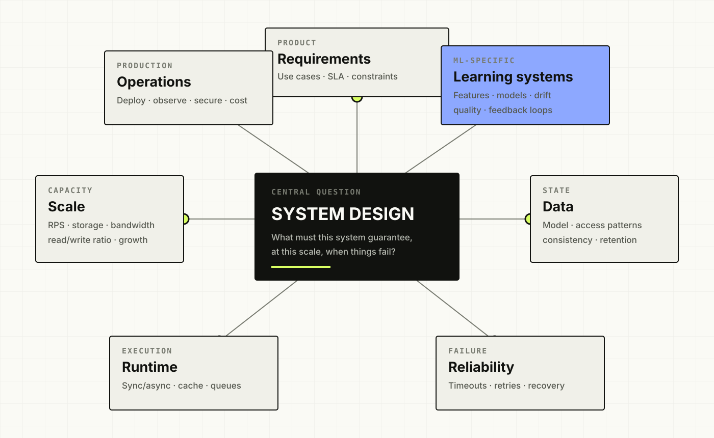
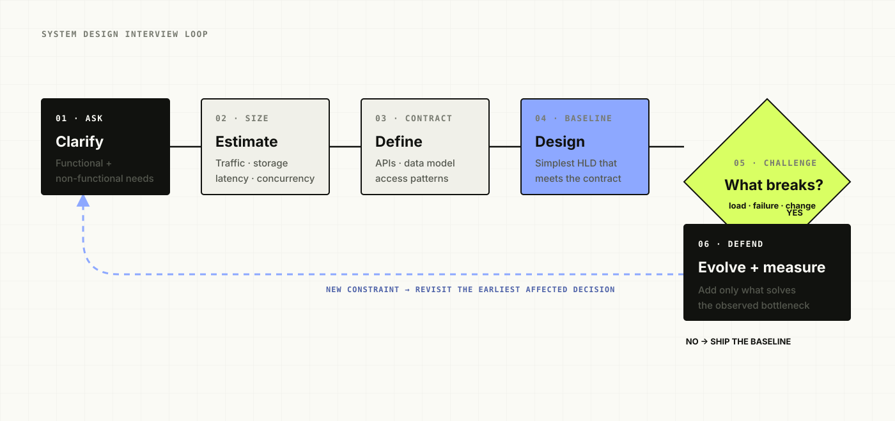
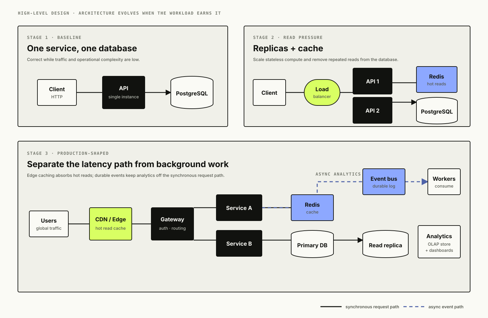
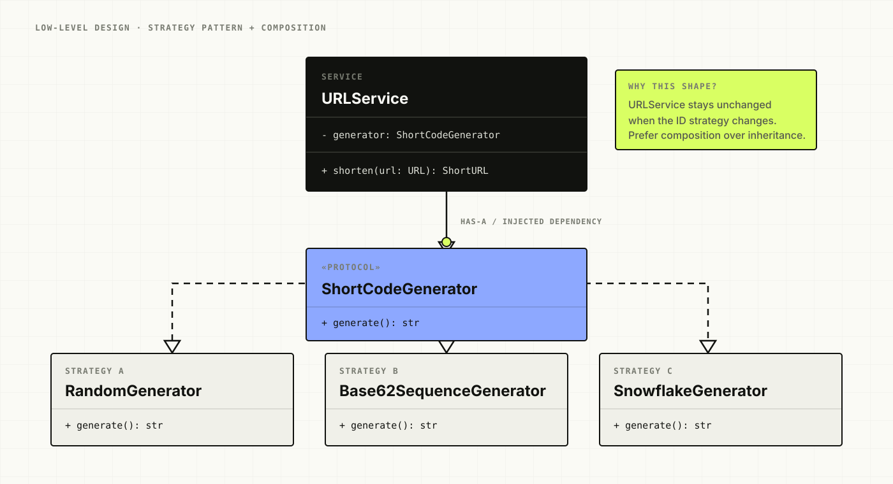
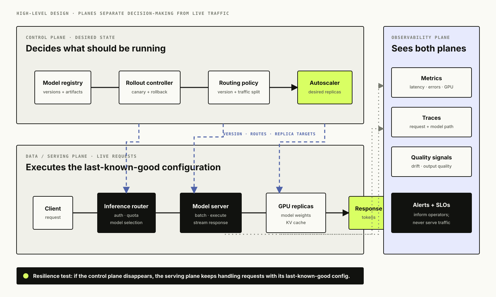
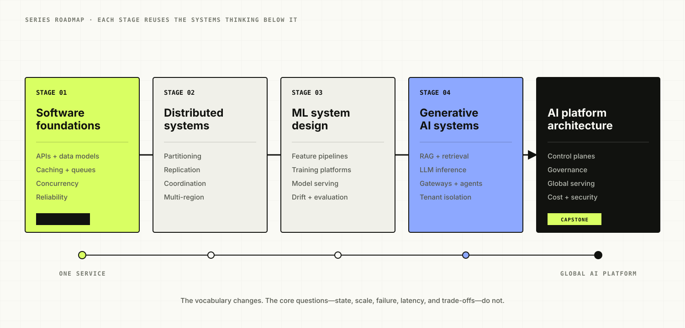

# Designing ML Systems: Introduction

*Learning system design by building real systems, poking at every architectural decision, and working our way up from software fundamentals to production ML and AI platforms.*

There's something strange about how system design learning actually goes. You can spend weeks grinding through Redis, Kafka, Kubernetes, database sharding, design patterns, concurrency primitives, API gateways, load balancers, feature stores, model serving — and still freeze the moment an interviewer says "design a system for me."

Turns out the individual pieces were never really the hard part. Knowing *when* they matter is. When do you reach for Redis? Why PostgreSQL here and DynamoDB there? Should this run synchronously or async? Do you actually need Kafka, or are you just bolting it on because it shows up in every system design diagram you've ever seen? At what point does a monolith stop cutting it, and when do you split the control plane from the data plane? What happens when two requests hit the same resource at the same instant — and how does the whole picture shift once you go from a thousand users to ten million?

Bring ML into it and a fresh batch of questions shows up: where do features get computed, how do you avoid training-serving skew, should predictions happen online or in a batch, how do you version and safely roll out a new model, how do you catch drift before it catches you? And once you're deep into generative AI, the questions get even weirder: how do you serve an LLM at thousands of requests a second, design RAG for millions of users, keep enterprise tenants properly isolated, or figure out what actually belongs in an "AI control plane" versus everything else?

That's the ground this series is trying to cover — not through fifty disconnected tutorials, but through systems that grow, break, and get rebuilt in front of you.

<figure class="technical-figure">
  <a href="assets/system-design-mind-map.svg" target="_blank" rel="noreferrer"></a>
  <figcaption>A useful design starts with the questions around the system—not with a preselected stack.</figcaption>
</figure>

## Table of Contents

- Why this series exists
- How we'll learn
- The interview-first approach
- We're actually going to build these systems
- What a typical write-up looks like
- Software design gets its due too
- UML when it earns its keep
- Concurrency won't be its own chapter
- Architectures eventually grow planes
- Cloud architecture
- Deployment is part of the design, not an afterthought
- Reliability and observability are first-class, not an extra section
- How the series climbs toward ML
- Series index
- How to use this series
- Test your understanding
- Where we begin

## Why This Series Exists

I've mostly seen system design taught two ways.

The first teaches concepts in isolation — caching one week, message queues the next, then replication, then sharding, then CAP theorem. Useful, sure, but real systems don't come pre-labeled telling you which concept applies where. An interviewer never says "please demonstrate your knowledge of Redis." They say "design Bitly," and it's on you to notice the workload is read-heavy, that hammering the database on every redirect is wasteful, that a handful of links will get disproportionately hammered, and that maybe some of this belongs at the edge. Caching only becomes the right answer once you've done that reasoning — not before.

The second approach just hands you a finished diagram:

```text
Client
   |
API Gateway
   |
Load Balancer
   |
Services
   |
Redis -- Kafka -- Database
```

Looks the part. But it skips the one question that actually matters: *why did the architecture end up looking like this?*

So this series starts before any of those boxes exist. We build the simplest thing that could plausibly work, then we break it — traffic spikes, requirements shift, dependencies fall over, two users step on each other at the same instant, one customer suddenly dwarfs everyone else, the database chokes, a region goes dark, security requirements tighten, latency budgets shrink. Every time something breaks, the question is the same: what should change in the architecture, and why?

## How We'll Learn

Despite the name, this series doesn't open with machine learning — that's deliberate. A production ML platform is, underneath everything, still a distributed software system. Before you can reasonably worry about feature stores, model registries, GPU serving, or drift detection, you need to be genuinely comfortable with APIs, databases, caching, concurrency, networking, messaging, deployment, observability, reliability. The unglamorous stuff.

So we start with familiar territory: a URL shortener, a rate limiter, a notification platform, a messaging app, a file storage system, a payment system. These naturally surface the engineering ideas we'll keep leaning on. Later, when we shift into recommendation systems, fraud detection, feature stores, training platforms, and model serving, those same foundations get reused rather than relearned. And by the time we reach RAG, LLM inference, enterprise copilots, and agent platforms, all of it should feel like one continuous toolkit rather than separate subjects bolted together.

We shouldn't have to relearn caching once ML enters the picture — the better question is whether the caching strategy we already learned still holds up against this new kind of workload. That's a fundamentally different kind of learning than memorizing fifty topics in sequence.

## The Interview-First Approach

Every major design in this series starts life as an interview question. Say the prompt is "design a URL shortener like Bitly." We don't open with "I'll use Redis, Kafka, and Cassandra" — we open with questions. Do links expire? Can users pick custom aliases? Can a destination change after the link is live? Do we need click analytics? What's our daily creation volume, our redirect volume, our availability bar on the redirect path?

<figure class="technical-figure wide-figure">
  <a href="assets/interview-first-flow.svg" target="_blank" rel="noreferrer"></a>
  <figcaption>The interview loop: clarify, quantify, establish contracts, draw a baseline, then let new constraints tell you what must change.</figcaption>
</figure>

None of that is interview theater. Those answers *are* the architecture. And the conversation doesn't stop there — "why PostgreSQL?" should get an answer about access patterns and consistency needs, not "because it scales." Then the ground shifts: a celebrity posts one link and it's suddenly eating 500,000 requests a second. Whatever Redis was doing for you before, you've now got a hot key problem, and edge caching starts looking a lot more interesting. Then: links become editable, and updates need to propagate globally within five seconds. Suddenly your CDN strategy just got a lot more complicated.

That's the shape I want these designs to take — not "here's the correct architecture," but "given these constraints, here's what I'd build, and here's exactly what would make me change my mind."

## We're Actually Going to Build These Systems

Diagrams are fine, but architecture clicks a lot faster once you've watched something actually fail. So wherever it's practical, the major case studies here come with a working implementation — a frontend, real APIs, an actual database schema, caching, async processing, containers, a real deployment, instrumentation, and load tests. Then we change the architecture and run the load test again.

Say our first pass at the URL shortener looks like this:

```text
Frontend
    |
Backend
    |
PostgreSQL
```

Nothing wrong with that — for a small app, it might genuinely be the right call. Then we throw traffic at it. If reads start dominating the request path, we've *earned* the right to add caching, and now we can drop in Redis and actually measure the difference. Later, maybe analytics writes start dragging down redirect latency — that's a real reason to pull analytics off the synchronous path, and suddenly Kafka or Pub/Sub has context instead of just being cargo-culted in.

<figure class="technical-figure wide-figure">
  <a href="assets/architecture-evolution-hld.svg" target="_blank" rel="noreferrer"></a>
  <figcaption>An HLD should preserve the reason each component appeared: first correctness, then read scaling, then separation of the latency-sensitive and asynchronous paths.</figcaption>
</figure>

The goal isn't reproducing Google's traffic on a laptop. It's building production-shaped systems, pushing them hard enough to expose real architectural behavior, and understanding how they'd keep evolving at a much bigger scale than we can actually simulate.

## What a Typical Write-Up Looks Like

Each article follows a rough rhythm, though I'd rather it feel like a live conversation than a checklist being filled in mechanically.

We usually start with the product itself — what does the user actually need? Then we clarify requirements the way you would in an interview, estimate scale (requests per second, storage, read/write ratio, bandwidth, concurrency — and later, for ML systems, feature throughput, prediction latency, training volume, token throughput, GPU capacity), and sketch the *first* architecture — not the final one, just the simplest thing we can honestly justify.

From there we zoom into APIs, data models, sometimes the frontend, database access patterns, race conditions, where async processing earns its keep, failure modes, security. Then the interviewer makes life harder — more traffic, a dependency failure, multi-tenancy, going global, tighter latency — and the architecture evolves in response. We close out with deployment, cloud mapping, observability, cost, and a round of harder interview questions thrown at the finished design.

## Software Design Gets Its Due Too

System design tends to get taught entirely in terms of high-level boxes, but somebody eventually has to write the code that lives inside them. So we'll drop into low-level design whenever a problem gives us a genuine reason to — revisiting OOP concepts (encapsulation, abstraction, polymorphism, inheritance, and especially composition) and design principles like SOLID, DRY, KISS, and YAGNI only when they actually clarify our thinking, not as a checklist.

Say our URL service generates short codes with one hardcoded algorithm, and later we want to experiment with random IDs, Base62-encoded sequences, and Snowflake-style distributed IDs. That's a natural moment to ask whether short-code generation deserves its own abstraction:

```python
class ShortCodeGenerator(Protocol):
    def generate(self) -> str:
        ...
```

<figure class="technical-figure wide-figure">
  <a href="assets/short-code-generator-lld.svg" target="_blank" rel="noreferrer"></a>
  <figcaption>The Strategy pattern becomes useful here because the URL service depends on a stable contract while generation algorithms vary independently.</figcaption>
</figure>

Now different strategies can implement that contract, and talking about the Strategy pattern or the Open/Closed principle actually *means* something — the pattern grew out of the problem, we didn't reach for it because it's on a Gang of Four checklist. Same logic applies when Factory, Adapter, Observer, Repository, State, Builder, Saga, Circuit Breaker, or Outbox show up later. And just as often, the right call will be "we don't need a pattern here" — that's architecture too.

## UML When It Earns Its Keep

We'll reach for UML when a diagram genuinely communicates something prose can't — a class diagram for a service's internals, a sequence diagram for a distributed request flow, a state diagram for something like a payment lifecycle, a deployment diagram for where things actually run. No UML for UML's sake. A diagram should answer a question, full stop.

## Concurrency Won't Be Its Own Chapter

Concurrency taught in the abstract tends to feel pointless. So instead we'll run into it the way you actually do in practice — through failures. Say two people request the alias `mycompany` at the exact same moment. Both app instances check whether it exists, both get "no," both try to create it. Now there's something worth talking about: race conditions, atomicity, transactions, database uniqueness guarantees, maybe optimistic locking.

Elsewhere we'll hit semaphores because some external API only allows so many concurrent calls, or thread pools, worker pools, mutexes, distributed locks, producer-consumer patterns. Eventually processes, threads, coroutines, async/await, event loops, connection pools, deadlocks, contention — all of it. But the system creates the question first; we don't start from the vocabulary list.

## Architectures Eventually Grow Planes

For small systems, "control plane" is unnecessary jargon. For big platforms, it's not optional. Take an inference platform — the live request path might look like:

```text
User
  |
Inference Router
  |
Model Server
  |
GPU
  |
Response
```

That's the serving (data) plane. Somewhere else entirely, a different set of components decides which models are live, which version gets traffic, what the routing policy is, how replicas scale — that's starting to look like a control plane. As the series climbs, we'll keep drawing the line between data plane, control plane, management plane, and observability plane, and asking the question that actually matters: if the control plane vanished for ten minutes, would the data plane keep serving traffic? That tells you more about an architecture than any box-labeling exercise.

<figure class="technical-figure wide-figure">
  <a href="assets/control-data-plane-hld.svg" target="_blank" rel="noreferrer"></a>
  <figcaption>The control plane decides desired state; the data plane serves live traffic from its last-known-good configuration; observability watches both without entering the request path.</figcaption>
</figure>

## Cloud Architecture

We'll design conceptually before picking a vendor. A queue is a queue before it's SQS, Azure Service Bus, or Pub/Sub. Object storage is a primitive before it's S3, Blob Storage, or GCS. Once the shape of the architecture makes sense, we map it onto whatever cloud fits the scenario — AWS, Azure, GCP, whichever's relevant — touching managed databases, object storage, API gateways, container platforms, Kubernetes, serverless compute, managed messaging, observability tooling, secrets management, IAM, infrastructure as code. Once we're in ML territory, that extends to SageMaker, Azure ML, Vertex AI.

The point was never to memorize a cloud product catalog. It's two questions, asked in order: what capability does this architecture actually need, and which managed service gives us that capability at an acceptable trade-off?

## Deployment Is Part of the Design, Not an Afterthought

A system that exists only on a whiteboard hasn't answered the real questions yet: how does it get deployed, how does config reach it, how does it find its dependencies, where do secrets live, what happens when a new version breaks, how does autoscaling behave, can you roll back, what does a health check actually verify? Docker, Kubernetes, CI/CD, rolling and canary and blue-green releases, infrastructure as code, autoscaling, config management, feature flags — these show up as soon as a system is sophisticated enough to need them, not as a bolted-on afterthought.

## Reliability and Observability Are First-Class, Not an Extra Section

A happy path working is not the same thing as production-ready. For every serious dependency, ask what happens when it fails. If Redis goes down, does PostgreSQL get crushed? If Kafka's unavailable, do redirects stop working entirely? If a region disappears, where does traffic go? If a downstream call starts taking thirty seconds instead of three hundred milliseconds, what protects you? That's where timeouts, retries, exponential backoff, circuit breakers, bulkheads, graceful degradation, and disaster recovery come from — not from a list, from necessity.

And none of that means anything if you can't see what the system's actually doing, so logs, metrics, and traces are part of the architecture, not bolted on at the end — along with SLI/SLO/SLA thinking. ML adds its own observability layer on top: prediction quality, data drift, feature drift, model versions, training-serving skew. LLM systems add yet another: token usage, time to first token, retrieval quality, groundedness, tool execution, GPU utilization, cost per request.

## How the Series Climbs Toward ML

The early stretch is intentionally software-heavy — that's the foundation everything else stands on. Then the center of gravity shifts. A recommendation system brings in candidate generation and ranking. Fraud detection forces real-time features and unforgiving latency budgets. A feature store makes you think hard about online versus offline data. A training platform brings experiment tracking, distributed compute, orchestration. Model serving brings deployment strategy, inference scaling, versioning.

Then generative AI changes the workload again — RAG brings embeddings and retrieval, enterprise RAG adds ACL-aware search and tenant isolation, LLM inference brings GPUs, KV caches, batching, token throughput, and multi-agent platforms bring orchestration, tool permissions, state, execution governance. By that point, the distributed-systems ideas from the very first article shouldn't feel like a separate subject anymore — they're just tools you reach for.

<figure class="technical-figure wide-figure">
  <a href="assets/series-roadmap.svg" target="_blank" rel="noreferrer"></a>
  <figcaption>The subject matter changes as the series climbs, but each stage reuses the systems reasoning established below it.</figcaption>
</figure>

## Series Index

This page stays as the permanent index for *Designing ML Systems*. Every article links back here, and titles get swapped for live links as they publish.

**Part I — Building the Software Foundation**

1. **[URL Shortener Like Bitly](../02-url-shortener/)** — starts almost trivial, ends globally scalable. API design, relational modeling, indexes, short-ID generation, Redis, caching, concurrency, distributed IDs, event-driven analytics, CDNs, load balancing, deployment, and a handful of useful LLD patterns along the way.
2. **[Distributed Rate Limiter](../03-distributed-rate-limiter/)** — our first real brush with distributed state. Token bucket vs. leaky bucket vs. fixed/sliding window, atomic counters, Redis, consistency, tenant-aware quotas.
3. **[Notification Platform](../04-notification-platform/)** — email, SMS, push look simple until retries, duplicate delivery, provider outages, and fan-out show up. Queues, workers, backpressure, dead-letter handling, idempotency, Strategy/Factory/Adapter.
4. **Chat System Like WhatsApp** — now it's real-time. WebSockets, presence, ordering, delivery guarantees, offline messaging, partitioning, multi-region. *(Coming soon)*
5. **Google Drive / Dropbox** — object storage, metadata DBs, multipart uploads, checksums, sync, versioning, conflict resolution. *(Coming soon)*
6. **Search Autocomplete** — a tiny text box as an excuse for prefix search, tries, ranking, hot queries, caching, live updates. *(Coming soon)*
7. **Distributed Cache** — the cache becomes the whole system. Consistent hashing, replication, eviction, TTL, hot keys, failure recovery, coherence trade-offs. *(Coming soon)*
8. **API Gateway** — routing, auth, TLS termination, rate limiting, service discovery, resilience. *(Coming soon)*
9. **Observability Platform** — logs, metrics, and traces as their own distributed-data problem. Collection, aggregation, sampling, storage, indexing, cardinality, OpenTelemetry, alerting. *(Coming soon)*
10. **E-commerce Checkout** — distributed transactions become unavoidable. Inventory, payments, orders, idempotency, Saga, Outbox, consistency trade-offs. *(Coming soon)*

**Part II — Distributed Systems and Data Platforms**

11. **Payment System** — reliability, auditability, ledgers, reconciliation, state transitions. *(Coming soon)*
12. **Event Streaming Platform Like Kafka** — partitions, brokers, replication, offsets, consumer groups, ordering, rebalancing. *(Coming soon)*
13. **Real-Time Analytics Platform** — streaming vs. batch, windows, OLTP vs. OLAP, analytical storage. *(Coming soon)*
14. **Logging Platform Like Splunk** — large-scale ingestion, indexing, retention tiers, distributed search. *(Coming soon)*
15. **Global Configuration Service** — first deep dive into control-plane architecture, config propagation, watchers, versioning, safe rollout. *(Coming soon)*
16. **Service Discovery** — health checks, leases, registries, DNS, failure detection, distributed coordination. *(Coming soon)*
17. **Distributed Job Scheduler** — worker pools, leases, retries, duplicate execution, leader election, scheduling guarantees. *(Coming soon)*
18. **Multi-Tenant SaaS Platform** — tenant isolation, noisy neighbors, RBAC, ABAC, ACLs, quotas, shared vs. dedicated infra. *(Coming soon)*
19. **Multi-Region Active-Active Platform** — global routing, regional failure, replication, consistency, conflict resolution. *(Coming soon)*
20. **CDN** — edge caching, Anycast, origin shielding, invalidation, TTLs, global distribution. *(Coming soon)*

**Part III — Machine Learning System Design**

21. **[Recommendation System](../21-recommendation-system/)** — candidate generation, ranking, embeddings, online/offline features, feedback loops, experimentation, reliability, and global serving.
22. **[Real-Time Fraud Detection](../22-real-time-fraud-detection/)** — streaming features, low-latency inference, class imbalance, delayed labels, graph evidence, feature freshness, and safe intervention policy.
23. **ML Feature Store** — online vs. offline features, point-in-time correctness, freshness, training-serving consistency. *(Coming soon)*
24. **ML Training Platform** — data versioning, distributed training, orchestration, experiment tracking, GPU scheduling. *(Coming soon)*
25. **Model Serving Platform** — deployment, sync inference, batching, autoscaling, canaries, shadow traffic, rollback. *(Coming soon)*
26. **Real-Time Prediction Platform** — feature retrieval, prediction latency, fallback behavior, caching, service reliability. *(Coming soon)*
27. **Experimentation Platform** — assignment, bucketing, feature flags, metrics, guardrails, controlled rollouts. *(Coming soon)*
28. **Search Ranking System** — retrieval, features, ranking models, freshness, evaluation. *(Coming soon)*
29. **Ads Ranking Platform** — candidate selection, auctions, CTR prediction, ranking, brutal latency constraints. *(Coming soon)*
30. **ML Monitoring and Drift Detection** — data drift, concept drift, prediction telemetry, alerts, retraining triggers. *(Coming soon)*

**Part IV — Generative AI and LLM Systems**

31. **Design ChatGPT** — conversation state, streaming, model routing, moderation, inference infra, reliability. *(Coming soon)*
32. **Production RAG Platform** — chunking, embeddings, hybrid search, vector DBs, reranking, citations, evaluation. *(Coming soon)*
33. **Enterprise RAG for 10 Million Users** — multi-tenancy, ACL-aware retrieval, sharding, distributed search, caching, multi-region. *(Coming soon)*
34. **Billion-Scale Vector Search** — ANN search, HNSW, IVF, recall-latency trade-offs, metadata filtering, distributed indexing. *(Coming soon)*
35. **LLM Inference at 10K RPS** — token throughput, continuous batching, KV cache, prefill/decode, GPU scheduling, backpressure, autoscaling. *(Coming soon)*
36. **LLM Gateway** — provider abstraction, model routing, fallbacks, quotas, retries, cost management, capability-aware routing. *(Coming soon)*
37. **Multi-Agent AI Platform** — agents, tools, workflows, memory, orchestration, execution limits, observability. *(Coming soon)*
38. **AI Customer Support Platform** — RAG, tool execution, escalation, human-in-the-loop, guardrails, CRM integration. *(Coming soon)*
39. **AI Coding Assistant** — repository indexing, code retrieval, context management, sandboxed execution, streaming. *(Coming soon)*
40. **Enterprise Copilot** — enterprise connectors, identity, permissions, multi-source retrieval, tools, governance. *(Coming soon)*

**Part V — AI Architect-Level Platforms**

41. **Enterprise AI Platform** — a shared platform behind many AI products in one org. *(Coming soon)*
42. **AI Control Plane** — model deployment, routing policy, config, rollouts, scaling, separation from serving. *(Coming soon)*
43. **Agent Control Plane** — agent registration, tool permissions, policy, execution governance, config distribution. *(Coming soon)*
44. **LLM and Agent Evaluation Platform** — offline evaluation, regression suites, model judges, human review, release gates. *(Coming soon)*
45. **AI Observability Platform** — prompts, model calls, retrieval traces, tool executions, tokens, quality, cost. *(Coming soon)*
46. **Secure Multi-Tenant GenAI Platform** — identity, RBAC, ABAC, ACLs, tenant isolation, encryption, auditability, prompt-injection defense. *(Coming soon)*
47. **Multi-Region LLM Serving** — GPU fleets, global routing, failover, capacity planning, residency requirements. *(Coming soon)*
48. **AI Cost Optimization Platform** — routing, caching, batching, quantization, model selection, AI FinOps. *(Coming soon)*
49. **Real-Time Voice AI Platform** — streaming audio, ASR, LLM inference, TTS, interruption handling, brutal-low-latency orchestration. *(Coming soon)*
50. **Global Enterprise AI Platform** — the capstone. Frontend, backend, distributed systems, data architecture, ML infra, LLMs, agents, cloud, security, reliability, observability, control planes, deployment — one architecture, evolving through all of it. *(Coming soon)*

## How to Use This Series

I don't think reading these top to bottom is really the point. Stop the moment the architecture hits a wall and decide, before reading on, what *you'd* do. When someone asks why PostgreSQL, answer before you see my answer. When Redis goes down, work out what happens to the database on your own. When a service gets overloaded, figure out where backpressure belongs. When the system goes global, decide which parts genuinely need global consistency and which don't. Once we're in ML territory, ask what breaks if the model itself becomes unavailable.

The point was never to agree with every call made in this series — quite the opposite. If you can argue for a different architecture and defend the trade-offs, you're doing the actual work of learning system design.

## Test Your Understanding

Before the first system, sit with this: an interviewer tells you "we're building for 500 users today, but we might hit several million eventually." Do you build for millions on day one? If not, what determines what you actually build today?

Now: "why didn't you use Kafka?" What would actually make it necessary? Or: "why is this a microservice instead of a module in the existing app — can you justify the operational overhead?" And underneath all of it, the one question worth asking every single time: *what problem is this piece of technology actually solving?*

If we can keep answering that honestly across the next fifty systems, this series will have done its job.

## Where We Begin

We're starting small, on purpose. Someone hands us:

```text
https://example.com/a/very/long/url
```

and we hand back:

```text
https://short.ly/a8Ks3
```

That's the whole job. Right up until a few million people start clicking it — and that's when it gets interesting.
