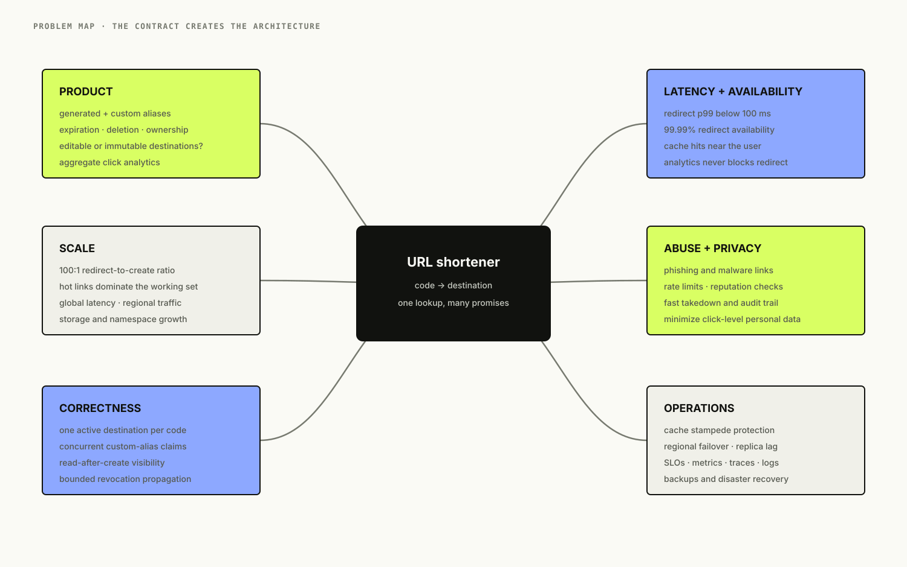
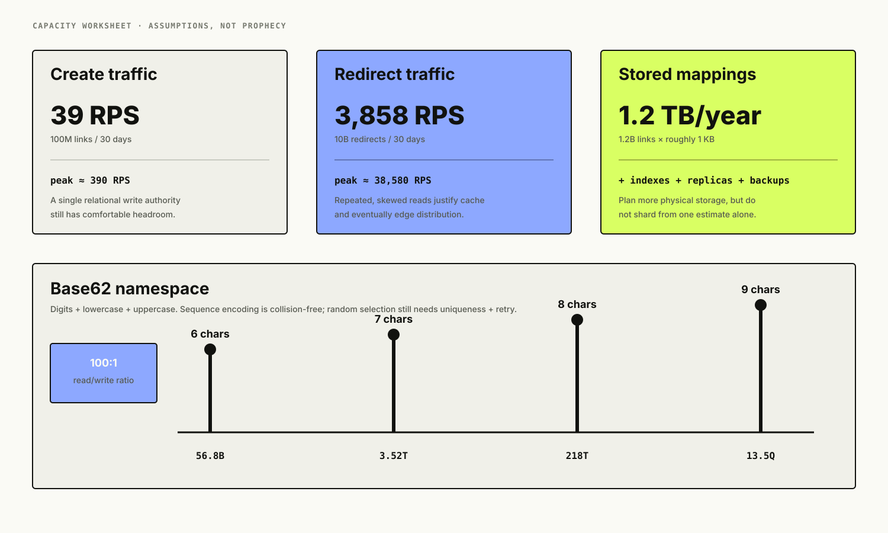
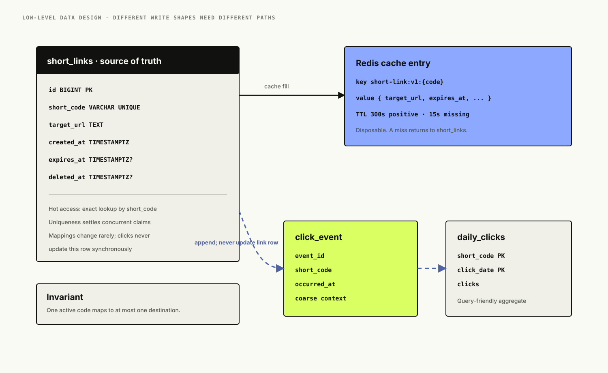
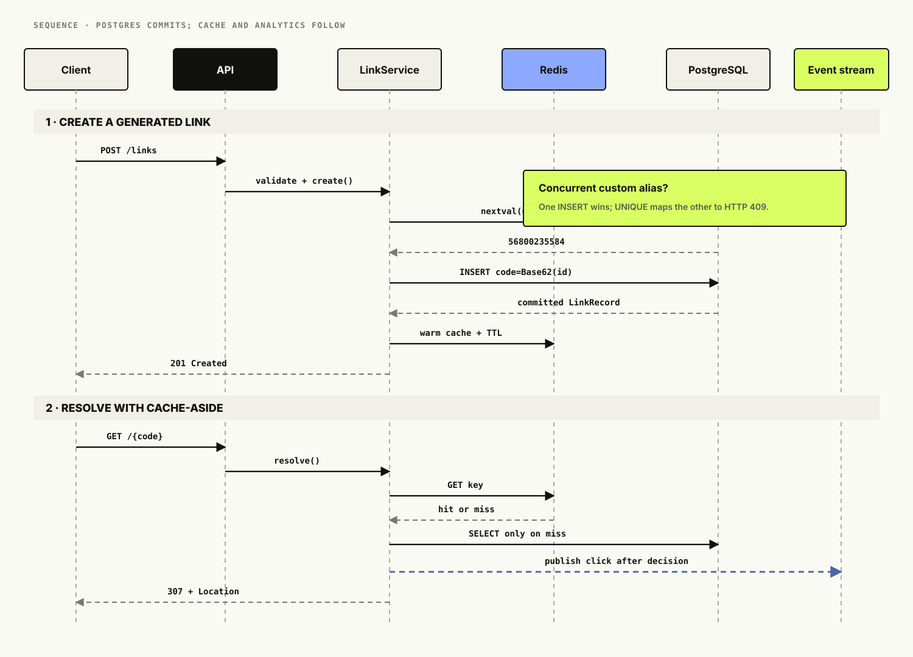
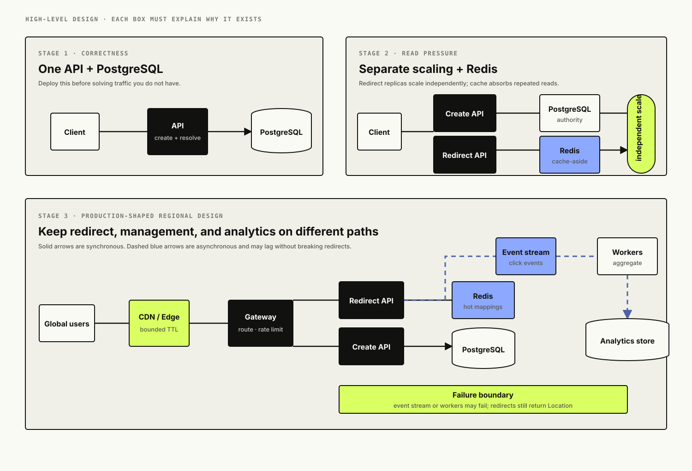
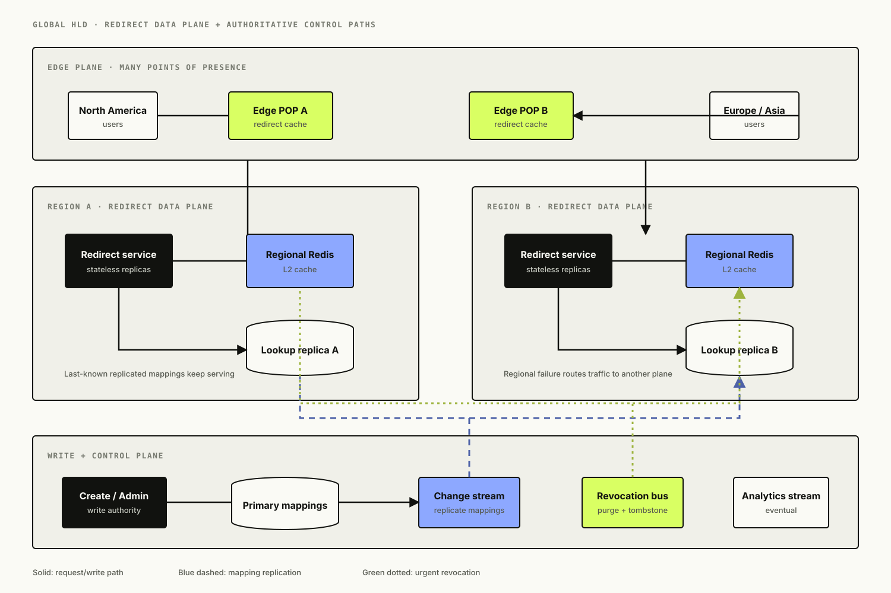
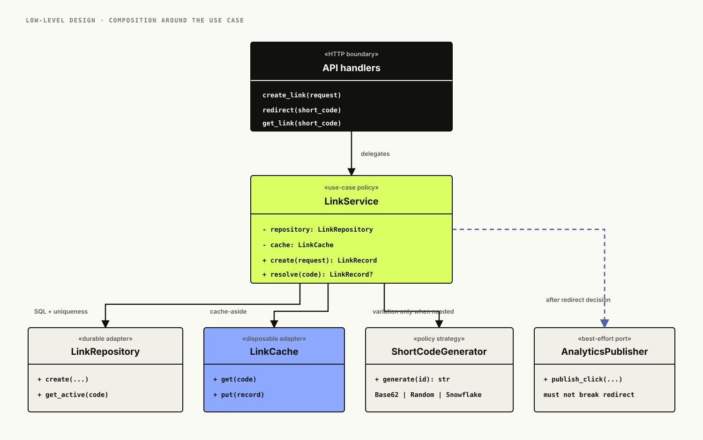

# Designing a URL Shortener: From One Table to a Global Redirect Plane

*A URL shortener looks like one database lookup. That is exactly why it is such a good place to learn requirements, capacity, IDs, caching, concurrency, asynchronous work, global reads, and the discipline of keeping the important path small.*

A user gives us a long URL. We return a short one. Later, somebody opens the short URL and we redirect them. If we drew only the product behavior, the whole system would fit in three lines:

```text
POST long URL -> short code
GET short code -> long URL
Return redirect
```

That version is not wrong. In fact, it is where we should begin. The interesting architecture appears only after we ask what the service must promise: Can links expire? Are destinations editable? Can users reserve aliases? Is a redirect allowed to fail because analytics is unavailable? What happens when one link gets 500,000 requests in a second? Does a code have to be unguessable? How quickly must a disabled phishing link stop resolving worldwide?

Those answers turn one lookup into a compact tour of system design.

<figure class="technical-figure wide-figure">
  <a href="assets/problem-map.svg" target="_blank" rel="noreferrer"></a>
  <figcaption>The product sounds tiny; the contract around it is where the design lives.</figcaption>
</figure>

## Table of Contents

- Start with the interview, not the stack
- Define the contract
- Estimate the workload
- Design the API
- Model the data around access patterns
- Choose a short-code strategy
- Build the smallest correct version
- Let the database settle the alias race
- Treat redirect semantics as a product decision
- Add caching only after reads earn it
- Keep analytics off the redirect path
- Evolve the high-level design
- Take the read path global
- Design for failure
- Treat abuse prevention as part of the architecture
- Observe the promises users care about
- A little low-level design
- Run the companion implementation
- What I would actually ship first
- Interview follow-ups
- References
- What comes next

## Start With the Interview, Not the Stack

The prompt is: **Design a URL shortening service like Bitly.**

Before drawing Redis, Kafka, or a CDN, I would clarify the product:

- Users can create a short link for an `http` or `https` destination.
- The service generates an alias, and authenticated users may request a custom alias.
- A link may have an expiration time.
- Opening a valid link redirects the browser to its destination.
- We collect aggregate click analytics, but analytics can lag behind redirects.
- A link can be disabled for abuse or deleted by its owner.
- The redirect path is far more latency- and availability-sensitive than link creation.

For this version, destinations are immutable. Editing a live destination sounds harmless, but it changes the caching contract everywhere: browser caches, CDN caches, Redis, regional replicas. We will discuss how to add editing, but not quietly smuggle it into the first release.

We also need to say what is out of scope. A polished dashboard, QR codes, branded domains, billing, team workspaces, and a real malware-classification pipeline are worthwhile product features, but none is necessary to reason about the core system.

### Functional requirements

1. Create a generated or custom short link.
2. Resolve a short code to an active destination.
3. Expire, delete, or administratively disable a link.
4. Count clicks asynchronously.
5. Return metadata to an authenticated owner.

### Non-functional requirements

1. Redirects should have a p99 origin latency below 100 ms; cache hits should be much faster.
2. Redirect availability should target 99.99% or better.
3. Link creation may tolerate lower availability than redirects.
4. A successful creation must not later resolve to somebody else's destination.
5. Analytics may be eventually consistent and should never make a redirect fail.
6. Disabled links should stop resolving globally within a defined window—say five minutes initially, then seconds for confirmed abuse.

Notice that the last requirement already predicts a trade-off. Long cache TTLs improve hit rate and resilience; short TTLs make revocation faster. “Use a CDN” is not a design until we decide which side of that trade-off matters.

## Define the Contract

A system-design answer gets sharper when we turn adjectives into numbers. Let us assume:

| Workload | Assumption |
|---|---:|
| New links | 100 million/month |
| Redirects | 10 billion/month |
| Read/write ratio | 100:1 |
| Peak-to-average factor | 10× |
| Stored bytes/link, including overhead | about 1 KB |
| Average redirect response | about 500 bytes |

The exact numbers are invented; the arithmetic is not. Using a 30-day month:

```text
creates/second   = 100,000,000 / 2,592,000  ~=       39 average,    390 peak
redirects/second = 10,000,000,000 / 2,592,000 ~=  3,858 average, 38,580 peak
yearly link data = 100,000,000 * 12 * 1 KB   ~=  1.2 TB/year
```

Indexes, replication, backups, and storage-engine overhead push the real storage requirement above that 1.2 TB estimate. Even so, this is not “shard on day one” territory. A relational database can carry the initial write workload comfortably, and the redirect workload is exactly the kind of skewed, repeated-read traffic a cache can absorb.

The average also hides the dangerous part. Traffic will not be spread evenly across codes. Most links may receive no clicks; a handful can become extremely hot. Capacity planning therefore needs both aggregate throughput and a per-key burst assumption.

<figure class="technical-figure wide-figure">
  <a href="assets/capacity-and-code-space.svg" target="_blank" rel="noreferrer"></a>
  <figcaption>Back-of-the-envelope math rules out unnecessary complexity while exposing the two real pressures: read amplification and hot keys.</figcaption>
</figure>

## Design the API

The public API can stay small.

### Create a link

```http
POST /api/v1/links
Content-Type: application/json

{
  "target_url": "https://example.com/a/very/long/path?campaign=summer",
  "custom_alias": "summer-launch",
  "expires_at": "2027-01-01T00:00:00Z"
}
```

```http
HTTP/1.1 201 Created
Content-Type: application/json

{
  "id": 56800235584,
  "short_code": "summer-launch",
  "short_url": "https://sho.rt/summer-launch",
  "target_url": "https://example.com/a/very/long/path?campaign=summer",
  "created_at": "2026-08-09T20:00:00Z",
  "expires_at": "2027-01-01T00:00:00Z"
}
```

A repeated request raises an idempotency question. If clients can retry after a timeout, an `Idempotency-Key` header is useful: store the key and response for a bounded period, and return the original link instead of creating a second one. Duplicating the same destination is not necessarily wrong—campaigns often want separate links—so deduplicating by `target_url` would be a product bug, not an optimization.

### Resolve a link

```http
GET /summer-launch

HTTP/1.1 307 Temporary Redirect
Location: https://example.com/a/very/long/path?campaign=summer
Cache-Control: private, no-store
```

### Read metadata

```http
GET /api/v1/links/summer-launch
Authorization: Bearer <token>
```

The redirect endpoint and the management API should not accidentally share every concern. Authentication, dashboards, and analytics queries belong on the management side. The public redirect path should do as little work as possible.

## Model the Data Around Access Patterns

The hot query is beautifully specific:

```sql
SELECT target_url, expires_at
FROM short_links
WHERE short_code = $1
  AND deleted_at IS NULL
  AND (expires_at IS NULL OR expires_at > now());
```

That suggests a straightforward relational model:

```sql
CREATE TABLE short_links (
    id          BIGINT PRIMARY KEY,
    short_code  VARCHAR(32) NOT NULL UNIQUE,
    target_url  TEXT NOT NULL,
    created_at  TIMESTAMPTZ NOT NULL DEFAULT now(),
    expires_at  TIMESTAMPTZ,
    deleted_at  TIMESTAMPTZ
);
```

The unique constraint on `short_code` is both an integrity rule and a lookup index. PostgreSQL creates a unique B-tree index for a unique constraint, so adding another identical index would only duplicate work and storage.

Click events should not live as an ever-increasing counter on this row. Updating the same popular row for every redirect creates contention, write amplification, and a coupling between availability of analytics writes and availability of redirects. Raw click events belong in a stream or append-oriented store; aggregates can land in a table keyed by `(short_code, date)`.

<figure class="technical-figure wide-figure">
  <a href="assets/data-model-lld.svg" target="_blank" rel="noreferrer"></a>
  <figcaption>The link row is authoritative and relatively cold; click events are append-heavy and follow a different storage path.</figcaption>
</figure>

### What about a key-value database?

The redirect access pattern—one exact key to one value—is a natural key-value workload. At very large scale, a globally replicated key-value store can be a good serving database. But the initial product also needs unique custom aliases, ownership queries, expiration sweeps, administrative updates, and clear transaction semantics. PostgreSQL gives us those without inventing distributed consistency problems early.

The database choice can evolve. The important thing is to preserve the contract: a code maps to at most one active destination, and the system has a reliable path for revocation.

## Choose a Short-Code Strategy

There are several defensible strategies, and they optimize for different things.

### Random Base62 strings

Pick seven or eight characters from `0-9`, `a-z`, and `A-Z`, attempt an insert, and retry on collision. Seven Base62 characters give:

```text
62^7 = 3,521,614,606,208 possible codes
```

This space looks enormous, but “a collision is unlikely for the next insert” and “we will never see any collision” are different claims. The birthday effect makes at least one collision likely long before the namespace is full. That is fine if the database uniqueness constraint is authoritative and retry is part of the algorithm. It is not fine if the application checks first and assumes the subsequent insert is safe.

Random codes are hard to enumerate, but generation needs a cryptographically secure source if unpredictability is a security or privacy goal.

### Database sequence encoded as Base62

Ask PostgreSQL for the next integer and encode it:

```python
ALPHABET = "0123456789abcdefghijklmnopqrstuvwxyzABCDEFGHIJKLMNOPQRSTUVWXYZ"

def encode_base62(value: int) -> str:
    encoded = []
    while value:
        value, remainder = divmod(value, 62)
        encoded.append(ALPHABET[remainder])
    return "".join(reversed(encoded)) or "0"
```

This is collision-free as long as the sequence is unique, easy to test, and fast enough for our estimated 390 peak creations per second. It also leaks ordering and makes enumeration easy. If public unpredictability matters, we can permute IDs with a keyed bijection before encoding; hashing and truncating would reintroduce collisions.

The companion implementation uses this strategy because it makes the correctness boundary explicit. Its sequence starts at `62^6`, so generated codes begin at seven characters rather than a visually noisy run of leading zeros.

### Distributed IDs

At multi-region write scale, one database sequence can become a coordination point. A Snowflake-style 64-bit ID combines time, worker identity, and a per-time-unit sequence; UUIDv7 puts a millisecond Unix timestamp in the most significant 48 bits and adds randomness in the remaining available bits. Either can be generated without a central round trip.

Those IDs are larger than a simple sequence, and worker IDs or clock behavior need operational care. A globally writable system may accept that cost. Our first version does not need to.

### Custom aliases

Custom aliases and generated codes share one namespace. Reserve words such as `api`, `healthz`, `metrics`, and `admin`; enforce a clear character policy; and let a unique index arbitrate competing requests. A separate “check availability” endpoint can improve the UI, but it can never guarantee that the following create will win.

## Build the Smallest Correct Version

The baseline architecture is one stateless API deployment and PostgreSQL:

```text
Client -> API -> PostgreSQL
```

Creation validates the destination, gets an ID, derives or accepts a short code, and inserts one row. Redirect looks up one row and returns a `Location` header. This version is deployable, observable, and probably enough for a young product.

It also gives us a clean baseline. If p99 redirect latency is already below the objective and the database has headroom, adding Redis is optional complexity. If reads grow to tens of thousands per second or a few links dominate the working set, the measurement tells us why caching is worth operating.

## Let the Database Settle the Alias Race

Suppose two API instances receive `summer-launch` at the same moment:

```text
Instance A: SELECT -> no row
Instance B: SELECT -> no row
Instance A: INSERT
Instance B: INSERT
```

An application-level “check then insert” does not prevent the race. A distributed lock could, but that would be more machinery around a guarantee PostgreSQL already provides. Define `short_code` as unique, attempt the insert, let one transaction win, and translate the other transaction's uniqueness violation into `409 Conflict`.

This is a recurring system-design habit: correctness should sit in the component that can actually enforce it atomically. The UI can predict. The API can validate. The database arbitrates.

<figure class="technical-figure wide-figure">
  <a href="assets/create-resolve-sequence.svg" target="_blank" rel="noreferrer"></a>
  <figcaption>The sequence diagram makes the consistency boundary visible: PostgreSQL commits the mapping; cache and analytics are downstream conveniences.</figcaption>
</figure>

## Treat Redirect Semantics as a Product Decision

HTTP gives us several redirect status codes. `301` and `308` are permanent; `302` and `307` are temporary. `307` and `308` require the user agent to preserve the request method, while historical behavior around `301` and `302` can change a `POST` into a `GET`.

For a GET-only short-link endpoint, method preservation is rarely the deciding factor. Caching is. A permanent redirect can be cached aggressively by browsers and intermediaries, which makes later edits or emergency takedowns much harder to enforce. The initial implementation returns `307 Temporary Redirect` and `Cache-Control: private, no-store` so the origin remains in control.

That is conservative. If links are immutable and revocation latency can be longer, we can deliberately let a CDN cache redirect responses with a bounded shared TTL. The response might become:

```http
HTTP/1.1 307 Temporary Redirect
Location: https://example.com/
Cache-Control: public, max-age=0, s-maxage=300
```

The browser rechecks, while a shared edge cache can serve the response for five minutes. Confirmed abuse needs a purge path. Destination editing needs both cache invalidation and a clearly stated propagation objective. None of this should be left to whatever a CDN happens to cache by default.

## Add Caching Only After Reads Earn It

The redirect workload is read-heavy and skewed, so Redis cache-aside is a natural next step:

1. Read `short-link:v1:{code}` from Redis.
2. On a hit, return the cached mapping.
3. On a miss, query PostgreSQL.
4. Cache an active mapping with a TTL.
5. Cache “not found” briefly to absorb repeated probes.

Redis is not the source of truth. If it fails, redirect instances fall back to PostgreSQL. That sounds resilient, but it creates a dangerous transition: one Redis outage can instantly move the entire read load to the database. Connection-pool limits, timeouts, load shedding, and enough database headroom matter more than the phrase “fail open.”

### Cache invalidation

Immutable links make invalidation easy. Expiry is checked by the database and encoded into the cached object. Deletion or abuse takedown deletes the Redis key and purges any edge entry. If editing is added, write the database first, then invalidate caches; do not treat a successful cache update as proof the durable state changed.

There will still be a bounded stale window when invalidation fails. The TTL is the recovery mechanism. Choose it from the revocation requirement, not from habit.

### Negative caching

Attackers and crawlers can request random codes. Without negative caching, every nonexistent code becomes a database query. A short sentinel TTL—15 seconds in the demo—absorbs repeated misses without hiding a newly created custom alias for long.

### Stampedes and hot keys

When a celebrity link expires from cache, thousands of concurrent requests can miss together and stampede PostgreSQL. Options include:

- request coalescing or single-flight per code;
- a short distributed cache-fill lock;
- probabilistic early refresh before TTL expiry;
- TTL jitter so many keys do not expire together;
- stale-while-revalidate when bounded staleness is acceptable;
- an in-process L1 cache in front of Redis for the hottest codes;
- edge caching, which distributes one global hot key across many points of presence.

A Redis cluster distributes different keys, but one key still belongs to one shard. More shards do not automatically solve a single hot key. Replication, local caches, and the edge change the per-key topology.

## Keep Analytics Off the Redirect Path

Click analytics is valuable and expendable in a way redirects are not. The redirect request should not synchronously update PostgreSQL, call an analytics API, enrich geolocation, and wait for all of it to finish.

Instead, publish a compact click event after the redirect decision:

```json
{
  "short_code": "summer-launch",
  "occurred_at": "2026-08-09T20:01:02.123Z",
  "user_agent": "Mozilla/5.0 ..."
}
```

A consumer group validates, enriches, deduplicates if necessary, writes raw events to object storage, and updates query-friendly aggregates. Partitioning by `short_code` preserves per-link ordering when the event platform guarantees ordering within a partition.

The delivery contract needs to be honest. A best-effort in-process background task, like the small demo, may lose events during a crash. A durable local outbox or log gives stronger capture but adds work to the redirect path. At-least-once delivery means consumers must handle duplicates. Exactly-once business results come from idempotent processing and carefully chosen keys, not from saying “Kafka” near the diagram.

## Evolve the High-Level Design

We can now explain every box in the regional architecture:

- The gateway terminates TLS, applies coarse rate limits, and routes management traffic separately from redirects.
- Stateless create instances validate requests and write PostgreSQL.
- Stateless redirect instances check Redis, then PostgreSQL on a miss.
- Redis holds disposable mappings and negative-cache sentinels.
- PostgreSQL owns links, uniqueness, expiration, and administrative state.
- The event stream absorbs click telemetry.
- Analytics workers update aggregates without entering the redirect response.

<figure class="technical-figure wide-figure">
  <a href="assets/architecture-evolution-hld.svg" target="_blank" rel="noreferrer"></a>
  <figcaption>Each stage solves a measured constraint: correctness first, then read scaling, then separation of latency-sensitive and asynchronous work.</figcaption>
</figure>

Splitting create and redirect into separate deployments does not require separate codebases. It gives us independent scaling, release cadence, and failure isolation. Redirect capacity can grow with traffic while link creation remains small. A broken dashboard release should not take down public redirects.

## Take the Read Path Global

At global scale, network distance becomes part of latency. We want users to hit a nearby edge or region, but writes and revocations still need a coherent authority.

A practical progression looks like this:

1. Put a CDN or edge worker in front of the redirect endpoint with an explicit shared TTL.
2. Run redirect services in multiple regions.
3. Replicate the link lookup dataset into each region using database replicas, change-data capture, or a globally replicated key-value store.
4. Keep creation in one write region until write latency or availability proves that insufficient.
5. Move to distributed ID generation and multi-region writes only when the product actually needs them.

The global lookup store may be eventually consistent. That means a newly created link can return `404` in another region for a short period. Negative caching can make that period longer. We need read-after-write behavior for the creator—route them to the write region, warm regional caches after commit, or return a temporary management-domain URL until propagation completes.

Revocation is the reverse problem. Creation wants low latency to visibility; abuse response wants low latency to invisibility. A control channel can push tombstones and cache purges to every region, while TTL remains the last-known recovery bound.

<figure class="technical-figure wide-figure">
  <a href="assets/global-redirect-plane.svg" target="_blank" rel="noreferrer"></a>
  <figcaption>The redirect data plane scales outward; creation and revocation remain explicit control paths with measurable propagation delay.</figcaption>
</figure>

### The celebrity-link problem

Imagine one code receiving 500,000 requests per second. Sending all of them to one Redis key in one region is the wrong topology. An edge TTL of even 30 seconds turns many requests at many locations into, at most, periodic origin revalidations per point of presence. Regional L1 caches provide another layer. Request coalescing prevents an edge miss from becoming a synchronized origin storm.

This is where a CDN is more than a generic “make it faster” box. It changes the fan-in shape of the hottest key.

## Design for Failure

The architecture is easier to judge when we state what each failure does.

| Failure | Desired behavior | Protection |
|---|---|---|
| Redis unavailable | Redirect from PostgreSQL at reduced capacity | short timeout, bounded DB pool, load shedding |
| PostgreSQL unavailable | Serve cached active mappings; reject creation | cache TTL policy, read-only degradation |
| Event stream unavailable | Redirect succeeds; analytics gap is visible | bounded background publish, drop counter or durable buffer |
| Analytics worker unavailable | Events accumulate | consumer lag alert, autoscaling, retention |
| One redirect region unavailable | Route users elsewhere | health-based global routing |
| Edge serves disabled link | Purge and wait no longer than revocation SLO | control-channel tombstone, short safety TTL |
| Hot cache key expires | Avoid database stampede | request coalescing, early refresh, stale serve |
| ID generator unavailable | Generated-link creation pauses | preallocated ranges or distributed IDs later |

Retries deserve special care. A redirect database query can be retried once within a tight budget. A create request needs idempotency before automatic retry. Analytics consumers can retry, but poison events need a dead-letter path rather than an infinite loop. Every retry consumes capacity in the system that is already failing.

## Treat Abuse Prevention as Part of the Architecture

A public URL shortener is an intentional open redirect. That makes abuse a product property, not an edge case.

At creation time:

- accept only absolute `http` and `https` URLs;
- reject embedded credentials and malformed hosts;
- reserve internal paths and brand-sensitive aliases;
- rate-limit by account, IP, device, and risk score;
- require stronger verification as volume or risk grows;
- check domains and URLs against reputation services;
- prevent users from bypassing checks through nested shorteners where practical.

After creation:

- scan destinations again as reputation changes;
- expose a reporting and takedown workflow;
- maintain immutable audit records for administrative actions;
- push revocation quickly to caches and edges;
- show an interstitial for suspicious destinations;
- avoid logging full destination query strings when they may contain secrets.

Syntactic validation is not a safety verdict. The demo's `normalize_target_url` rejects `javascript:`, `data:`, credentials, missing hosts, and malformed IDNs. It does not claim that `https://looks-legitimate.example` is trustworthy. Reputation, content scanning, ownership, and human review form a separate abuse-control system.

Privacy belongs here too. Raw IP addresses and full user agents are personal data in many contexts. Collect only what analytics genuinely needs, truncate or hash carefully, set retention, and keep high-cardinality user data out of metrics.

## Observe the Promises Users Care About

For redirects, useful service-level indicators include:

- successful resolution rate, excluding confirmed invalid codes;
- p50, p95, and p99 redirect latency by region and cache outcome;
- cache hit ratio and negative-cache hit ratio;
- PostgreSQL query latency, connection-pool saturation, and replica lag;
- event publish failures and consumer lag;
- revocation propagation time;
- edge versus origin request ratio;
- hot-key concentration.

Do not label metrics with raw short codes or target URLs. Those values create unbounded cardinality and can leak sensitive data. Put request-specific identifiers in sampled traces or structured logs with an appropriate privacy policy; keep metric dimensions bounded to values such as region, outcome, and cache layer.

A redirect trace might contain spans for edge, Redis, and PostgreSQL. A cache hit should end quickly. A miss explains the extra latency. Metrics tell us how often each path occurs; logs capture discrete administrative and abuse events. Together they let us ask whether the architecture is meeting the contract rather than merely staying online.

## A Little Low-Level Design

The application has three useful boundaries:

```python
class LinkRepository:
    async def create(...) -> LinkRecord: ...
    async def get_active(short_code: str) -> LinkRecord | None: ...

class LinkCache:
    async def get(short_code: str) -> CacheLookup: ...
    async def put(record: LinkRecord) -> None: ...

class LinkService:
    async def create(request: CreateLinkRequest) -> LinkRecord: ...
    async def resolve(short_code: str) -> LinkRecord | None: ...
```

This is composition, not a pattern parade. `LinkService` owns use-case policy; the repository owns SQL; the cache owns disposable acceleration. We can replace Redis with an in-memory fake in tests or move the serving store later without making the API handler know how either one works.

<figure class="technical-figure wide-figure">
  <a href="assets/service-lld.svg" target="_blank" rel="noreferrer"></a>
  <figcaption>The LLD keeps durable state, disposable acceleration, ID policy, and best-effort telemetry behind separate contracts.</figcaption>
</figure>

The abstraction earns its keep when behavior varies. A `ShortCodeGenerator` protocol becomes valuable if we need sequence-based, random, or Snowflake-backed strategies. One class per trivial function would only hide the code.

## Run the Companion Implementation

The [`code/`](code/) directory contains a small production-shaped service:

- FastAPI with separate create, metadata, redirect, health, and metrics endpoints;
- PostgreSQL schema with an authoritative unique code constraint;
- Base62 sequence encoding and custom aliases;
- Redis cache-aside with positive and negative TTLs;
- Redis Streams click events and a separate aggregation worker;
- Prometheus counters and latency histograms;
- Docker Compose for the API, worker, PostgreSQL, and Redis;
- dependency-free unit tests for Base62 and URL policy;
- a k6 constant-arrival-rate redirect test.

Start it:

```bash
cd blogs/02-url-shortener/code
docker compose up --build
```

Create a link:

```bash
curl -sS http://localhost:8000/api/v1/links \
  -H 'content-type: application/json' \
  -d '{"target_url":"https://example.com/a/long/path"}'
```

Then inspect the redirect without following it:

```bash
curl -i http://localhost:8000/1000000
```

The code is intentionally honest about its boundary. Redis Streams is convenient for a local runnable example; Kafka, Kinesis, or Pub/Sub may be a better production event backbone. A best-effort background publication can lose analytics during a process crash. The global architecture in the diagram is a destination, not something four local containers pretend to reproduce.

## What I Would Actually Ship First

For a new product, I would ship one region:

```text
Load balancer
  -> stateless API instances
  -> managed PostgreSQL with backups and a standby
  -> managed Redis
  -> durable event stream and one analytics consumer
```

I would generate Base62 codes from a database sequence, reserve custom aliases with the same unique constraint, return temporary redirects, disallow editing initially, and set explicit latency and revocation objectives. I would instrument cache outcomes and database pressure before adding read replicas or a CDN.

The first scale step would probably be edge caching for immutable redirects and stronger stampede protection, not sharding PostgreSQL. The first reliability step would be proving what happens when Redis disappears. The first security investment would be abuse detection and takedown propagation, because a fast phishing service is still a failed system.

That is the larger lesson of this design: “simple” is not the absence of engineering. It is a small number of components with precise responsibilities and known breaking points.

## Interview Follow-Ups

### Why not use `301 Moved Permanently`?

Because browsers and intermediaries can cache it beyond our ability to revoke or edit quickly. If links are guaranteed immutable and permanent, `301` or `308` may be appropriate, but that becomes part of the product contract.

### Why PostgreSQL instead of Cassandra or DynamoDB?

The initial write volume is modest, custom aliases need atomic uniqueness, and ownership/administrative queries benefit from relational access. A key-value serving store becomes compelling when global read distribution or dataset scale earns it.

### How do you avoid collisions?

The demo uses a unique sequence encoded in Base62. A random strategy would rely on a unique database constraint and retry. A preflight existence check alone is never sufficient.

### What if Redis fails?

Redirects fall back to PostgreSQL with tight timeouts and bounded concurrency. The database must have reserved capacity, and the service may shed low-priority traffic. “Fallback” without capacity planning is a second outage waiting behind the first.

### How do you handle one extremely hot link?

Cache it at geographically distributed edges, use regional and process-local caches, coalesce misses, refresh before expiry, and keep the origin response tiny. Adding Redis shards does not distribute one key.

### Can users edit destinations?

Yes, after defining a propagation objective. Update durable state, publish invalidation, delete regional cache entries, purge the edge, and rely on a bounded TTL if invalidation is lost. Versioned mappings can make stale responses easier to detect.

### How would you support multi-region creation?

Use region-safe ID generation such as allocated ranges, Snowflake-style IDs, or UUIDv7; decide how custom-alias uniqueness is coordinated globally; and state the consistency trade-off. Generated links can be eventually propagated more easily than globally unique human-selected aliases.

### Is the analytics pipeline exactly once?

Not by default. Prefer at-least-once delivery with an event ID and idempotent aggregation. If approximate product analytics is acceptable, explicitly say so and simplify. The required accuracy determines the pipeline.

## References

The design and implementation were informed by these standards and primary technical sources:

1. [RFC 9110 — HTTP Semantics, Section 15.4: Redirection 3xx](https://www.rfc-editor.org/rfc/rfc9110.html#section-15.4)
2. [RFC 3986 — Uniform Resource Identifier: Generic Syntax](https://www.rfc-editor.org/rfc/rfc3986.html)
3. [RFC 9562 — Universally Unique IDentifiers, including UUIDv7](https://www.rfc-editor.org/rfc/rfc9562.html)
4. [PostgreSQL documentation — `INSERT` and `ON CONFLICT`](https://www.postgresql.org/docs/current/sql-insert.html)
5. [PostgreSQL documentation — Unique indexes](https://www.postgresql.org/docs/current/indexes-unique.html)
6. [Redis documentation — Cache-aside](https://redis.io/docs/latest/develop/use-cases/cache-aside/)
7. [Redis documentation — Cache-aside with stampede protection](https://redis.io/docs/latest/develop/use-cases/cache-aside/go/)
8. [Apache Kafka documentation — Event streaming, partitions, and ordering](https://kafka.apache.org/documentation/)
9. [Cloudflare documentation — Cache freshness and retention](https://developers.cloudflare.com/cache/concepts/retention-vs-freshness/)
10. [Cloudflare documentation — Purging cached content](https://developers.cloudflare.com/cache/how-to/purge-cache/)
11. [OpenTelemetry documentation — Signals](https://opentelemetry.io/docs/concepts/signals/)
12. [OpenTelemetry documentation — Metrics and cardinality](https://opentelemetry.io/docs/concepts/signals/metrics/)
13. [OWASP Cheat Sheet — Unvalidated Redirects and Forwards](https://cheatsheetseries.owasp.org/cheatsheets/Unvalidated_Redirects_and_Forwards_Cheat_Sheet.html)

## What Comes Next

The next design is a distributed rate limiter. It takes several questions we touched here—hot keys, atomic updates, time windows, consistency, failure policy—and makes them the center of the system.

Before moving on, try changing one assumption in this design: allow destination edits, demand one-second global revocation, require offline creation in every region, or make analytics financially exact. If the architecture does not change, the assumption probably was not taken seriously enough.

---

[← Back to the series introduction](../01-introduction/) · [Browse the companion code](code/)
