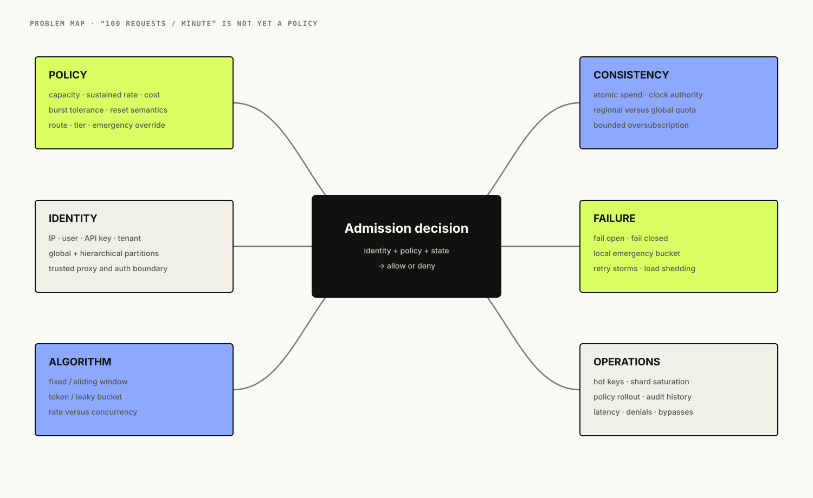
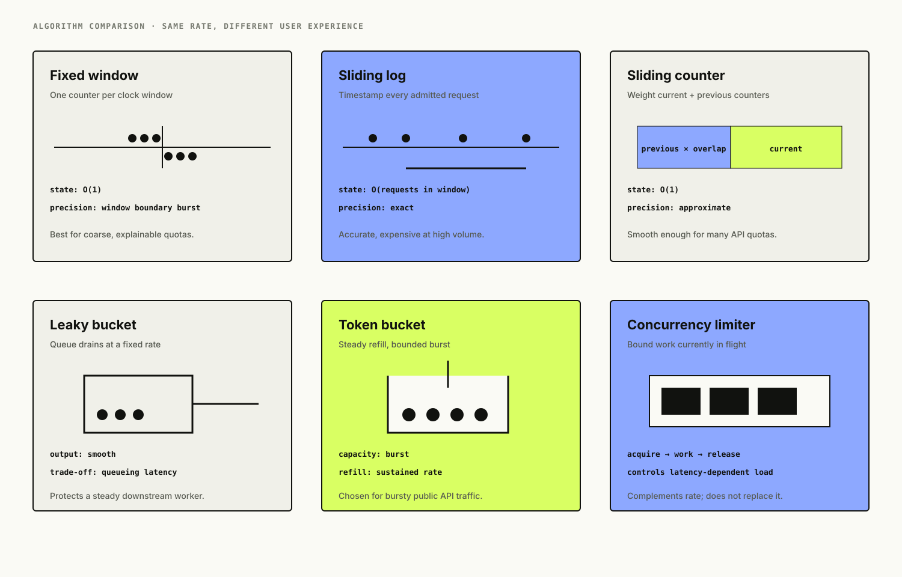
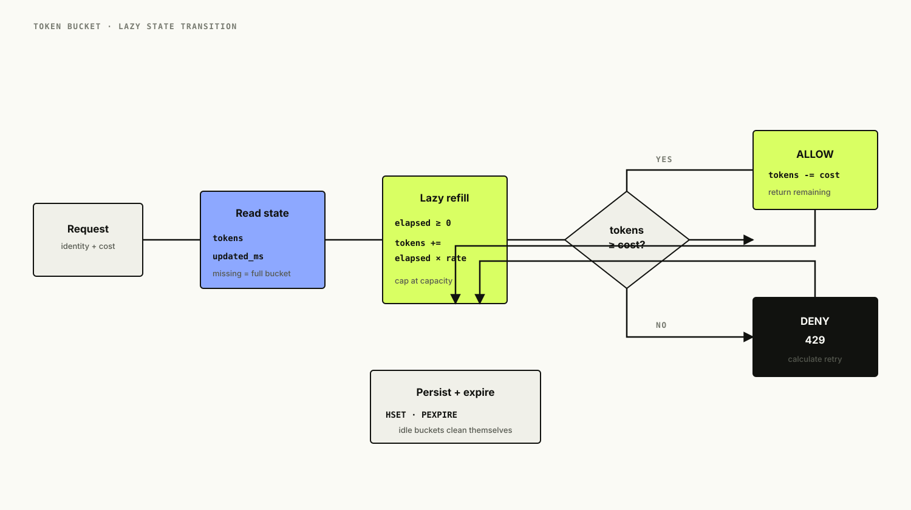
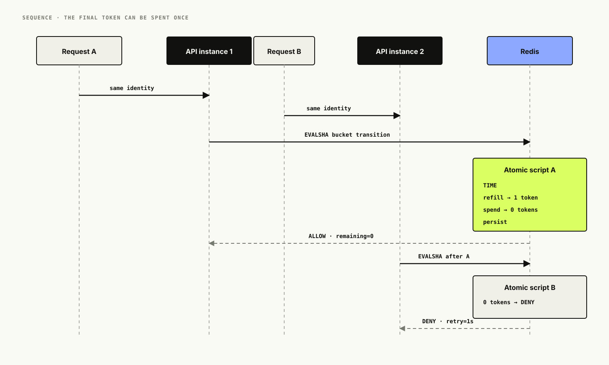
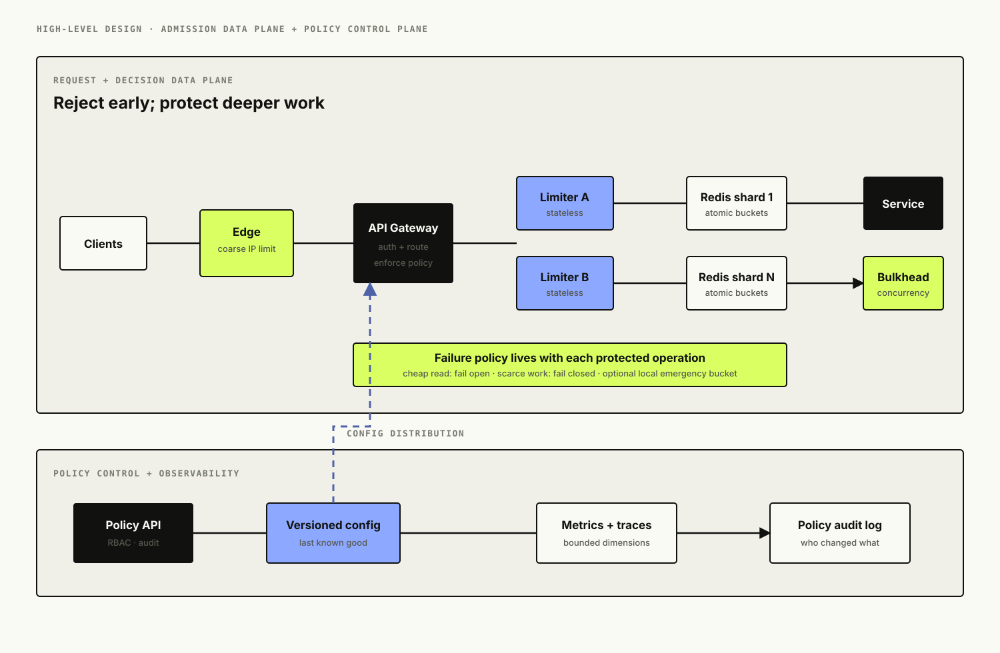
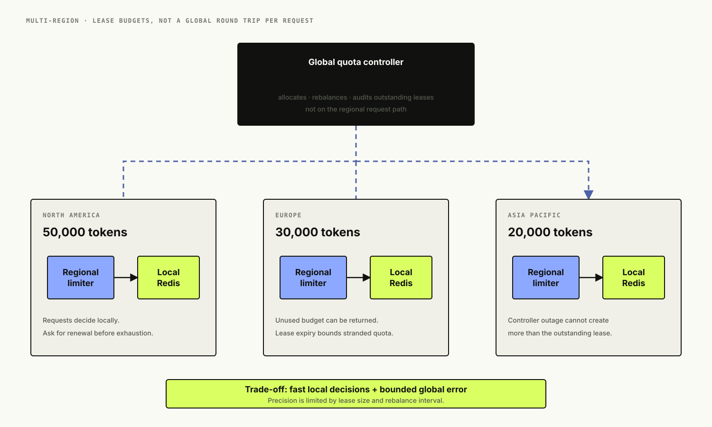

# Designing a Distributed Rate Limiter: Correct Quotas Across Many Servers

*A rate limiter stops being a counter the moment two servers must agree. This design starts with one process, exposes the races, moves the decision into atomic Redis execution, and then asks the harder questions: whose clock wins, what happens when Redis fails, and how can a global quota work without a global round trip?*

“Allow 100 requests per minute” sounds precise. It is not.

Can all 100 arrive in the first second? Does the minute begin on the clock or on the user's first request? Are we limiting an IP address, user, API key, tenant, route, region, or all of them at once? Do failed requests consume quota? If the limiter is unavailable, should the application admit everything or reject everything? If one customer sends traffic through two regions, must both regions share exactly the same count?

Until those questions have answers, `100 requests/minute` is a slogan, not a policy.

<figure class="technical-figure wide-figure">
  <a href="assets/problem-map.svg" target="_blank" rel="noreferrer"></a>
  <figcaption>The counting algorithm is only one branch of the problem; identity, failure policy, and consistency often shape the architecture more.</figcaption>
</figure>

## Table of Contents

- Begin with the admission contract
- Estimate the decision workload
- Compare the algorithms honestly
- Choose a token bucket for the API
- See why local state fails
- Make the Redis decision atomic
- Let one clock own elapsed time
- Design partition keys and hierarchical quotas
- Put the limiter in the request path carefully
- Separate policy control from admission decisions
- Decide how failure behaves before it happens
- Handle hot keys and retry storms
- Take quotas across regions
- Communicate limits over HTTP
- Observe decisions without exploding cardinality
- Secure the limiter itself
- Keep the low-level design small
- Run the companion implementation
- What I would ship first
- Interview follow-ups
- References
- What comes next

## Begin With the Admission Contract

The interview prompt is: **Design a distributed rate limiter for a public API.**

We will support several policy shapes:

- per API key and route, such as 100 reads/second;
- per tenant, such as 10,000 requests/minute across all keys;
- a global emergency limit protecting one dependency;
- weighted requests, where an expensive report costs more quota units than a metadata read;
- short bursts above the sustained rate;
- explicit feedback when a request is denied.

The limiter should add less than 5 ms at p99 inside a region and remain available enough for the endpoint it protects. Decisions for one partition key must be atomic across every API instance in that region. Policy changes should propagate within seconds. We will start with regional enforcement and make the limitations of global quotas explicit.

A rate limiter is not a complete denial-of-service defense. A malicious client can ignore `429` and keep sending traffic, so network and edge protections still need to absorb connections before requests consume scarce application resources. The limiter is an admission-control layer, not a force field.

### What exactly consumes quota?

The cleanest default is to charge when the request is admitted, before business work begins. Refunding failed requests creates another distributed transaction and can encourage expensive invalid traffic. Some products need different semantics—billing APIs may distinguish validation failures from provider failures—but that should be deliberate.

Retries count unless the API has an idempotency contract that says otherwise. Even an idempotent retry consumes transport, parsing, authentication, and lookup capacity. Business idempotency does not make computation free.

## Estimate the Decision Workload

Assume the platform receives 100,000 API requests/second at peak. Each request evaluates a route-level policy and a tenant-level policy, so the limiter sees roughly 200,000 decisions/second. At 500 bytes of network traffic per decision across request, response, and protocol overhead, that is about 100 MB/second before replication.

The active state is much smaller than the request volume suggests. If ten million identities exist but only 500,000 are active during a bucket's expiry horizon, Redis stores only those active buckets. At roughly 150 bytes per hash plus key and allocator overhead, the state is measured in hundreds of megabytes rather than one row per historical request.

This contrast explains why we do not store every request timestamp for a high-throughput default policy. The decision rate is large; the useful state per active identity is tiny.

```text
peak API traffic       = 100,000 requests/second
policies per request   = 2
limiter decisions      = 200,000/second
active partitions      = 500,000
state per partition    ~= 150-300 bytes in practice
```

We also need a hot-key estimate. A tenant-wide quota can make every request for a large customer touch one Redis key. Horizontal partitioning spreads different tenants, not one giant tenant. That key may become the actual capacity boundary.

## Compare the Algorithms Honestly

There is no universally correct algorithm. Each one defines a different product experience.

### Fixed window counter

Store a count for `identity + floor(now/window)`, increment it, and expire the key. It is cheap and understandable, but a client can send the full allowance at the end of one window and again at the start of the next. A nominal 100/minute policy can admit 200 requests across a tiny boundary.

Fixed windows are still useful for coarse daily quotas, where boundary bursts are acceptable and billing-style explainability matters more than smoothness.

### Sliding log

Store every admitted timestamp in a sorted set, remove entries older than the window, count the remainder, and append the new timestamp if allowed. This is precise but memory and work grow with request volume. One million admitted requests in a window means roughly one million entries to retain and prune.

### Sliding window counter

Keep the current and previous fixed-window counts, then weight the previous count by how much of that window overlaps the current sliding interval. It uses constant state and smooths the boundary, but it is an approximation.

### Leaky bucket

Model a queue draining at a fixed rate. Traffic exits smoothly; when the queue is full, new work is rejected or delayed. This is useful when the downstream system needs a steady flow, but delaying requests means queueing, timeouts, cancellation, and backpressure become part of the design.

### Token bucket

Tokens refill at a steady rate up to a capacity. A request spends one or more tokens. The refill rate controls sustained throughput; capacity controls burst tolerance. If the bucket holds 20 tokens and refills five per second, an idle client may burst 20 requests immediately, then sustain five per second.

### Concurrency limiter

Rate and concurrency are different. Ten requests per second can still overload a dependency if each request takes ten seconds. A concurrency limiter controls in-flight work, often with a semaphore or lease, and releases capacity when work completes. Production systems commonly need both.

<figure class="technical-figure wide-figure">
  <a href="assets/algorithm-comparison.svg" target="_blank" rel="noreferrer"></a>
  <figcaption>Algorithms are policy choices: the same nominal rate produces different burst, memory, precision, and latency behavior.</figcaption>
</figure>

## Choose a Token Bucket for the API

We will use a token bucket because public API traffic is naturally bursty. Mobile clients reconnect, dashboards load several resources together, and batch jobs submit work in clumps. A strict smooth rate would punish normal behavior.

For each partition we store:

```text
tokens       current available quota units
updated_ms   time used for the last refill calculation
```

On every request:

```text
elapsed = max(0, now - updated_ms)
tokens  = min(capacity, tokens + elapsed * refill_rate)

if tokens >= cost:
    tokens -= cost
    allow
else:
    deny and calculate when enough tokens return
```

We do not need a background job adding tokens. Refill is lazy: compute what should have accumulated when the next request arrives. Idle buckets expire after enough time to refill completely, which bounds memory to active partitions.

The demo scales tokens by 1,000 and stores integers. Floating-point state inside a long-lived distributed quota can accumulate awkward rounding behavior. Integer “millitokens” give us fractional refill rates while keeping state deterministic.

<figure class="technical-figure wide-figure">
  <a href="assets/token-bucket-flow.svg" target="_blank" rel="noreferrer"></a>
  <figcaption>Refill is calculated on demand; capacity defines the burst, refill defines the sustained rate, and cost lets policies protect expensive operations.</figcaption>
</figure>

## See Why Local State Fails

One API process can keep a dictionary of counters. Add a second process and each one independently admits the full allowance. A 100-request quota quietly becomes 200. Autoscaling makes the error dynamic: adding capacity to the application also multiplies every local quota.

We could divide the limit by the number of instances, but instance counts change, traffic is uneven, and one process may be idle while another rejects requests. Sticky routing keeps one identity on one process until a process restarts, a load balancer rebalances, or multi-region traffic moves.

Distributed enforcement needs a shared authority—or an explicit scheme that allocates independent budgets. Inside one region, Redis is a practical shared authority because the state is small, the operation is simple, and latency is low.

## Make the Redis Decision Atomic

A naïve implementation performs separate commands:

```text
HGET tokens
HGET updated_ms
calculate refill
HSET tokens ...
HSET updated_ms ...
```

Two API instances can read the same token balance, both decide that one token is available, and both admit. Transactions do not help if the application reads outside the transaction and computes with stale state. Optimistic `WATCH` can detect contention and retry, but the hottest keys produce the most retries exactly when latency matters.

The companion service sends one Lua script to Redis. Redis executes the read, time lookup, refill, decision, update, and expiry as one atomic operation. The client receives `allowed`, `remaining`, `retry_after_ms`, and `reset_after_ms` in one round trip.

```lua
local state = redis.call('HMGET', KEYS[1], 'tokens', 'updated_ms')
local tokens = tonumber(state[1]) or capacity
local elapsed_ms = math.max(0, now_ms - updated_ms)
tokens = math.min(capacity, tokens + math.floor(elapsed_ms * refill / 1000))

if tokens >= cost then
  tokens = tokens - cost
  allowed = 1
end

redis.call('HSET', KEYS[1], 'tokens', tokens, 'updated_ms', now_ms)
redis.call('PEXPIRE', KEYS[1], ttl_ms)
```

Long-running scripts block other Redis work, so atomicity is not permission to do arbitrary computation. This script has bounded work and touches one key.

<figure class="technical-figure wide-figure">
  <a href="assets/atomic-decision-sequence.svg" target="_blank" rel="noreferrer"></a>
  <figcaption>Both servers may race to Redis, but the script serializes each bucket transition; the final token can be spent once.</figcaption>
</figure>

## Let One Clock Own Elapsed Time

If every API instance supplies its own timestamp, clock skew becomes quota. One server five seconds ahead can refill early; a server behind can move time backward. NTP reduces skew but does not make wall clocks perfectly monotonic across machines.

The Lua script calls Redis `TIME`, so the state transition and its clock share one authority. We still clamp negative elapsed time to zero because failover can move a bucket to a node whose wall clock is slightly behind. We never manufacture tokens from negative time.

For multi-primary or multi-region stores, “Redis time” is no longer one clock. That is one reason strict global token buckets are harder than regional ones.

## Design Partition Keys and Hierarchical Quotas

The partition key defines fairness. Useful dimensions include:

- API key for a programmatic client;
- authenticated user for a product limit;
- tenant for an organization-wide contract;
- source IP for unauthenticated abuse control;
- route or operation class;
- model, provider, or downstream dependency;
- region for an allocated regional budget.

Do not put raw API keys, emails, or full IP addresses into Redis keys or metric labels. The demo HMACs the identity and truncates the digest:

```text
rate-limit:v1:public-read:{a9f12d...}
```

The braces form a Redis Cluster hash tag, keeping one bucket's state in one slot. The HMAC prevents someone with keyspace access from trivially reading customer identifiers. Rotate the secret with a versioned key namespace rather than changing it silently and resetting every quota unpredictably.

Many requests need several limits: per-key, per-tenant, and global. Evaluating them sequentially can spend a token from the first bucket even when the second denies. One Lua script can atomically evaluate multiple keys only when they share a Redis Cluster slot, which global and per-tenant keys usually do not.

Options are to accept small conservative token loss, co-locate related keys, reserve from the broadest policy first, or build a more complex reservation/refund protocol. The right answer depends on whether quotas are abuse guardrails or financially exact entitlements.

## Put the Limiter in the Request Path Carefully

Enforce as early as possible, after enough identity is known to choose the correct policy:

```text
TLS / edge protection
  -> coarse IP limiter
  -> authentication
  -> tenant + route limiter
  -> application
  -> downstream concurrency guard
```

An API gateway is a natural enforcement point for policies shared across services. Service-local enforcement is better when cost depends on domain information the gateway does not have. Large systems often use both: a global external rate-limit service at the gateway and local bulkheads around fragile dependencies.

The limiter must have a strict timeout smaller than the protected request's latency budget. A 100 ms limiter timeout on a 50 ms API is not graceful degradation.

## Separate Policy Control From Admission Decisions

The data plane answers a tiny question at high volume: is this request allowed? The control plane manages policy definitions, tenant plans, route mappings, emergency overrides, rollout, and audit history.

Policy configuration should be versioned and distributed to limiter instances or gateways. The hot path should use last-known-good policy if the control plane disappears. An unavailable admin API must not erase every quota or stop every request.

<figure class="technical-figure wide-figure">
  <a href="assets/distributed-rate-limiter-hld.svg" target="_blank" rel="noreferrer"></a>
  <figcaption>The data plane makes low-latency decisions from cached policy and Redis state; the control plane can fail without removing the last-known-good policy.</figcaption>
</figure>

## Decide How Failure Behaves Before It Happens

When Redis is unavailable, there is no universally safe default.

### Fail open

Allow the request and expose that enforcement was bypassed. This protects availability for cheap reads or endpoints with downstream safeguards, but an outage removes the quota precisely when traffic may be unstable.

### Fail closed

Reject with `503 Service Unavailable`, not `429`, because the client did not exhaust a known quota—the authority failed. This protects expensive jobs, scarce third-party quotas, payments, or GPU work, but limiter availability now bounds endpoint availability.

### Local emergency limiter

Fall back to a conservative in-process bucket. It cannot enforce a precise distributed quota, but it can prevent unlimited traffic. If there are 20 instances, each might receive 1/20 of a conservative emergency budget. Autoscaling and uneven traffic still make this approximate.

### Stale decisions are not enough

Caching an “allowed” result and reusing it is usually unsafe because admission consumes state. Cached policy is fine; cached decisions are not. A small preallocated token lease is different: the shared authority grants a process a bounded batch of tokens, and the process spends them locally. That reduces Redis traffic at the price of bounded oversubscription and more complicated recovery.

The demo makes failure policy part of `RateLimitPolicy`. `/public-data` fails open; `/expensive-report` fails closed. Hiding this decision in a generic exception handler would make the architecture dishonest.

## Handle Hot Keys and Retry Storms

A single global key puts all traffic on one Redis shard. Even a tenant key can be hot enough to dominate its slot. Solutions include:

- hierarchical limits that keep most decisions on per-key partitions;
- allocated token leases to gateway instances;
- sharded counters with bounded error for coarse global limits;
- a dedicated limiter cluster separate from unrelated caches;
- local concurrency protection even after admission;
- adaptive limits based on downstream saturation.

Denials can create synchronized retries. `Retry-After: 1` may cause thousands of clients to return one second later. Client guidance should include exponential backoff and jitter, and the server may vary retry windows. Rate limiting without retry design can turn a smooth overload into a pulse generator.

## Take Quotas Across Regions

A strongly consistent global token bucket requires a coordination round trip to one authority or consensus group. That adds inter-region latency and makes a remote dependency part of every request. Most APIs do not need that precision.

Three common designs are:

### Home-region routing

Assign each identity to a home region and route its checks there. Precision is good, but users far from home pay network latency, and regional failover needs state recovery.

### Regional budget allocation

The control plane divides a global quota into regional budgets—perhaps 50% North America, 30% Europe, 20% Asia—and periodically rebalances unused capacity. Decisions remain local and fast. The quota may be temporarily underutilized in one region or oversubscribed during delayed reallocation, but the error is bounded by allocated leases.

### Eventually merged counters

Each region admits against local state and merges usage asynchronously. Availability is excellent; strict global limits are not. This can work for abuse controls with a safety margin, but not for a hard contractual entitlement.

<figure class="technical-figure wide-figure">
  <a href="assets/multi-region-budgeting.svg" target="_blank" rel="noreferrer"></a>
  <figcaption>Regional leases replace a global request-time round trip with a bounded-consistency trade-off: local speed, explicit oversubscription limits, and periodic rebalance.</figcaption>
</figure>

For a 100,000-request global allowance, the controller might lease 50,000, 30,000, and 20,000 tokens. A region requests more before it runs out. If the controller is unavailable, regions can spend only their remaining lease. The maximum uncoordinated spend is bounded by outstanding leases rather than unlimited.

## Communicate Limits Over HTTP

When a client exceeds a policy, return `429 Too Many Requests` with a body explaining which policy was hit and a `Retry-After` value in seconds or as an HTTP date. RFC 6585 says `429` responses may carry `Retry-After` and must not be cached.

```http
HTTP/1.1 429 Too Many Requests
Retry-After: 1
RateLimit-Policy: "public-read";q=20;w=4
RateLimit: "public-read";r=0;t=1
Content-Type: application/json

{"detail":"rate limit exceeded"}
```

As of this article, `RateLimit-Policy` and `RateLimit` are defined by an active IETF Internet-Draft, not a finalized RFC. Earlier drafts and many production APIs use different `RateLimit-*` or `X-RateLimit-*` fields. Treat headers as a versioned API contract and follow the current draft's evolution rather than claiming universal interoperability.

`Retry-After` takes precedence when it appears. A client should still add jitter and should not interpret “one token remains” as a guarantee that the next request will succeed; another concurrent request may spend it first.

## Observe Decisions Without Exploding Cardinality

Measure:

- allowed, denied, failed-open, and failed-closed decisions by policy and region;
- decision latency and Redis command latency;
- active bucket count, memory, evictions, and script errors;
- denied-request ratio by route and tenant tier—not raw tenant ID;
- Redis shard CPU, network, replication lag, and hot-key concentration;
- policy version and propagation lag;
- downstream saturation before and after limiting;
- regional lease utilization and rebalance frequency.

Do not put identity hashes in metric labels. Even anonymized high-cardinality values create unbounded time series. Sample traces can carry a policy name, decision, cost, and Redis shard. Structured audit logs record policy changes. Privacy-preserving per-tenant investigation belongs in a controlled log or analytics system, not Prometheus labels.

Alerting only on `429` volume is misleading. A product launch can produce legitimate denials; a broken Redis cluster can produce none because every endpoint failed open. Alert on the enforcement state and the protected resource, not just the response code.

## Secure the Limiter Itself

Trust identity only after the component that authenticates it. Never accept a caller-supplied `X-Tenant-ID` from the public internet without the gateway replacing it. Parse `X-Forwarded-For` only from trusted proxies; otherwise clients can rotate the value themselves.

The policy control plane needs authentication, authorization, audit logs, and guarded rollouts. Raising a customer's quota can be a financially or operationally sensitive action. Redis should be on a private network with authentication, encryption where appropriate, command restrictions, and a dedicated workload boundary.

Rate-limit responses can leak policy details that help attackers tune traffic. Public APIs often expose useful client feedback; sensitive internal controls may return less detail. Security and developer experience pull in different directions.

## Keep the Low-Level Design Small

The implementation has four useful concepts:

```python
@dataclass(frozen=True)
class RateLimitPolicy:
    name: str
    capacity: int
    refill_per_second: float
    cost: int = 1
    fail_open: bool = False

class RedisTokenBucket:
    async def allow(identity, policy) -> RateLimitDecision: ...

class RateLimitDecision:
    def headers(self) -> dict[str, str]: ...
```

`RateLimitPolicy` owns configuration, `RedisTokenBucket` owns the atomic adapter, and `RateLimitDecision` owns protocol feedback. A dependency wrapper chooses identity and failure behavior for each endpoint.

The pure `TokenBucketModel` mirrors the Lua state machine for deterministic tests. That gives us fast boundary tests without pretending they replace a Redis integration test. In production, run the same scenarios against the deployed script and compare decisions to the reference model.

## Run the Companion Implementation

The [`code/`](code/) directory contains:

- FastAPI endpoints with different risk profiles;
- an atomic Redis Lua token bucket using Redis server time;
- integer-scaled quota units and weighted request cost;
- HMAC partition keys and Redis Cluster hash tags;
- explicit fail-open and fail-closed behavior;
- `429`, `503`, `Retry-After`, and draft `RateLimit` fields;
- Prometheus decision and latency metrics;
- deterministic unit tests and a k6 burst test;
- Docker Compose for the API and Redis.

Start it:

```bash
cd blogs/03-distributed-rate-limiter/code
docker compose up --build
```

Then exhaust the small expensive-operation burst:

```bash
for i in 1 2 3 4; do
  curl -i -X POST http://localhost:8000/expensive-report \
    -H 'X-API-Key: customer-123'
done
```

The fourth immediate request returns `429`; quota returns gradually at 0.2 tokens/second.

## What I Would Ship First

I would enforce coarse unauthenticated limits at the edge, authenticate at the gateway, and apply per-key plus per-tenant token buckets through a dedicated regional Redis deployment. Policy configuration would be versioned and cached locally. Cheap reads would fail open behind a conservative local emergency limiter; expensive writes would fail closed. Every denial would include `Retry-After`, and SDKs would use exponential backoff with jitter.

I would not begin with exact global counters. I would begin with regional quotas and measure how often identities are genuinely active in multiple regions. If a contractual global limit became necessary, I would choose home-region routing for precision or bounded regional leases for lower latency.

The important design is not “Redis plus Lua.” It is knowing exactly what approximation the business can tolerate when coordination, latency, and availability disagree.

## Interview Follow-Ups

### Why not just use `INCR` and `EXPIRE`?

It implements a fixed window, and separate commands can leave a key without expiry if the process fails between them. A Lua script makes increment and expiry atomic, but fixed-window boundary bursts still remain.

### Why token bucket instead of sliding window?

The product wants controlled bursts and constant state per active identity. Sliding logs give exact windows at higher memory cost; sliding counters provide smoother approximate windows. The policy should choose the algorithm.

### What happens when two servers spend the last token?

Both invoke the same Redis script. Redis serializes script execution, so one transition spends the token and the next sees the updated balance and denies.

### Why use Redis time?

It prevents skew among API-instance clocks from creating or delaying tokens. Failover can still move to a slightly different wall clock, so elapsed time is clamped at zero.

### How do you apply both tenant and user limits?

Evaluate both policies and deny if either fails. Sequential checks may conservatively spend one bucket before the other denies. Exact atomic multi-key admission requires co-location or a more complex reservation protocol.

### What if Redis fails?

Choose per endpoint. Fail open for cheap, non-destructive traffic with downstream protection; fail closed with `503` for scarce or expensive work; optionally apply a conservative local emergency bucket.

### How do you prevent a global key from becoming hot?

Avoid one request-time global counter when possible. Use hierarchical limits, preallocated leases, sharded approximate counters, or adaptive local controls. A dedicated Redis shard cannot scale one key indefinitely.

### How do you change policies safely?

Version policy, distribute it through a control plane, canary changes, preserve last-known-good config, audit mutations, and expose policy-version metrics. Decide whether new capacity applies immediately to existing buckets or only after reset.

## References

1. [RFC 6585 — Additional HTTP Status Codes (`429 Too Many Requests`)](https://www.rfc-editor.org/rfc/rfc6585.html#section-4)
2. [RFC 9110 — `Retry-After`](https://www.rfc-editor.org/rfc/rfc9110.html#section-10.2.3)
3. [IETF HTTPAPI Working Group — RateLimit header fields for HTTP, active Internet-Draft](https://datatracker.ietf.org/doc/draft-ietf-httpapi-ratelimit-headers/)
4. [Redis documentation — Rate limiter use case](https://redis.io/docs/latest/develop/use-cases/rate-limiter/)
5. [Redis documentation — Token bucket with Redis and Lua](https://redis.io/docs/latest/develop/use-cases/rate-limiter/python/)
6. [Redis documentation — Scripting with Lua](https://redis.io/docs/latest/develop/programmability/eval-intro/)
7. [Redis command documentation — `TIME`](https://redis.io/docs/latest/commands/time/)
8. [Redis command documentation — `INCR` rate-limiter patterns](https://redis.io/docs/latest/commands/incr/)
9. [Envoy documentation — HTTP global rate-limit filter](https://www.envoyproxy.io/docs/envoy/latest/configuration/http/http_filters/rate_limit_filter)
10. [NGINX documentation — `ngx_http_limit_req_module`](https://nginx.org/en/docs/http/ngx_http_limit_req_module.html)
11. [Google SRE Workbook — Handling Overload](https://sre.google/workbook/handling-overload/)
12. [AWS Builders' Library — Timeouts, retries, and backoff with jitter](https://aws.amazon.com/builders-library/timeouts-retries-and-backoff-with-jitter/)

## What Comes Next

Next we will design a notification platform. Rate limiting reappears immediately—provider quotas, tenant fairness, and retry storms—but the center of the problem shifts to asynchronous delivery, idempotency, fallback providers, backpressure, and dead letters.

---

[← Previous: URL Shortener](../02-url-shortener/) · [Back to the series introduction](../01-introduction/) · [Browse the companion code](code/)
