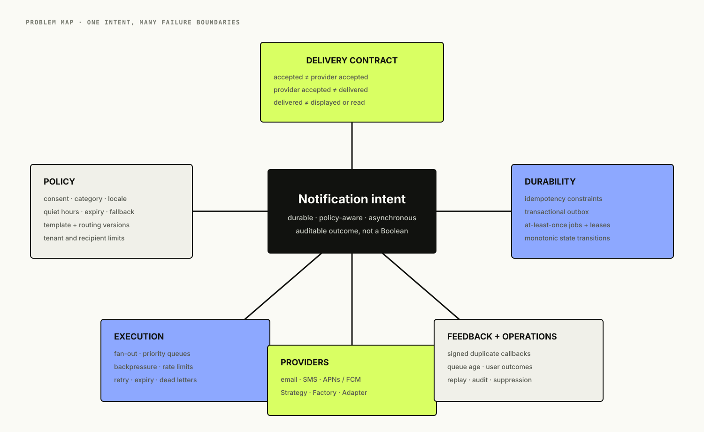
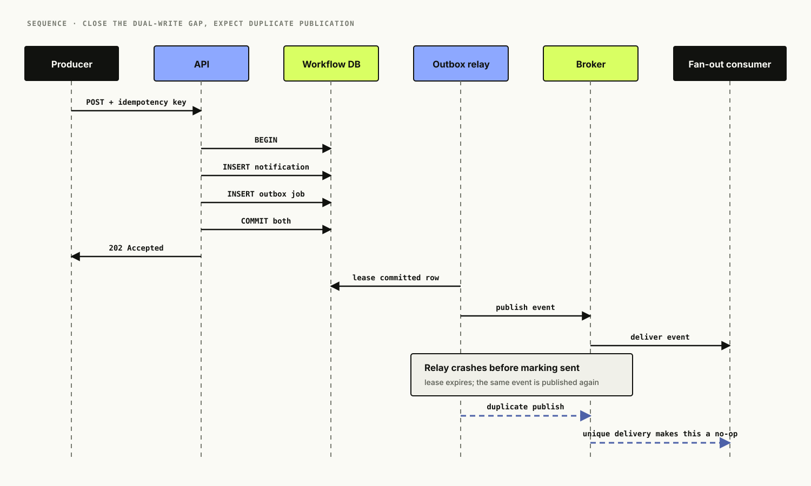
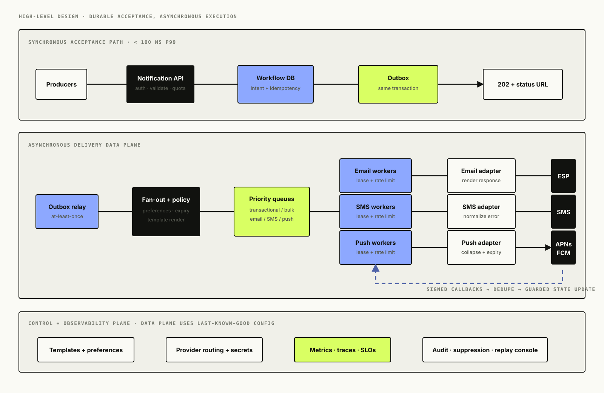
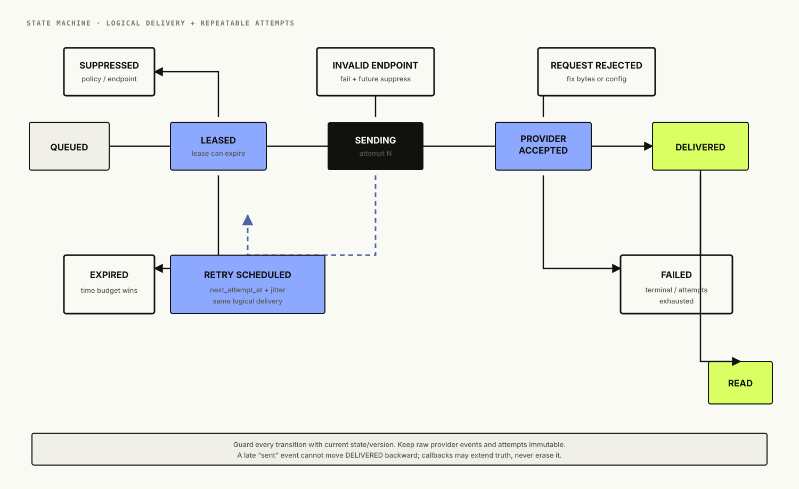
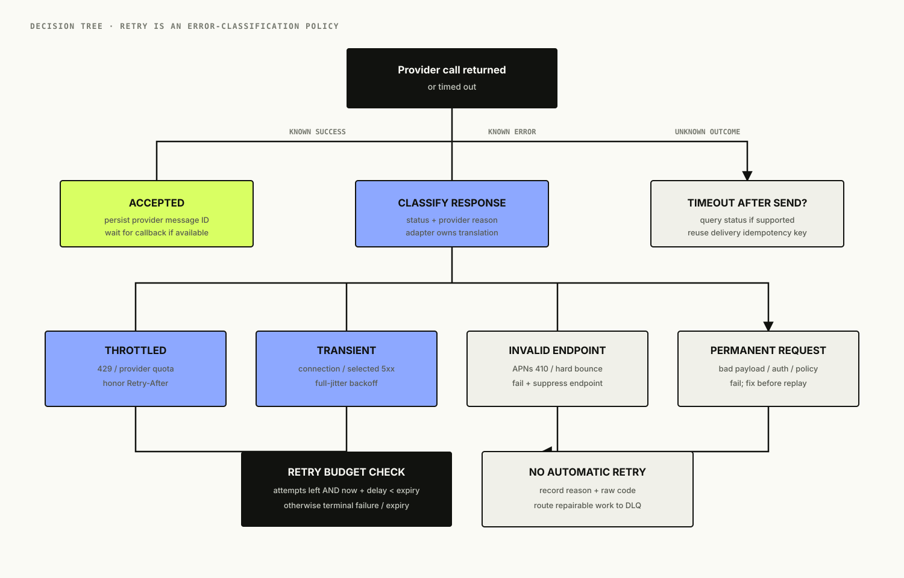
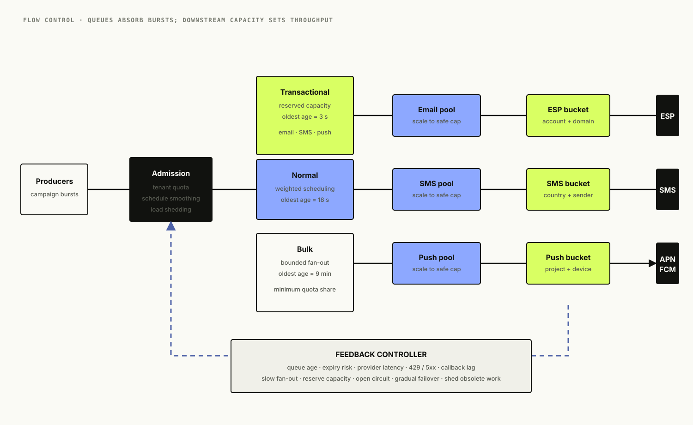

# Designing a Notification Platform: Durable Intent, At-Least-Once Delivery, and Provider Reality

*A notification platform is not an email API with two more channels. It is a durable workflow that accepts intent, applies policy, fans out work, survives duplicate execution, absorbs provider outages, and tells the truth about what “delivered” actually means.*

“Send this user a notification” sounds like one function call:

```python
send(user_id, message)
```

That call hides almost every difficult part. Which channel is allowed? Which address or device token is current? Is the user asleep? Is this a password reset that must bypass quiet hours, or a marketing campaign that must not? What happens if the database commits but the queue publish fails? What if the worker times out after the provider accepted the message? Can a callback arrive twice, or before the API response is stored? Does `200 OK` from a push provider mean the device displayed anything?

The useful system-design problem is not moving text from A to B. It is preserving a notification's meaning while unreliable components execute it more than once and external providers report only partial truth.

<figure class="technical-figure wide-figure">
  <a href="assets/problem-map.svg" target="_blank" rel="noreferrer"></a>
  <figcaption>The payload is the easy branch; durable acceptance, policy, retry semantics, and provider feedback define the platform.</figcaption>
</figure>

## Table of Contents

- Start with the delivery contract
- Estimate fan-out rather than API traffic
- Design an asynchronous API
- Make idempotency a data constraint
- Eliminate the database-and-queue dual write
- Build the high-level architecture
- Resolve preferences before fan-out
- Keep templates versioned and deterministic
- Partition queues by operational behavior
- Model delivery as a monotonic state machine
- Retry only what can succeed later
- Hide providers behind channel adapters
- Treat callbacks as untrusted, duplicate events
- Apply backpressure before queues become outages
- Make dead letters repairable
- Be honest about exactly-once delivery
- Take the platform across regions
- Observe user outcomes, not worker activity
- Protect sensitive data and communication rights
- Keep the low-level design explicit
- Run the companion implementation
- What I would ship first
- Interview follow-ups
- References
- What comes next

## Start With the Delivery Contract

The interview prompt is: **Design a multi-channel notification platform for email, SMS, and mobile push.**

We will support transactional notifications such as password resets and payment receipts, plus lower-priority product updates. Producers submit one logical intent; the platform chooses eligible channels, renders content, sends through external providers, ingests delivery feedback, and exposes status.

The first design decision is vocabulary:

- **Accepted** means the platform durably stored the intent and owns the remaining work.
- **Queued** means a channel delivery is eligible for asynchronous processing.
- **Provider accepted** means the provider acknowledged the request. It does not prove end-user delivery.
- **Delivered** means the strongest positive signal available from that channel, such as a carrier delivery receipt or provider delivery event.
- **Read** is a separate, optional signal and often unavailable or disabled.
- **Failed** means a terminal error or an expired retry budget.
- **Suppressed** means policy intentionally prevented a send: opt-out, quiet hours, invalid endpoint, deduplication, or another rule.

Apple says APNs makes every effort to deliver and may store or coalesce notifications. Twilio exposes separate `sent`, `delivered`, `failed`, and `undelivered` states. Email delivery-status notifications can represent delayed, failed, or successful transfer, but successful transfer still does not prove a human read the message. Our API must not collapse those different facts into a dishonest Boolean.

### Functional requirements

1. Accept one notification intent with an idempotency key.
2. Resolve recipient endpoints and channel preferences.
3. Render a versioned template for each eligible channel and locale.
4. Schedule immediate or future delivery with an expiry time.
5. Prioritize critical transactional work over bulk traffic.
6. Retry transient failures without retrying permanent ones.
7. Ingest provider callbacks idempotently and expose delivery status.
8. Suppress opted-out, invalid, or duplicate destinations.

### Non-functional requirements

1. A successful API response must survive process or queue failure.
2. The API should return within 100 ms at p99 without waiting for a provider.
3. Critical notifications should begin an attempt within five seconds at p99.
4. One tenant, campaign, channel, or provider must not starve the others.
5. Every delivery transition must be auditable without retaining unnecessary message content.
6. Provider outages must create bounded backlog, not retry storms.

We are not promising exactly-once display on a person's device. We are promising durable intent, controlled at-least-once processing, and explicit outcome semantics.

## Estimate Fan-Out Rather Than API Traffic

Assume 100 million logical notification intents per day. An intent produces 1.4 channel deliveries on average after preferences and fallback rules. Traffic peaks at ten times the daily average, and each delivery produces two provider callbacks on average.

```text
logical intents/day       = 100,000,000
average intents/second    = 1,157
peak intents/second       = 11,570
deliveries per intent     = 1.4
peak delivery jobs/second = 16,200
callback events/day       = 280,000,000
average callbacks/second  = 3,241
```

At roughly 2 KB per logical intent, rendered metadata, delivery rows, and indexes, the operational store grows by about 200 GB/day before replication. Keeping full bodies forever would turn a workflow database into an expensive archive of sensitive content. Retain compact metadata and audit transitions according to product and regulatory needs; move long-term aggregates to analytical storage; expire rendered bodies quickly.

Capacity planning must also be per provider. Twenty thousand jobs per second in the platform do not help if one SMS sender can legally or operationally emit only a small fraction of that. The real bottleneck may be a country, sender pool, tenant contract, device, or provider quota.

## Design an Asynchronous API

The submission endpoint accepts responsibility; it does not wait for delivery:

```http
POST /v1/notifications
Authorization: Bearer <service-token>
Idempotency-Key: order-742-receipt-v1
Content-Type: application/json

{
  "recipient_id": "user_231",
  "template": "order-receipt",
  "template_version": 4,
  "channels": ["email", "push"],
  "data": {"order_id": "742", "total": "$38.50"},
  "priority": "transactional",
  "expires_at": "2026-08-10T03:00:00Z"
}
```

```http
HTTP/1.1 202 Accepted
Location: /v1/notifications/ntf_01K...

{
  "notification_id": "ntf_01K...",
  "status": "accepted"
}
```

`202` says processing has not completed. The caller can query the resource or consume a status event. A synchronous “send now” endpoint can exist for specialized internal workloads, but it should not be the default contract for a workflow crossing several providers.

The request includes a template identifier and structured variables, not arbitrary provider payloads. That lets the platform enforce content policy, localization, channel limits, and provider portability. It can still support a tightly controlled raw mode for advanced producers.

The idempotency key is scoped to the producer or tenant. Reusing a key with the same normalized request returns the original notification. Reusing it with a different request is a conflict, not an update.

## Make Idempotency a Data Constraint

Clients retry when responses time out. A load balancer may deliver the retry to another API process. Therefore “check whether the key exists, then insert” is a race.

Use a unique database constraint:

```sql
CREATE UNIQUE INDEX uq_notification_idempotency
ON notifications (tenant_id, idempotency_key);
```

Store a hash of the normalized request beside the key. On a uniqueness conflict, compare hashes. Matching input returns the existing identifier; different input returns `409 Conflict`.

Each channel delivery also has a stable identifier and a uniqueness rule such as `(notification_id, channel, endpoint_id)`. Worker retries reuse the same delivery identifier as the provider idempotency key when the provider supports one. Provider callbacks use their event ID or a stable hash as another deduplication key.

Idempotency exists at every boundary because duplicates can enter at every boundary:

```text
producer retry       -> notification idempotency key
fan-out retry        -> unique delivery identity
worker redelivery    -> delivery state + provider idempotency key
callback redelivery  -> unique provider event identity
manual replay        -> same delivery identity, new attempt record
```

An in-memory set is not sufficient. The deduplication record must live as long as the duplicate can plausibly arrive.

## Eliminate the Database-and-Queue Dual Write

A naïve API writes the notification to PostgreSQL and then publishes to a broker. Those are two independent commits:

- database commits, publish fails: the API accepted work that no worker sees;
- publish succeeds, database rolls back: workers receive work with no authoritative record;
- API times out between them: a caller retry may create another notification.

The transactional outbox pattern puts the notification and an outbox event in one database transaction. A relay later publishes committed outbox rows to the broker. If the relay crashes after publishing but before marking the row complete, it publishes again. That is acceptable because consumers are idempotent.

<figure class="technical-figure wide-figure">
  <a href="assets/transactional-outbox-sequence.svg" target="_blank" rel="noreferrer"></a>
  <figcaption>The database transaction closes the lost-event gap; duplicate publication remains possible and is handled deliberately.</figcaption>
</figure>

The relay can poll rows with `FOR UPDATE SKIP LOCKED`, stream changes through change data capture, or use a database-native integration. Ordering matters only within an ordering key. A password-reset cancellation should not be overtaken by the older send intent, but unrelated users do not need global order.

The companion implementation uses SQLite outbox jobs directly as a small durable queue so the pattern is visible without infrastructure. Production would normally separate the workflow database from a broker designed for higher throughput.

## Build the High-Level Architecture

Separate accepting intent from executing delivery:

<figure class="technical-figure wide-figure">
  <a href="assets/notification-platform-hld.svg" target="_blank" rel="noreferrer"></a>
  <figcaption>The synchronous path ends at durable acceptance; fan-out, provider calls, callbacks, and analytics remain asynchronous.</figcaption>
</figure>

The main components are:

- **Notification API:** authenticates producers, validates requests, enforces tenant quotas, and commits intent plus outbox.
- **Recipient and preference service:** resolves channel endpoints, consent, locale, quiet hours, and suppression lists.
- **Template service:** stores immutable versions and renders channel-specific content.
- **Fan-out service:** creates one delivery per eligible endpoint and channel.
- **Broker:** isolates bursty producers from workers and supports independent priority/channel scaling.
- **Channel workers:** lease jobs, enforce provider rate limits, call adapters, and schedule retries.
- **Provider adapters:** translate a canonical request into provider APIs and normalize responses.
- **Callback gateway:** verifies signatures, deduplicates events, and advances delivery state.
- **Status and analytics path:** serves operational state and exports aggregates outside the send path.

The control plane manages templates, providers, routing weights, credentials, tenant policies, and rollout. The data plane should continue sending with last-known-good configuration during a short control-plane outage.

## Resolve Preferences Before Fan-Out

A caller may request `email` and `push`, but the platform owns the final eligibility decision. It evaluates:

1. Does the recipient have a verified, active endpoint?
2. Has the recipient consented to this channel and notification category?
3. Is the message transactional, security-critical, or promotional?
4. Do quiet hours apply in the recipient's timezone?
5. Is this endpoint suppressed after a hard bounce, invalid token, or complaint?
6. Does the fallback policy say “email then SMS,” “all eligible,” or “first success”?

Take a snapshot of the relevant decision inputs or store a policy version. Without it, an operator cannot later explain why a message was suppressed or sent.

Preferences can race with queued work. A user may opt out after fan-out but before a worker sends. For marketing traffic, check suppression again immediately before provider submission. Security and legally required transactional traffic may follow different rules, which should be explicit policy—not a hard-coded bypass named `urgent`.

Quiet hours should schedule the delivery for the next eligible instant rather than making workers repeatedly retry. Expiry still wins: a “your driver has arrived” push delayed until morning should be dropped, not delivered late.

## Keep Templates Versioned and Deterministic

Template editing is a deployment. Store immutable versions with:

- subject/title and body per channel;
- allowed variables and schema;
- locale and fallback locale;
- provider-specific constraints;
- classification such as transactional or marketing;
- approval and audit metadata.

Render either during fan-out or immediately before sending. Early rendering gives a stable audit artifact and catches bad variables before queueing millions of jobs. Late rendering picks up fresh profile data but makes replay nondeterministic. A practical design pins the template version at acceptance and renders with the submitted data; dynamic values that must remain fresh are represented deliberately.

Never let a template silently execute arbitrary code. Use a restricted renderer, bound output size, escape channel-specific markup, and prevent producers from injecting headers, destinations, or unsubscribe URLs.

## Partition Queues by Operational Behavior

One global queue creates head-of-line blocking. A bulk email campaign can bury password-reset SMS messages, and an APNs outage can consume every worker with retries.

Partition first by behavior that needs independent scaling or failure isolation:

```text
transactional.email
transactional.sms
transactional.push
bulk.email
bulk.push
scheduled
callback-events
```

Then partition records by a stable key such as tenant or recipient when local order matters. Global order would destroy parallelism and rarely matches the product.

Priority queues require reserved capacity, not just labels. If high-priority workers can drain the entire provider quota forever, bulk work starves. Weighted scheduling—say 80% transactional, 20% bulk under load—keeps both classes moving while protecting the urgent SLO.

Per-tenant quotas prevent one campaign from filling every partition. Per-provider token buckets keep workers below external quotas. Per-recipient limits prevent loops from draining a battery or sending dozens of nearly identical messages.

## Model Delivery as a Monotonic State Machine

Delivery state is not “whatever the latest callback said.” Events can be delayed, duplicated, or reordered. Define valid transitions and retain every attempt separately.

<figure class="technical-figure wide-figure">
  <a href="assets/delivery-state-machine.svg" target="_blank" rel="noreferrer"></a>
  <figcaption>Attempts may repeat, but the logical delivery follows guarded transitions; a late `sent` callback cannot move `delivered` backward.</figcaption>
</figure>

A useful model separates the logical delivery from attempts:

```text
delivery
  id, notification_id, channel, endpoint_id
  state, next_attempt_at, expires_at
  provider, provider_message_id

delivery_attempt
  delivery_id, attempt_number
  started_at, finished_at
  provider_request_id, outcome, error_class
```

`sending` is a lease, not a terminal truth. If a worker dies, the lease expires and another worker may execute the delivery. Status transitions use a compare-and-set condition on the current version so two workers cannot both rewrite history.

State precedence protects against callback reordering. `delivered` may outrank `provider_accepted`; terminal invalid-endpoint failure may suppress future work; `read` may extend `delivered`. Do not assume a single universal state graph across channels—normalize common states while retaining raw provider details.

## Retry Only What Can Succeed Later

Retries are traffic. During an outage they can multiply load and extend the outage, so every provider response belongs to a deliberate class:

- **Success:** store provider identifiers and await callbacks if available.
- **Retryable:** timeout, connection failure, `429`, and selected `5xx` responses. Respect `Retry-After`, then use exponential backoff with full jitter.
- **Terminal endpoint:** invalid APNs token, hard email bounce, invalid destination. Fail this delivery and suppress the endpoint.
- **Terminal request:** malformed content, oversized payload, unauthorized sender, policy violation. Fix the producer or configuration; retrying the same bytes is waste.
- **Unknown outcome:** timeout after the request may have reached the provider. Query provider status if possible; otherwise retry with the same idempotency key and accept that some providers can still duplicate.

<figure class="technical-figure wide-figure">
  <a href="assets/retry-decision-tree.svg" target="_blank" rel="noreferrer"></a>
  <figcaption>A retry policy begins with error classification; exponential backoff cannot repair a bad token or malformed payload.</figcaption>
</figure>

Full-jitter delay can be calculated as:

```text
cap     = min(max_delay, base_delay * 2^attempt)
delay   = random(0, cap)
send_at = max(now + delay, provider_retry_after)
```

Every delivery also has a maximum attempt count and an expiry. Whichever arrives first stops retries. A one-time password that expires in five minutes must not sit in a retry queue for an hour.

Provider guidance differs. FCM says not to retry most `400`-series errors, to honor `Retry-After` on `429`, and to use backoff for server failures. APNs marks inactive device tokens with `410` and identifies errors that should not be retried. The adapter translates those channel-specific rules into the platform's normalized outcome.

## Hide Providers Behind Channel Adapters

The core worker should not contain a growing chain of `if provider == ...`. Use three related patterns:

- **Strategy:** the routing policy chooses a provider according to channel, geography, tenant, health, cost, and capability.
- **Factory:** configuration constructs the appropriate adapter with credentials and timeouts.
- **Adapter:** each provider translates the canonical request and response into normalized platform types.

```python
class ProviderAdapter(Protocol):
    def send(self, request: ProviderRequest) -> ProviderResult: ...

adapter = provider_factory.for_delivery(delivery)
result = adapter.send(request.with_idempotency_key(delivery.id))
```

Routing changes should be versioned and observable. Sudden failover of all traffic to a backup can overload it, violate geographic policy, change sender identity, or destroy deliverability reputation. Shift gradually with health gates and independent rate limits.

Provider acceptance IDs must be persisted before acknowledging queue work. Credentials belong in a secret manager and should be scoped per environment and tenant where isolation requires it.

## Treat Callbacks as Untrusted, Duplicate Events

Providers send delivery receipts through public webhooks. The callback gateway should:

1. preserve the raw body needed for signature verification;
2. verify signature, timestamp, and expected provider/account;
3. reject stale replay windows where the provider protocol supports timestamps;
4. deduplicate the provider event ID with a unique constraint;
5. enqueue the verified event quickly;
6. process state transitions asynchronously and idempotently.

SendGrid signs its Event Webhook and warns that parsing or transforming raw bytes before verification can break validation. Twilio status callbacks carry state and error codes. A callback endpoint should return promptly; doing expensive joins or analytics before responding invites provider retries and duplicate events.

Unknown provider message IDs should be quarantined rather than silently discarded. They can indicate delayed replication, configuration mistakes, cross-environment credentials, or forged traffic.

## Apply Backpressure Before Queues Become Outages

Queues absorb bursts; they do not create capacity. If producers enqueue 20,000 SMS deliveries per second and the legal/provider send rate is 2,000, backlog grows by 18,000 every second.

<figure class="technical-figure wide-figure">
  <a href="assets/fanout-backpressure.svg" target="_blank" rel="noreferrer"></a>
  <figcaption>Capacity is constrained at several levels; backlog age and expiry determine when to slow producers, degrade channels, or shed obsolete work.</figcaption>
</figure>

Track the age of the oldest eligible message, not only queue depth. Ten million scheduled messages for next week are less urgent than 5,000 password resets already two minutes late.

Backpressure actions form a ladder:

1. smooth scheduled and bulk fan-out before predictable campaign times;
2. cap per-tenant and per-campaign admission;
3. reserve worker and provider quota for transactional classes;
4. pause an unhealthy provider partition with a circuit breaker;
5. route eligible traffic gradually to a backup provider;
6. drop expired or superseded notifications;
7. reject new low-priority intents with an explicit retryable response.

Autoscaling workers helps only until provider rate limits, database writes, or callback capacity become the bottleneck. Scale from queue age and service time, with a ceiling tied to downstream capacity.

## Make Dead Letters Repairable

A dead-letter queue is not a graveyard. Every dead-letter record needs:

- delivery and tenant identifiers;
- original immutable request reference;
- attempt history and normalized error class;
- last provider response, redacted where necessary;
- template, policy, and routing versions;
- first/last failure times and expiry;
- a replay reason and operator identity when reprocessed.

Separate poison messages from outage exhaustion. A malformed template should be fixed before replay. A provider outage may justify a bounded bulk replay after recovery. Replays must reuse logical delivery IDs so they do not bypass idempotency or create a new user-visible send accidentally.

Alert on dead-letter arrival rate and age. A DLQ that grows quietly is data loss with better branding.

## Be Honest About Exactly-Once Delivery

At-least-once brokers can redeliver. A worker can call a provider successfully, crash before recording the response, and call again after its lease expires. No local transaction can atomically include an arbitrary external provider.

We can approach effective-once behavior:

- stable delivery ID sent as a provider idempotency key;
- provider status lookup after an unknown outcome;
- database uniqueness around fan-out and callbacks;
- monotonic state transitions;
- short lease plus bounded retry;
- content-level collapse keys for replaceable push notifications.

But when a provider lacks idempotency and status lookup, exactly-once visible delivery is impossible to guarantee. State the residual duplicate risk and design message content so a duplicate receipt is annoying rather than dangerous. Never put a non-idempotent financial action behind “click this notification” without its own protected API.

## Take the Platform Across Regions

The simplest reliable design gives each tenant or notification a home region. The API routes there, the workflow database is authoritative there, and provider calls originate there unless policy says otherwise. A second region can take over after replication and fencing.

Active-active writes for one notification create difficult conflicts: two regions may both fan out and send. If global API availability requires local acceptance, assign globally unique intent IDs and use deterministic ownership or a regional lease before side effects. Replicated uniqueness constraints are not always immediately global.

Provider credentials, sender identities, data-residency rules, and device endpoints may be regional. “Fail over to another region” is therefore a policy decision, not only a DNS change.

Callbacks can land in any healthy region. Route by provider message ID to the owner, or ingest globally and forward through an idempotent event stream. A delayed callback must still find state after failover.

## Observe User Outcomes, Not Worker Activity

Core metrics include:

- acceptance rate and API latency by tenant class;
- intent-to-first-attempt and intent-to-provider-accept latency;
- delivered, failed, suppressed, expired, and unknown-outcome rates;
- queue age by channel, priority, provider, and region;
- attempts per delivery and retry-delay distribution;
- provider latency, throttling, and error classes;
- invalid endpoint and opt-out rate;
- callback verification failures, duplicates, and lag;
- DLQ arrival rate, age, and replay outcome.

Bound metric dimensions. `tenant_tier=enterprise` is useful; `recipient_id=user_231` will bankrupt a time-series system and leak identity. Use structured logs and traces for individual delivery IDs with access controls and retention.

Trace the asynchronous chain with the notification and delivery IDs, but do not put message bodies, email addresses, phone numbers, or device tokens in span attributes. Synthetic canaries should exercise API acceptance, queues, provider sandboxes, callbacks, and status convergence.

The most meaningful SLO is not worker success. It is something like: “99.9% of eligible transactional deliveries reach provider-accepted within 30 seconds,” paired with channel-specific delivery outcome reporting.

## Protect Sensitive Data and Communication Rights

Recipient endpoints and message content are sensitive. Encrypt them at rest, use TLS to providers, restrict decryption to the sending path, redact logs, and set short retention. HMAC or tokenize endpoints used for deduplication rather than exposing raw addresses in keys.

Authenticate producers with narrow template and tenant permissions. A compromised internal service should not send arbitrary messages to every customer. Add per-producer quotas, anomaly detection, template allowlists, and audited emergency controls.

Consent is data, not a UI checkbox. Keep category- and channel-specific preference history, source, timestamp, and applicable jurisdiction. RFC 8058 defines one-click list unsubscribe for qualifying email and requires authenticated, hard-to-forge handling. Suppression changes should propagate to the send path quickly and remain durable.

Verify inbound webhook signatures before parsing where required, rotate provider secrets, isolate test and production accounts, and prevent server-side request forgery in any remotely configurable callback or media URL.

## Keep the Low-Level Design Explicit

The central entities are small:

```text
Notification 1 ─── N Delivery 1 ─── N DeliveryAttempt
      │                  │
      └── N OutboxJob    └── N ProviderEvent

Recipient 1 ─── N Endpoint
Recipient 1 ─── N Preference
Template  1 ─── N TemplateVersion
```

The worker owns one operation:

```text
lease eligible delivery
  -> re-check expiry and suppression
  -> load pinned template + endpoint
  -> choose adapter from routing policy
  -> spend provider quota
  -> create attempt
  -> send with stable idempotency key
  -> normalize result
  -> commit state + next job atomically
  -> acknowledge broker message
```

Keep policy evaluation, rendering, provider translation, and persistence behind interfaces. They change for different reasons and deserve independent tests.

The companion code demonstrates:

- SQLite transaction containing notification, deliveries, and outbox jobs;
- database-enforced API idempotency;
- Strategy/Factory/Adapter provider design;
- leased at-least-once jobs;
- exponential backoff with full jitter and expiry;
- HMAC-verified, deduplicated callbacks;
- guarded monotonic delivery transitions;
- a FastAPI submission and status API.

## Run the Companion Implementation

The runnable example lives in [`code/`](code/). It uses fake providers so failure modes are deterministic and no message leaves your machine.

```bash
cd blogs/04-notification-platform/code
python3.12 -m venv .venv
source .venv/bin/activate
pip install -e .
uvicorn app.main:app --reload
```

In another terminal, run one worker loop:

```bash
notification-worker --once
```

Submit a notification:

```bash
curl -i http://localhost:8000/v1/notifications \
  -H 'Content-Type: application/json' \
  -H 'X-Tenant-Id: demo' \
  -H 'Idempotency-Key: receipt-742' \
  -d '{
    "recipient_id": "user-231",
    "template": "order-receipt",
    "channels": ["email", "push"],
    "data": {"order_id": "742"},
    "priority": "transactional"
  }'
```

Endpoints containing `retry` cause one retryable failure; endpoints containing `invalid` produce a terminal endpoint error. See the code README for callback and Docker examples.

## What I Would Ship First

I would begin with one region, PostgreSQL, one durable broker, one provider per channel, immutable template versions, transactional outbox, strict producer idempotency, and separate transactional/bulk queues. Workers would use provider-specific adapters, bounded full-jitter retries, expiry, suppression rechecks, and a small state machine. Callbacks would be signed, deduplicated, and asynchronous.

I would not begin with active-active multi-region sends, dynamic cost optimization across five providers, arbitrary user-authored templates, or a universal workflow DSL. Those features enlarge the correctness surface before the platform has measured real traffic and provider failure modes.

The first production review would ask:

- Can an accepted notification disappear at every crash boundary?
- What happens if a provider accepts but the worker sees a timeout?
- Can bulk work delay a password reset?
- Can an opted-out user still be reached by queued marketing work?
- Can a duplicate or reordered callback move state backward?
- Can operators safely identify, repair, and replay failures?

If those answers are crisp, the platform is ready to grow.

## Interview Follow-Ups

**Why not call providers directly from the producer?**

It couples producer latency and availability to every provider, duplicates preference and retry logic across services, and cannot easily provide durable acceptance or centralized governance.

**Why both an outbox and a queue?**

The outbox atomically captures intent with the business write. The queue provides scalable buffering, consumer groups, and isolation. The relay between them is at-least-once, so consumers remain idempotent.

**How do you prevent duplicates?**

Unique producer idempotency keys, unique delivery identities, provider idempotency keys where available, deduplicated callback events, monotonic transitions, and bounded leases. A residual risk remains when an external provider cannot deduplicate an unknown-outcome retry.

**How do you support fallback from push to SMS?**

Represent fallback as a workflow policy with a timer and cancellation guard. Create the SMS delivery only if push has not reached the required state by the deadline, then use a compare-and-set so a late push callback and fallback timer cannot both win unnoticed.

**How do you send a campaign to 100 million users?**

Store the campaign definition, segment recipients in batches, checkpoint fan-out, smooth the schedule, enforce tenant/provider rates, and create compact per-recipient delivery work incrementally. Do not materialize and enqueue 100 million jobs in one transaction.

**Kafka or SQS?**

Either can work. Choose from ordering scope, replay needs, operational expertise, throughput, delay scheduling, and managed-service constraints. The correctness design—outbox, idempotent consumers, retry classification, and expiry—does not disappear with the broker choice.

**What belongs in a dead-letter queue?**

Work that exhausted attempts or cannot proceed automatically, with enough immutable context to diagnose and replay safely. Expected suppression and expired low-value notifications are normal terminal outcomes, not necessarily dead letters.

## References

1. [Amazon SQS at-least-once delivery](https://docs.aws.amazon.com/AWSSimpleQueueService/latest/SQSDeveloperGuide/standard-queues-at-least-once-delivery.html) — duplicate delivery and the requirement for idempotent consumers.
2. [Amazon SQS visibility timeout](https://docs.aws.amazon.com/AWSSimpleQueueService/latest/SQSDeveloperGuide/sqs-visibility-timeout.html) — in-flight leases, redelivery, and dead-letter handling.
3. [AWS Prescriptive Guidance: Transactional outbox pattern](https://docs.aws.amazon.com/prescriptive-guidance/latest/cloud-design-patterns/transactional-outbox.html) — resolving the database/message dual write and handling duplicate events.
4. [Amazon Builders' Library: Timeouts, retries, and backoff with jitter](https://aws.amazon.com/builders-library/timeouts-retries-and-backoff-with-jitter/) — retry amplification, bounded retries, and jitter.
5. [Firebase Cloud Messaging: Best practices at scale](https://firebase.google.com/docs/cloud-messaging/scale-fcm) — throttling, `Retry-After`, exponential backoff, jitter, and traffic smoothing.
6. [Firebase Cloud Messaging: Throttling and quotas](https://firebase.google.com/docs/cloud-messaging/throttling-and-quotas) — project, fan-out, and per-device limits.
7. [Apple: Setting up a remote notification server](https://developer.apple.com/documentation/usernotifications/setting-up-a-remote-notification-server) — APNs architecture and delivery behavior.
8. [Apple: Handling notification responses from APNs](https://developer.apple.com/documentation/usernotifications/handling-notification-responses-from-apns) — response classes, inactive tokens, throttling, and retry guidance.
9. [Twilio: Outbound message status in status callbacks](https://www.twilio.com/docs/messaging/guides/outbound-message-status-in-status-callbacks) — accepted, queued, sent, delivered, failed, and undelivered states.
10. [Twilio SendGrid: Event Webhook security](https://www.twilio.com/docs/sendgrid/for-developers/tracking-events/getting-started-event-webhook-security-features) — signed callbacks and raw-body verification.
11. [RFC 3464: Delivery Status Notifications](https://www.rfc-editor.org/rfc/rfc3464.html) — standard email delivery-status representation.
12. [RFC 8058: One-Click Unsubscribe](https://www.rfc-editor.org/rfc/rfc8058.html) — authenticated one-click list unsubscribe behavior.

## What Comes Next

Notifications tolerate asynchronous completion and mostly independent recipients. The next system adds continuous bidirectional connections, per-conversation order, online presence, offline synchronization, and millions of clients that may reconnect at once: **a chat system like WhatsApp**.

The permanent series map lives in **[the introduction](../01-introduction/)**.
