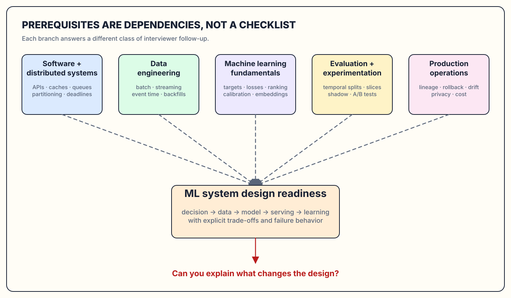
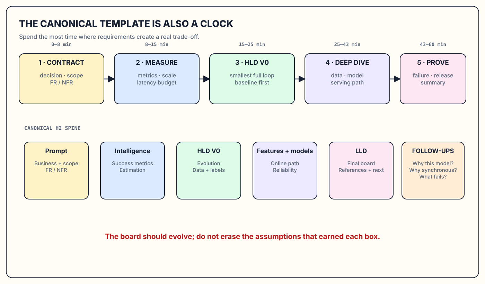
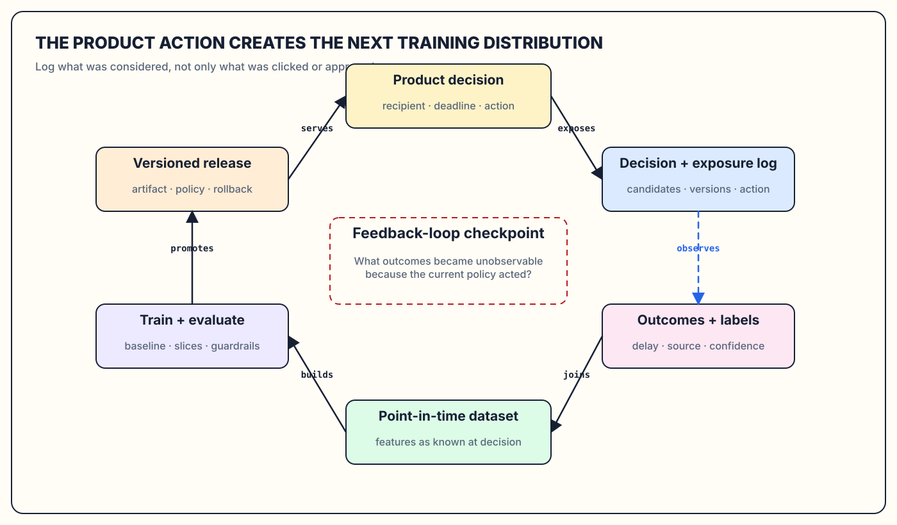
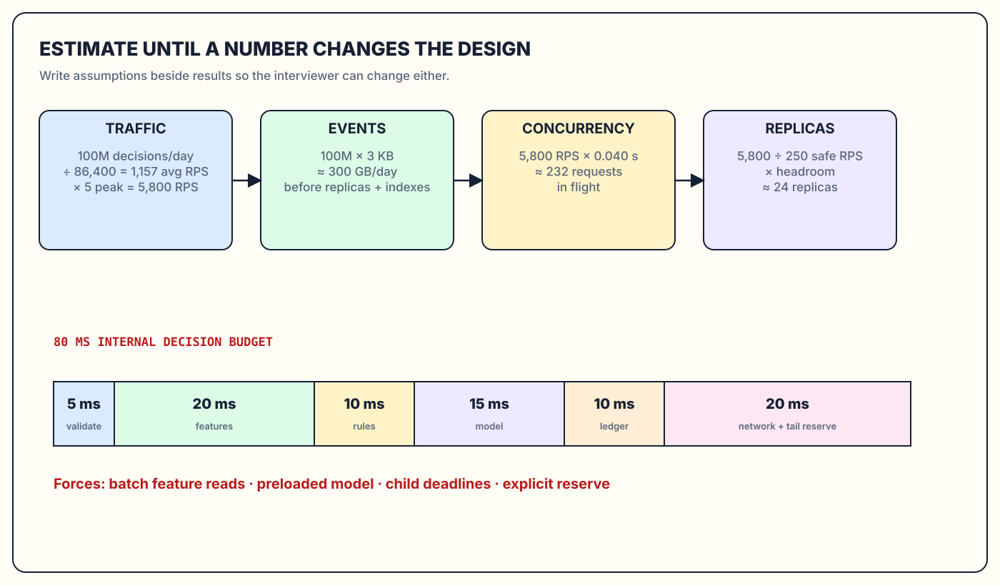
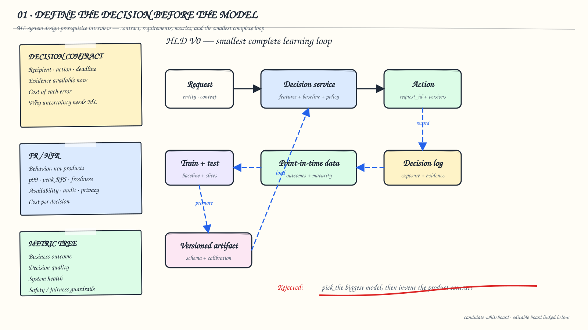
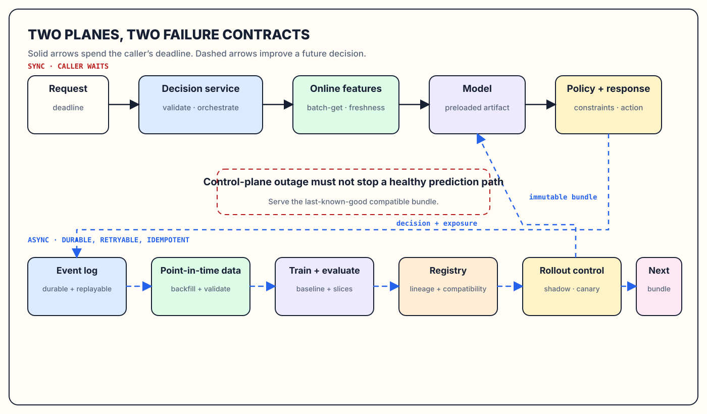
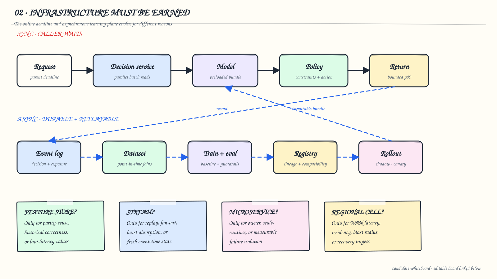
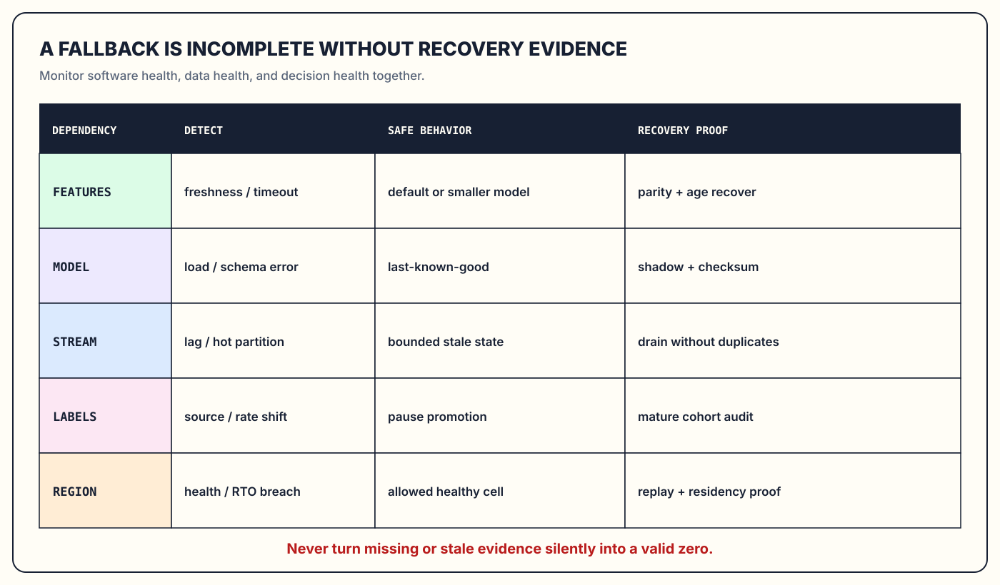
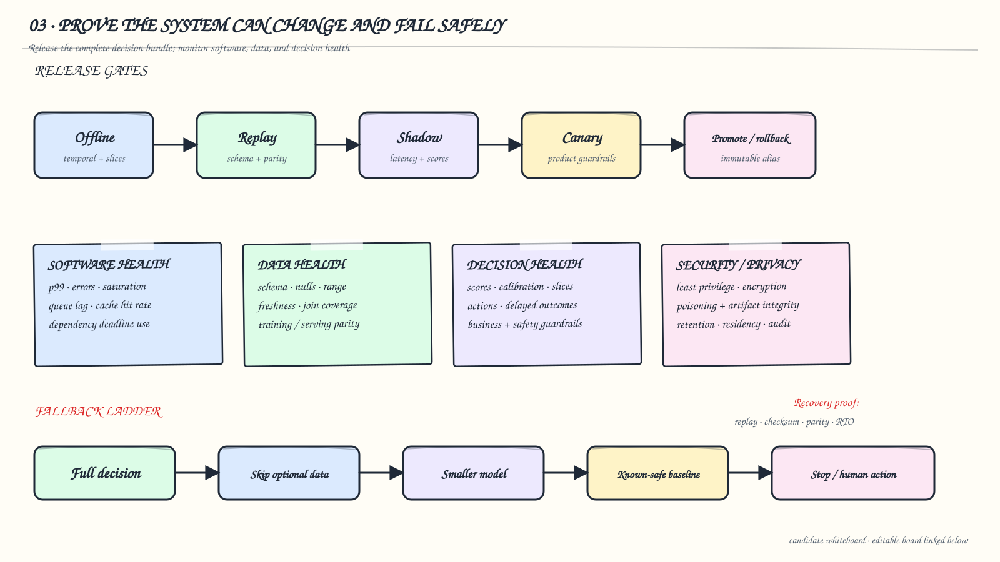

# ML System Design Prerequisites: The Interview Template Before the Case Studies

*A practical bridge from knowing machine learning and distributed systems separately to designing one production decision system under interview pressure.*

Recommendation, fraud detection, search ranking, content moderation, forecasting, and anomaly detection look like different interview questions. Underneath, they test the same ability: turn an ambiguous product decision into a measurable intelligence problem, connect historical data to an online or batch action, and keep that loop correct when labels arrive late, distributions move, dependencies fail, and traffic grows.

This blog is the bridge into the ML system-design part of the series. It explains the prerequisites worth learning, the canonical interview template used by every case study that follows, the diagrams to draw, the numbers to estimate, and the follow-up questions an interviewer is likely to ask. The goal is not to memorize a universal architecture. It is to build a repeatable reasoning process that tells you when a feature store, stream processor, model registry, vector index, GPU, microservice, or multi-region cell is actually justified.

<figure class="technical-figure wide-figure">
  <a href="assets/prerequisite-map.svg" target="_blank" rel="noreferrer"></a>
  <figcaption>Prerequisites are dependencies, not a reading list: each branch answers a different class of follow-up question. Original diagram for this blog; concept selection informed by the <a href="https://www.systemdesignhandbook.com/guides/ml-system-design/">System Design Handbook ML guide</a> and Google’s production ML guidance.</figcaption>
</figure>

## Table of Contents

- Interview Prompt
- Business Decision and Scope
- Functional Requirements
- Non-Functional Requirements
- Intelligence Problem
- Success Metrics
- Back-of-the-Envelope Estimation
- HLD V0
- Architecture Evolution
- Data and Labels
- Features and Models
- Online Serving and Critical Path
- Reliability, Security, Deployment, and Observability
- LLD and Implementation
- Final Whiteboard and Two-Minute Answer
- References
- What Comes Next

## Interview Prompt

### Recognize What the Interview Is Actually Testing

<aside class="interview-dialogue">
  <p><strong>Interviewer</strong> Before we start the case studies, how would you approach an ML system-design problem?</p>
  <p><strong>Candidate</strong> I would first identify the product decision, who receives it, when it must be made, and what happens if it is wrong. Then I would define measurable requirements and scale, state the intelligence problem and baseline, draw the smallest end-to-end learning loop, and evolve it only when a requirement breaks that version.</p>
  <p><strong>Interviewer</strong> Why did you not begin with the model?</p>
  <p><strong>Candidate</strong> Because “which model?” is downstream of what must be predicted, which labels exist, what latency is available, and whether ML is necessary at all. A sophisticated model cannot repair an undefined action or an unobservable outcome.</p>
</aside>

An ML system-design interview is not a model trivia round and not a generic distributed-systems interview with a model-server box added. It tests whether you can connect four kinds of reasoning:

1. **Product reasoning:** What decision creates value, and what is the cost of each error?
2. **Statistical reasoning:** What target, data, evaluation method, and uncertainty describe that decision?
3. **Systems reasoning:** How will data, features, artifacts, and predictions move within latency, scale, consistency, and availability constraints?
4. **Operational reasoning:** How will the system be released, observed, audited, corrected, and degraded safely?

A strong candidate keeps these concerns connected. They do not say “use Kafka” until an event stream needs replay, ordering, fan-out, or burst absorption. They do not say “use a feature store” until multiple training and serving consumers need governed feature definitions or low-latency values. They do not say “use Kubernetes” when one managed endpoint and a scheduled job honestly satisfy the contract.

The interview is usually forty-five to sixty minutes. The most common failure is spending half of it drawing infrastructure before agreeing on the decision. The second is spending half of it explaining model internals while the end-to-end data and serving path remains missing. The template below is designed to prevent both.

## Business Decision and Scope

### Start With the Decision Contract

Write one sentence before drawing a box:

```text
For <decision recipient>, use <evidence available by deadline>
to choose/predict <output> before <action deadline>,
optimizing <business outcome> while protecting <guardrails>.
```

For a home-feed recommender, the decision is a slate of eligible items before the feed deadline. For fraud detection, it is an intervention before payment authorization. For demand forecasting, it may be a quantity produced overnight for tomorrow’s replenishment. These systems should not inherit the same serving architecture merely because all three use ML.

Scope is equally important. Name the adjacent problems you are excluding. A home feed is not search, even if both return ranked items. Payment fraud is not anti-money-laundering case generation, even if both use transaction evidence. Image moderation at upload is not the same deadline as re-scanning the corpus after a policy change.

The decision contract exposes the first important question: **Does this require ML?** Use deterministic logic when the desired behavior is exactly expressible, labels do not exist, the cost of uncertainty is unacceptable, or a heuristic already satisfies the business target. Google’s Rules of ML explicitly recommends robust instrumentation and simple approaches before complex learning. In an interview, saying “I would launch a measurable baseline first” is often stronger than forcing a model into an immature product.

### Build the Prerequisite Dependency Map

You do not need research depth in every model family. You do need enough fluency to defend interfaces and trade-offs across these prerequisite areas:

| Area | Minimum interview fluency | Follow-up it unlocks |
|---|---|---|
| APIs and distributed systems | RPCs, queues, caches, partitioning, idempotency, consistency, deadlines | “What fails when this dependency is slow?” |
| Data engineering | batch vs streaming, event time, schemas, backfills, point-in-time joins | “How do you prevent future data from entering this feature?” |
| ML fundamentals | supervised learning, ranking, embeddings, calibration, imbalance, overfitting | “Why is this model appropriate for the target and serving budget?” |
| Evaluation and experimentation | chronological splits, offline metrics, shadowing, canaries, A/B tests | “What evidence permits launch?” |
| Production operations | lineage, registries, rollback, drift, security, privacy, cost | “Can you reproduce and safely undo yesterday’s decision?” |

<figure class="technical-figure wide-figure">
  <a href="assets/interview-roadmap.svg" target="_blank" rel="noreferrer"></a>
  <figcaption>The canonical headings are also a time-management tool. This is an original 60-minute roadmap, expanded from the shorter roadmap pattern in the <a href="https://www.systemdesignhandbook.com/guides/ml-system-design/">reference guide</a>.</figcaption>
</figure>

## Functional Requirements

### Specify Behaviors, Not Components

Functional requirements describe what the system must do. They should be observable from outside the component and should not pre-decide the implementation.

For a generic ML decision system, ask whether it must:

- accept one item, a batch, a query, or a stream;
- return a class, score, ranked list, forecast, generated object, or action;
- explain the decision with stable reason codes;
- capture impressions, predictions, interventions, and later outcomes;
- support human review, appeals, or overrides;
- incorporate fresh behavior within seconds, minutes, or days;
- train on demand, on a schedule, or from a data/performance trigger;
- support backfills, replay, and historical reconstruction;
- expose batch and online prediction modes;
- preserve tenant, region, or policy-specific behavior.

“Use a feature store” is not a functional requirement. “Retrieve the same governed feature definition for historical training and online inference” is. “Use Kafka” is not a requirement. “Durably record decision events and allow independent consumers to replay them” is.

<aside class="interview-dialogue">
  <p><strong>Interviewer</strong> Would you list model training as a functional requirement?</p>
  <p><strong>Candidate</strong> If the system owns learning, yes—but I would make the behavior concrete: build a reproducible dataset as of each decision time, train a candidate, evaluate it against a baseline and slices, and produce a versioned artifact. “Train a model” alone hides the contracts that make training trustworthy.</p>
</aside>

## Non-Functional Requirements

### Turn Adjectives Into Numbers and Policies

Non-functional requirements determine architecture more strongly than most model choices. Replace “fast, scalable, reliable, and fresh” with measurable targets.

| Dimension | Questions to ask | Typical architectural consequence |
|---|---|---|
| Latency | batch deadline or online p50/p95/p99? | synchronous boundary, cache, model size, batching |
| Throughput | average and peak requests/events per second? | replicas, partitions, backpressure, quotas |
| Availability | what must work during feature/model/region failure? | baseline, cached artifact, regional isolation |
| Freshness | how old may features, labels, predictions, and models be? | batch schedule, stream windows, invalidation |
| Consistency | which state must be exact, monotonic, or eventually convergent? | transactional store, idempotency, version pins |
| Auditability | how long must a decision be reproducible? | immutable ledger, lineage, retention |
| Privacy and security | which data can be collected, joined, retained, or moved? | minimization, encryption, regional cells, access control |
| Cost | budget per prediction, training run, or active user? | model tiering, CPU/GPU choice, cache and autoscaling |

If a dimension is not applicable, keep it visible and explain why. A weekly internal forecast may not require an online p99 target. That means the simpler design can use batch inference and object storage; it does not mean latency was forgotten. State the trigger that would change the answer—for example, planners requesting interactive what-if forecasts.

The interviewer is looking for prioritization. A system rarely needs strongest consistency, freshest features, five-nines availability, the largest model, global replication, and the lowest cost simultaneously. Conflicting targets are the design problem.

## Intelligence Problem

### Separate Prediction, Policy, and Product Action

Translate the business decision into an intelligence contract:

```text
entity or request: what receives a prediction?
observation time: what evidence is legally and technically available now?
target: what uncertain outcome should be estimated?
horizon: over what future window?
output: class, probability, score, embedding, ranking, forecast?
policy: how does the estimate become an action?
```

The model should estimate uncertainty; deterministic policy should apply hard constraints, economics, capacity, and legal requirements. A fraud model might estimate `P(dispute within 60 days | evidence at authorization)`. A policy chooses allow, challenge, review, or block using that probability, transaction value, challenge availability, and review capacity. Keeping these separate allows thresholds to change without retraining and prevents a model from overriding non-negotiable controls.

Choose the ML formulation only after this contract:

- **classification** for categorical outcomes such as harmful/not harmful;
- **regression** for continuous outcomes such as demand or time-to-failure;
- **ranking** when relative order matters more than independent scores;
- **retrieval and embeddings** when the candidate universe is too large to score exhaustively;
- **sequence models** when ordered history provides incremental value;
- **anomaly detection** when positive labels are scarce, with care because unusual is not automatically harmful;
- **forecasting** when time structure, horizon, and uncertainty intervals drive planning.

### Draw the Decision-to-Learning Loop

<figure class="technical-figure wide-figure">
  <a href="assets/decision-learning-loop.svg" target="_blank" rel="noreferrer"></a>
  <figcaption>A production ML system is a closed decision-and-learning loop, not a left-to-right training pipeline. Original diagram; lifecycle framing informed by the <a href="https://www.systemdesignhandbook.com/guides/ml-system-design/">reference guide</a>, Google’s <a href="https://docs.cloud.google.com/architecture/mlops-continuous-delivery-and-automation-pipelines-in-machine-learning">MLOps architecture</a>, and the hidden-technical-debt literature.</figcaption>
</figure>

The loop starts with a product action, not raw data. The action determines what gets exposed, and exposure determines which outcomes can later be observed. This creates feedback loops: a recommender only receives clicks for items it showed; a fraud system receives chargebacks only for transactions it allowed; a moderation system may never see engagement for content it removed. Log the decision context, candidate alternatives, policy, and version lineage so evaluation can reason about that selection.

## Success Metrics

### Build a Metric Tree Before Choosing a Loss

Use four layers:

1. **Business outcome:** the value the product wants—loss prevented, quality watch time, successful searches, forecast cost.
2. **Decision quality:** the error trade-off at an operating point—precision/recall, calibration, NDCG, MAE, coverage.
3. **System health:** latency, availability, freshness, throughput, fallback rate, cost.
4. **Guardrails:** safety, fairness slices, false declines, creator concentration, review load, privacy violations.

The training loss is not automatically the launch metric. Cross-entropy may train a classifier while launch depends on recall at a fixed review capacity. NDCG may evaluate a ranker while product success depends on long-term satisfaction and hide/report guardrails. RMSE may hide a forecasting model’s systematic underprediction during peak demand.

Prefer metrics matched to the problem:

- class imbalance: precision-recall curves and recall at an action budget;
- probabilities used in policy: calibration and cost at thresholds;
- ranking: Recall@K for retrieval, NDCG/MRR for ranking, diversity and coverage for the slate;
- forecasting: MAE/WAPE plus interval coverage and business asymmetry;
- delayed labels: mature cohorts, proxy metrics clearly labeled as proxies, and slice stability.

<aside class="interview-dialogue">
  <p><strong>Interviewer</strong> The candidate model improves offline AUC. Do you launch it?</p>
  <p><strong>Candidate</strong> Not from that fact alone. I would verify the operating region, calibration, temporal and slice performance, latency and cost, then shadow it and canary or experiment with guardrails. Offline improvement is evidence for the next gate, not permission for full rollout.</p>
</aside>

## Back-of-the-Envelope Estimation

### Estimate Only Numbers That Change the Design

The point is not arithmetic performance. Estimation converts requirements into component pressure.

```text
average QPS = daily decisions / 86,400
peak QPS = average QPS × peak factor
event ingress/day = decisions/day × bytes per event
online feature memory = active entities × bytes per entity × replication
in-flight requests = peak QPS × average service time in seconds
replicas = peak QPS / safe QPS per replica × headroom
training scan = rows × bytes per row × epochs
```

Example: 100 million daily decisions are roughly 1,157 requests per second on average. A five-times peak is about 5,800 RPS. If each decision writes a 3 KB lineage event, the raw event stream is about 300 GB/day before replication and indexing. At 40 ms average synchronous service time, roughly 232 requests are in flight at peak before fan-out. If one model replica safely sustains 250 RPS at the required p99, the traffic floor is about 24 replicas—then add failure-domain and rollout reserve separately. The point is to distinguish tens of replicas from one or ten thousand.

Then allocate the deadline:

```text
80 ms risk decision
  5 ms request validation + idempotency
 20 ms batched feature retrieval
 10 ms rules and policy inputs
 15 ms model inference
 10 ms durable decision record
 20 ms network, queueing, and tail reserve
```

The budget reveals that ten serial feature RPCs will not fit, request-time model loading is impossible, and optional dependencies need child deadlines. It also tells you where caching or precomputation matters.

<figure class="technical-figure wide-figure">
  <a href="assets/estimation-whiteboard.svg" target="_blank" rel="noreferrer"></a>
  <figcaption>Estimate from left to right until a number forces an architectural choice. Original diagram for this blog; the companion calculator implements the same equations.</figcaption>
</figure>

The companion [`estimation.py`](code/estimation.py) makes assumptions explicit and prints a reusable capacity envelope. Change the inputs instead of memorizing outputs.

## HLD V0

### Draw the Smallest Complete Learning System

HLD V0 should include every essential responsibility but the fewest operational boundaries:

```text
application -> decision service -> baseline/model -> policy -> response
                     |                                  |
                     +------ decision/exposure log -----+
                                      |
                               batch dataset job
                                      |
                           train -> evaluate -> artifact
                                      |
                                manual promotion
```

For a young product, the decision service can be a modular monolith. A scheduled workflow can build the dataset and train a logistic-regression, boosted-tree, or heuristic baseline. Object storage can hold immutable artifacts and metadata. One relational store can hold product configuration and a decision ledger if scale permits. Deployment can be manual but versioned and reversible.

This is not a toy if it satisfies the requirements. It already establishes the contracts later infrastructure depends on:

- a stable request and response schema;
- decision, feature, model, and policy version lineage;
- exposure and outcome events;
- point-in-time dataset semantics;
- an offline baseline and release threshold;
- a known-safe fallback;
- a reproducible artifact and rollback procedure.

### Whiteboard Checkpoint 1: V0 and Its Rejected Shortcut

<figure class="technical-figure wide-figure">
  <a href="assets/interview-board-01-contract-and-v0.svg" target="_blank" rel="noreferrer"></a>
  <figcaption>Checkpoint 1 keeps the decision contract beside HLD V0 and explicitly rejects “pick a model, then invent the product around it.” Original interview-board view for this blog.</figcaption>
</figure>

## Architecture Evolution

### Add Components Only When a Contract Breaks

Architecture evolves along independent axes:

| Measured failure | Earned component | What it costs |
|---|---|---|
| Historical joins are inconsistent or reused across teams | governed feature definitions / offline feature store | backfills, ownership, schema evolution |
| Online feature reads miss latency or freshness targets | online feature materialization and cache | dual storage, consistency and TTL semantics |
| Events need independent consumers, replay, and burst absorption | durable log plus stream processing | partitions, ordering, deduplication, lag operations |
| Model releases are frequent or many teams deploy | registry and automated validation | metadata discipline and compatibility gates |
| Training exceeds one machine | distributed data/training compute | scheduler, checkpoints, network and accelerator cost |
| Corpus cannot be exhaustively scored | inverted/vector index and multi-stage ranking | approximate recall, rebuild and freshness strategy |
| Stages have different bottlenecks, owners, or failure domains | service extraction | network latency, partial failure, version coordination |
| Region latency, residency, or blast radius becomes unacceptable | regional serving cells | replication, global rollout, failover testing |

A feature store is not mandatory. If one team owns one model, batch features are cheap, serving is batch, and shared transformation code already guarantees parity, adding a feature platform may create more work than it removes. Keep the heading, state why it is not applicable, and name the trigger: a second low-latency consumer, repeated definitions, or point-in-time correctness incidents.

### Separate the Prediction Path From the Learning and Control Plane

<figure class="technical-figure wide-figure">
  <a href="assets/two-plane-architecture.svg" target="_blank" rel="noreferrer"></a>
  <figcaption>Solid arrows spend the user’s deadline; dashed arrows improve the next decision. Original diagram combining the data/train/serve and registry-flow teaching patterns from the <a href="https://www.systemdesignhandbook.com/guides/ml-system-design/">reference guide</a> into explicit synchronous and asynchronous planes.</figcaption>
</figure>

The online path must be region-local, bounded, version-compatible, and able to degrade. Dataset construction, training, expensive graph computation, index building, evaluation, and artifact promotion are usually asynchronous. They can take minutes or hours as long as they are durable, restartable, and observable.

“Asynchronous” does not mean fire-and-forget. It means the caller does not wait. The work still needs a durable event, stable identifier, retry policy, idempotent consumer, dead-letter or quarantine path, and lag monitoring.

### Whiteboard Checkpoint 2: Evolution Triggers

<figure class="technical-figure wide-figure">
  <a href="assets/interview-board-02-evolution-and-planes.svg" target="_blank" rel="noreferrer"></a>
  <figcaption>Checkpoint 2 treats infrastructure names as answers to measured failures, not as mandatory boxes. Original interview-board view for this blog.</figcaption>
</figure>

## Data and Labels

### Design the Event Contract Before the Training Table

Every decision event should answer:

- what was the stable decision/request ID?
- which entity, actor, context, and candidate set were considered?
- what evidence values and freshness were available?
- which feature definitions, model, policy, and experiment versions ran?
- what prediction and action were returned?
- which alternatives were exposed, at what position or treatment probability?
- when did later outcomes arrive, from which source, with what confidence?

The raw immutable event is the debugging and replay source. Derived feature tables and training datasets can be rebuilt. If only a mutable “current state” table exists, yesterday’s decision becomes impossible to reconstruct after features change.

### Prevent Leakage With Point-in-Time Semantics

For a decision at time (t), every feature must be computed from information available at or before (t). Common leakage paths include:

- joining a chargeback or moderation outcome filed after the decision;
- using a lifetime aggregate materialized after the row’s timestamp;
- random-splitting repeated users, devices, or campaigns across train and test;
- normalizing with statistics computed from the entire future dataset;
- treating “not observed” as a true negative when the item was never exposed;
- training on the current graph snapshot for historical decisions.

Use chronological splits, point-in-time joins, entity/campaign grouping where needed, and a gap for label maturity. Preserve `event_time`, `ingestion_time`, `effective_time`, and `observed_time`; they answer different questions. A late event may describe old behavior but arrive after a training cutoff.

Labels need provenance. A human-review label is fast but selected and fallible. A dispute is stronger but delayed. A click is immediate but may be a weak proxy for satisfaction. Store source, confidence, maturity, corrections, and policy context rather than flattening every signal into one permanent boolean.

<aside class="interview-dialogue">
  <p><strong>Interviewer</strong> Why can’t I random-split all rows?</p>
  <p><strong>Candidate</strong> Because production predicts the future from the past. Random splitting can let the same entity, campaign, later aggregate, or changed policy appear on both sides. I would recreate the information boundary at each historical decision and evaluate on newer mature outcomes.</p>
</aside>

## Features and Models

### Choose the Baseline That Tests the Pipeline

The first model should make errors you can understand and serve cheaply. Useful baselines include:

- rules or segmented popularity for sparse recommender data;
- logistic regression for calibrated tabular classification;
- gradient-boosted trees for nonlinear tabular interactions and missing values;
- seasonal or last-value forecasting before a deep temporal model;
- BM25 or an inverted index before semantic retrieval;
- simple content embeddings before a large sequence architecture.

The baseline proves labeling, splitting, feature parity, evaluation, artifact loading, and online logging. A complex model can hide pipeline errors behind impressive aggregate metrics.

### Select Models From Data Shape and Serving Constraints

Explain model choice through a short decision table:

| Evidence and constraint | Defensible starting point | Upgrade trigger |
|---|---|---|
| sparse tabular data, CPU, explainability | linear model / boosted trees | measured interaction or sequence limitation |
| large item corpus, retrieval deadline | two-tower embeddings plus ANN | retrieval recall or representation gap |
| ordered behavior with sufficient data | sequence model | baseline plateaus and latency budget permits |
| image/text content | pretrained encoder plus small task head | domain shift or task-specific quality gap |
| graph relationships | offline graph aggregates/embeddings | fast-forming structures justify nearline graph work |
| rare positives | weighted loss, sampling, calibrated threshold | error budget still unmet after label/feature work |

Always discuss calibration if a score drives cost-sensitive policy. Discuss negative sampling and exposure bias for retrieval/ranking. Discuss missing-value semantics and monotonic constraints where policy demands them. Discuss uncertainty intervals for forecasts. Model architecture is one part of the answer; the data and action contract usually dominate.

## Online Serving and Critical Path

### Choose Batch, Online, Streaming, or Edge Deliberately

- **Batch prediction** is correct when outputs can be precomputed and refreshed on a schedule.
- **Online inference** is needed when request context changes the answer and the caller needs it now.
- **Streaming computation** maintains fresh state continuously; it does not automatically mean inference itself is streaming.
- **Nearline** work runs shortly after events but outside the request deadline.
- **Edge/on-device inference** removes network dependency and improves privacy or responsiveness, while constraining model size, update control, and available evidence.

Many systems combine them. A recommender may batch-compute item embeddings, stream session counters, retrieve and rank online, and cache the final slate. Fraud detection may stream velocity features, infer synchronously, and run graph investigation nearline.

### Budget and Bound Every Dependency

The synchronous path needs:

- request validation and an explicit parent deadline;
- parallel or batch retrieval of independent feature groups;
- model and feature schema compatibility checks;
- preloaded immutable model artifacts;
- deterministic policy after prediction;
- a durable decision/exposure event;
- child deadlines, cancellation, and a fallback ladder;
- propagation of request, model, policy, and experiment IDs.

Caching must specify what key identifies equivalent work, how long the value is valid, and what invalidates it. Feature caches and prediction caches solve different problems. A model cache normally means keeping weights loaded in RAM or accelerator memory; loading from object storage per request is not serving.

Microservices are not a prerequisite. Start with modules in one process if stages share a team, runtime, scale, and release cycle. Extract a service when an ownership boundary, independent bottleneck, specialized hardware/runtime, or failure-isolation requirement becomes measurable.

## Reliability, Security, Deployment, and Observability

### Monitor Three Systems at Once

An ML service can return HTTP 200 while making increasingly bad decisions. Observe:

1. **software health:** latency, errors, saturation, queue lag, cache hit rate;
2. **data health:** schema, nulls, freshness, range, distribution, join coverage;
3. **decision health:** prediction distribution, calibration, slice metrics, interventions, delayed outcomes, business guardrails.

Drift is a diagnostic signal, not an automatic retraining command. Input drift may be harmless; concept drift can occur without obvious marginal feature drift; a policy or logging change can mimic model degradation. Investigate lineage and slices before replacing the model.

### Release the Whole Decision Bundle

A release includes more than weights:

```text
model + preprocessing + feature schema + calibration
+ policy thresholds + eligibility rules + reason mapping
+ training cutoff + evaluation report + compatibility metadata
```

Validate artifacts offline, replay representative traffic, shadow without affecting users, canary a small population, and roll back automatically on system or product guardrails. Pin versions for an acknowledged decision. A model registry records artifacts and lineage; it does not by itself prove production readiness.

Security and privacy questions belong in the design:

- minimize collected features and retention;
- encrypt data in transit and at rest;
- isolate training, serving, and analyst permissions;
- protect labels, features, and model artifacts from poisoning or tampering;
- avoid leaking sensitive training data through logs or explanations;
- respect deletion, residency, and purpose constraints;
- rate-limit and authenticate prediction APIs;
- audit consequential policy and override changes.

### Build a Degradation Matrix

<figure class="technical-figure wide-figure">
  <a href="assets/failure-matrix.svg" target="_blank" rel="noreferrer"></a>
  <figcaption>Reliability means specifying detection, user-visible behavior, and recovery proof for each dependency. Original diagram informed by Google’s production-readiness and ML test-score guidance.</figcaption>
</figure>

Examples:

| Failure | Safe response | Evidence of recovery |
|---|---|---|
| optional feature group times out | default with freshness flag or smaller model | parity and freshness return to target |
| primary model fails compatibility/load | last-known-good artifact or heuristic | checksum, shadow parity, canary health |
| stream processor lags | bounded stale state and conservative policy | lag drained without duplicate state |
| label source changes | pause automated promotion | provenance audit and mature cohort validation |
| region unavailable | route to allowed healthy cell or local fallback | replay, checksum, residency and RTO test |

### Whiteboard Checkpoint 3: Failure and Release

<figure class="technical-figure wide-figure">
  <a href="assets/interview-board-03-release-and-failure.svg" target="_blank" rel="noreferrer"></a>
  <figcaption>Checkpoint 3 turns “monitor and retrain” into explicit release gates, fallback behavior, and recovery evidence. Original interview-board view for this blog.</figcaption>
</figure>

## LLD and Implementation

### Make Contracts Concrete

The companion toolkit contains:

- [`interview_template.md`](code/interview_template.md): a fill-in version of the canonical headings;
- [`system_contract.yaml`](code/system_contract.yaml): a machine-readable decision, data, serving, release, and fallback contract;
- [`estimation.py`](code/estimation.py): a standard-library capacity and latency calculator;
- [`tests/test_estimation.py`](code/tests/test_estimation.py): tests for the arithmetic and invalid assumptions.

A useful decision API pins lineage:

```json
{
  "request_id": "req_01J...",
  "entity_id": "user_42",
  "event_time": "2026-08-10T14:03:22Z",
  "features": {"schema_version": "features-v7"},
  "deadline_ms": 80
}
```

```json
{
  "request_id": "req_01J...",
  "prediction": {"score": 0.82, "model_version": "model-v18"},
  "decision": {"action": "CHALLENGE", "policy_version": "policy-v12"},
  "degraded": false,
  "reason_codes": ["NEW_DEVICE", "HIGH_VELOCITY"]
}
```

The service should reject an incompatible feature/model schema rather than silently reorder or default fields. Retries with the same idempotency key and request body should return the original acknowledged decision. Changed bodies must not reuse the same key. Decision logging should use an outbox or another atomic handoff so the system does not return an action it cannot later audit.

### Use the Template as a Reviewable Artifact

Before the interview ends, every major box should have:

- an input/output contract;
- an owner and scaling unit;
- a deadline or asynchronous durability contract;
- version and lineage semantics;
- a failure behavior;
- an observable success and guardrail metric;
- a reason it exists now rather than later.

If you cannot explain one of those, the box is probably decorative.

## Final Whiteboard and Two-Minute Answer

### The Complete Interview Board

The three checkpoints above are views from one editable board: contract and HLD V0, evolution into synchronous/asynchronous planes, and release/failure handling. The repository scene is the durable source. The hosted Excalidraw snapshot opens as an editable copy.

- [Open the ML system-design prerequisites board in Excalidraw](https://excalidraw.com/#json=R2n6OMqGWtvEUO6n6PkLs,cCOibCNhm8TtRwYmQPjRjw)
- [Download the editable `.excalidraw` scene](assets/ml-system-design-prerequisites-interview-board.excalidraw)

### A Reusable Two-Minute Answer

I begin by defining the product decision, recipient, deadline, error costs, and why uncertainty requires ML. I turn those into functional requirements plus measurable latency, scale, freshness, availability, audit, privacy, and cost targets. Then I define the entity, evidence available at decision time, target and horizon, model output, deterministic policy, business metric, ML metric, and guardrails.

I estimate peak QPS, event volume, online state, concurrency, replicas, and the latency budget because those numbers choose batch versus online inference, serial versus parallel reads, CPU versus accelerator serving, and whether indexing or caching is required. HLD V0 is the smallest complete loop: decision service, simple baseline, policy, immutable decision/exposure log, point-in-time dataset build, evaluation, versioned artifact, and rollback.

I add streaming, feature stores, registries, indexes, distributed training, microservices, or regional cells only when freshness, reuse, scale, ownership, runtime, or failure isolation breaks V0. The synchronous prediction path stays bounded and local; data processing, training, heavy computation, and release control remain durable asynchronous workflows.

Finally, I protect point-in-time correctness and label provenance, release the whole model-feature-policy bundle through replay, shadow, and canary gates, and monitor software, data, and decision health together. Every dependency has a fallback and recovery test. The design is complete when I can explain what the system knew, why it acted, how it learns, how it fails, and which measured trigger earns the next component.

### Final Follow-Up Questions

**What is the first diagram you draw?**

The decision boundary: caller, evidence, prediction, policy, action, and logged outcome. It prevents the training diagram from becoming disconnected from the product.

**What is the difference between data drift and concept drift?**

Data drift changes the input distribution. Concept drift changes the relationship between inputs and target. Either can occur without the other, and neither should trigger blind retraining without outcome and lineage analysis.

**When is a feature store unnecessary?**

When feature definitions have one owner, batch and online parity is already enforced, reuse is low, and direct computation satisfies freshness and latency. Add it when duplication, historical correctness, discovery, governance, or low-latency materialization becomes a measured problem.

**Why keep policy outside the model?**

Policy contains business cost, capacity, legal controls, and hard constraints that can change independently. A calibrated prediction can support several policies; a direct action model entangles those changes with retraining.

**What is the strongest sign of senior-level reasoning?**

Not the number of technologies named. It is the ability to connect each component to a requirement, reject unjustified complexity, state failure behavior, and identify the evidence that would change the design.

## References

**Source discipline.** The diagrams and interview framework in this blog are original syntheses. The reference guide supplied useful lifecycle and roadmap visual patterns; primary sources below support the production-ML claims and readiness practices.

1. [System Design Handbook: ML System Design—A Complete Guide](https://www.systemdesignhandbook.com/guides/ml-system-design/) — inspiration for a single prerequisite guide, lifecycle overview, registry flows, and interview roadmap; its artwork was reviewed but not copied.
2. [Google Developers: Rules of Machine Learning](https://developers.google.com/machine-learning/guides/rules-of-ml) — instrumentation, simple baselines, objective design, training-serving skew, and iterative production practice.
3. [Google Cloud: MLOps—Continuous Delivery and Automation Pipelines](https://docs.cloud.google.com/architecture/mlops-continuous-delivery-and-automation-pipelines-in-machine-learning) — data/model validation, feature stores, metadata, continuous training, CI/CD, and online validation.
4. [Sculley et al.: Hidden Technical Debt in Machine Learning Systems](https://research.google/pubs/hidden-technical-debt-in-machine-learning-systems/) — data dependencies, feedback loops, configuration debt, and the large system surrounding model code.
5. [Breck et al.: What’s Your ML Test Score?](https://research.google/pubs/whats-your-ml-test-score-a-rubric-for-ml-production-systems/) — actionable tests and monitoring for production readiness.
6. [Google Developers: Productionization](https://developers.google.com/machine-learning/managing-ml-projects/production) — production pipeline resources, deployment strategy, rollback, logs, and alerts.
7. [NIST AI Risk Management Framework](https://www.nist.gov/itl/ai-risk-management-framework) — governance, measurement, management, and trustworthy AI risk framing.
8. [Feast Documentation: Feature Store Concepts](https://docs.feast.dev/) — official feature registry, historical retrieval, and online serving concepts.
9. [MLflow Documentation: Model Registry](https://mlflow.org/docs/latest/ml/model-registry/) — official model lineage, versioning, aliases, and lifecycle management.
10. [Excalidraw](https://excalidraw.com/) — editable whiteboard format used for the companion interview board.

## What Comes Next

The template is intentionally abstract until it is applied to a system with real error costs and scale. Blog 21 uses it to design a video recommendation system from a popularity baseline through personalized retrieval, multi-stage ranking, slate policy, and global degraded serving. Blog 22 applies the same headings to a very different shape: real-time fraud detection with an 80 ms decision budget, adversarial drift, delayed labels, idempotent velocity state, capacity-bounded review, and regional risk cells.

Continue with **[Blog 21: Designing a Recommendation System](../21-recommendation-system/)**.

The permanent series map lives in **[the introduction](../01-introduction/)**.
