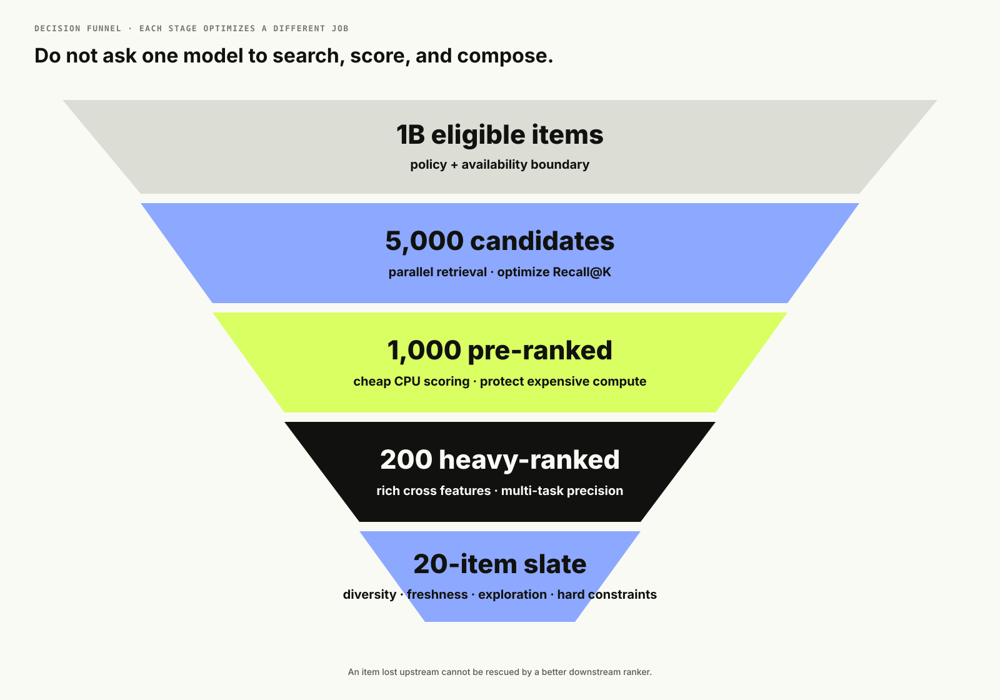
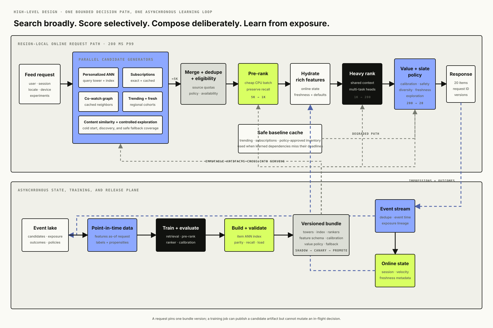
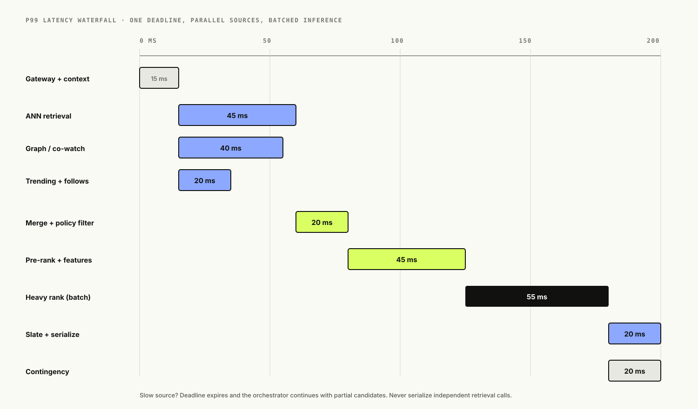
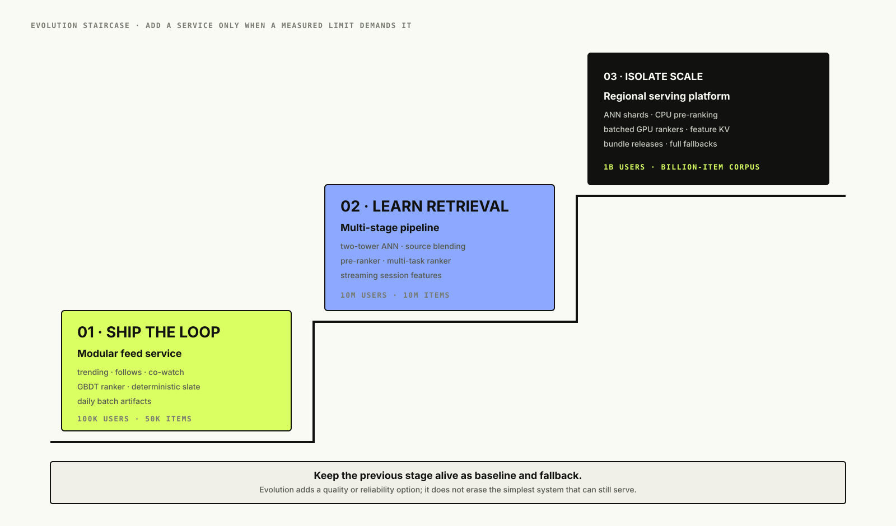
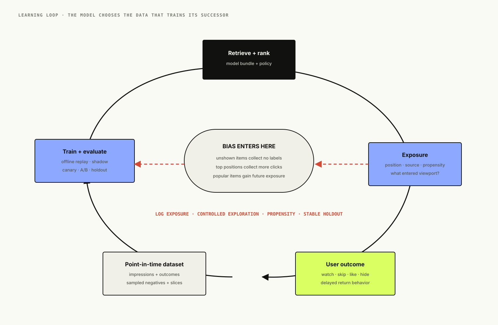
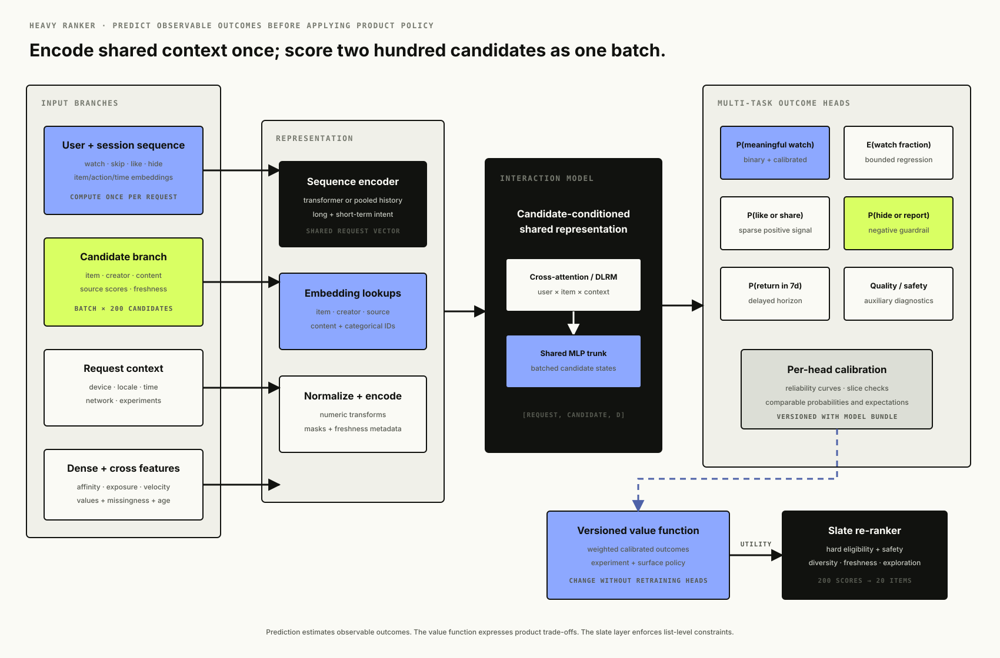
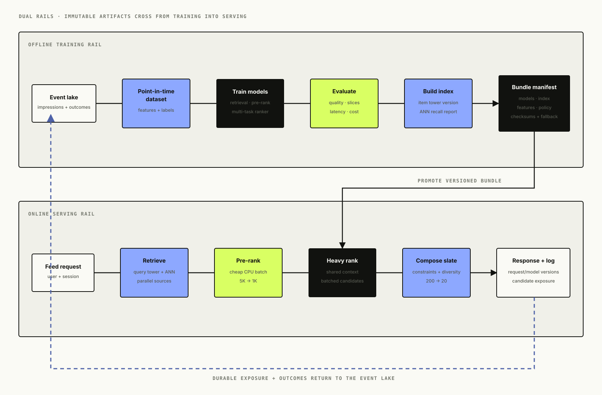
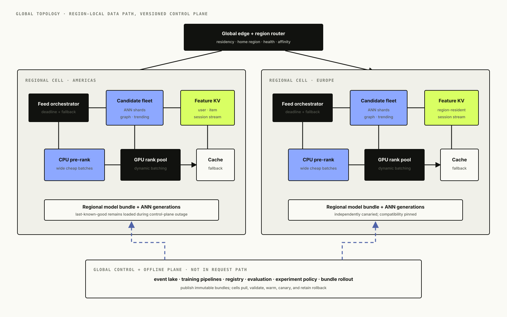

# Designing a Recommendation System: From a Popularity Baseline to Multi-Stage Ranking at Scale

*A production recommender is not one clever model. It is a learning loop that decides what can be considered, scores what survives, composes a useful slate, records what the user actually saw, and keeps working when fresh features, vector search, or the heaviest model do not.*

Suppose we are launching the home feed for a video product. The catalog contains videos, the user opens the app, and we need to choose twenty items.

The tempting answer is: train a model that predicts whether this user will watch each video, score the catalog, and return the highest scores. That answer fails before model choice matters. Scoring ten million videos per request is too slow. Historical clicks only exist for items earlier versions chose to expose. A model that maximizes clicks learns clickbait. New users have no history; new creators have no engagement. The best offline NDCG model may cost more latency than the product can afford. If the feature service fails, the feed still has to open.

The system is therefore a sequence of constrained decisions:

```text
billions of eligible items
  -> thousands retrieved with high recall
  -> hundreds scored cheaply
  -> dozens ranked precisely
  -> one slate balanced for relevance, freshness, diversity, and policy
```

This article will build that system three times. The first version is intentionally simple and may be the right production answer for a young product. The second introduces learned retrieval and real-time features when measurements justify them. The third separates the workload into independently scaled services for a global feed. At every step we will ask what stopped working, which new component repairs it, and what operational cost that component creates.

<figure class="technical-figure wide-figure">
  <a href="assets/recommendation-funnel.svg" target="_blank" rel="noreferrer"></a>
  <figcaption>Each stage spends more computation on fewer items; downstream precision cannot recover an item discarded by upstream retrieval.</figcaption>
</figure>

## Table of Contents

- Frame the product before choosing a model
- Define success without training clickbait
- High-level design: separate search, scoring, and composition
- Size the decision funnel and latency budget
- Scenario 1: ship a useful baseline in weeks
- Learn from impressions, not clicks alone
- Establish offline evaluation without temporal leakage
- Scenario 2: add personalized retrieval and ranking
- Generate candidates from several kinds of evidence
- Choose a two-tower retrieval model for factorized serving
- Add a pre-ranker before the expensive model
- Pick a ranking model for the data and latency we actually have
- Re-rank the slate, not twenty independent items
- Keep online and offline features consistent
- Build the training and model-release loop
- Scenario 3: split the global serving path deliberately
- Decide between a modular monolith and microservices
- Map the design to AWS and Google Cloud
- Handle new users, new items, and rapidly changing intent
- Break feedback loops with logged exposure and exploration
- Design degradation before dependencies fail
- Observe data, model, system, and product together
- Protect users and the creator ecosystem
- Keep the low-level serving contract testable
- Run the companion implementation
- What worked, what failed, and when to evolve
- Interview follow-ups
- References
- What comes next

## Frame the Product Before Choosing a Model

The prompt is: **Design the personalized home feed for a large video platform.**

We will serve twenty videos when a user opens or refreshes the home feed. The catalog mixes evergreen and newly uploaded content. Users can watch, skip, like, share, hide, or report a video. Creators need a credible path to discovery. Policy-ineligible videos must never appear, regardless of model score.

Clarifying the surface matters. “Up next” recommendations begin with the current video and optimize a local transition. Search ranking begins with an explicit query. A home feed begins with weaker intent and must infer what kind of session the user wants now. The same company may need all three, but their candidates, features, labels, and evaluation horizons differ.

Our initial serving contract is:

- return up to twenty eligible, deduplicated videos;
- p99 latency below 200 ms at the API boundary;
- reflect strong session actions within roughly one minute;
- make newly eligible videos retrievable within fifteen minutes;
- preserve a safe non-personalized fallback if ML dependencies fail;
- record the exact candidate set, features/model versions, final positions, and later outcomes for learning and audit.

The response includes an opaque recommendation request ID. Every impression and interaction carries that ID plus item and position. Without exposure logs, a click means little: we do not know which alternatives were available, which items were never shown, or whether the user clicked because an item was relevant or merely first.

## Define Success Without Training Clickbait

Maximizing click-through rate is a seductive first objective because labels arrive quickly. It is also easy to game with sensational thumbnails. Raw watch time improves alignment but favors long videos and can reward compulsive consumption. Completion rate favors short videos. Likes and shares are stronger signals but sparse. Retention is closer to business value but delayed and influenced by much more than one feed.

We will train a multi-task ranker to predict several observable outcomes, then let a versioned value function combine them:

```text
utility =
    0.30 * P(meaningful_watch)
  + 0.20 * expected_quality_watch_minutes
  + 0.15 * P(like_or_share)
  + 0.15 * P(return_within_7d)
  - 0.20 * P(hide_or_report)
```

These numbers are policy, not learned truth. They should be tested, audited, and changed without retraining every prediction head. The final slate also has guardrails for policy, creator repetition, topic diversity, freshness, and already-seen content.

No single metric is the release gate. We track:

- product: quality-adjusted watch time, seven-day retention, hides/reports, and session satisfaction;
- ranking: Recall@K for retrieval, NDCG@K for ranking, calibration, coverage, and diversity;
- ecosystem: exposure across creator cohorts, new-item discovery, and concentration;
- system: p50/p95/p99 latency, timeout and fallback rate, QPS, and cost per thousand feeds.

A model ships only if it improves the objective without breaking latency, safety, or ecosystem guardrails.

## High-Level Design: Separate Search, Scoring, and Composition

Before choosing individual models, draw the complete decision path. The request enters with user, session, device, locale, and experiment context. Several candidate generators run in parallel because each source represents different evidence and fails differently. Their results are merged, deduplicated, checked for eligibility, and narrowed by a cheap pre-ranker. Only then do we fetch the richest cross features and spend heavy-model compute. A final policy-aware re-ranker composes the slate, and the response is logged with enough lineage to learn from what the system actually exposed.

This decomposition creates five explicit contracts:

1. **Candidate generation searches broadly.** Personalized ANN retrieval, subscriptions, co-watch, trending, fresh inventory, and exploration optimize coverage and Recall@K—not final ordering.
2. **Pre-ranking protects scarce compute.** It cheaply removes obvious weak candidates while preserving items the heavy ranker might place highly.
3. **Heavy ranking predicts outcomes.** It estimates meaningful watch, satisfaction, negative feedback, and return behavior using richer user-item-context interactions.
4. **Slate policy makes the product decision.** A versioned value function and deterministic constraints balance relevance with safety, diversity, freshness, creator concentration, and exploration.
5. **Exposure logging closes the loop.** Candidate provenance, positions, propensities, feature/model versions, and outcomes feed streaming state and point-in-time training data.

The synchronous request path should remain region-local and bounded. Model training, item-embedding generation, ANN index construction, evaluation, and artifact promotion belong in the asynchronous control and learning plane. Versioned bundles connect the two planes; raw training jobs never mutate a live request halfway through its execution.

<figure class="technical-figure wide-figure">
  <a href="assets/end-to-end-recommendation-hld.svg" target="_blank" rel="noreferrer"></a>
  <figcaption>The request path narrows candidates under strict deadlines while the asynchronous learning path turns logged exposure and outcomes into a new immutable serving bundle.</figcaption>
</figure>

This is the stable architectural spine for all three scenarios in the article. Scenario 1 implements several boxes inside one modular service. Scenario 2 replaces heuristic internals with learned retrieval and ranking. Scenario 3 introduces network boundaries only where scaling, ownership, runtime, or failure isolation requires them.

## Size the Decision Funnel and Latency Budget

Assume 100 million daily active users, ten feed requests per active user per day, and a peak-to-average factor of five:

```text
feed requests/day      = 1,000,000,000
average requests/sec   = 11,574
peak requests/sec      = 57,870
items returned/day     = 20,000,000,000
retrieved/request      = 5,000 across all sources
pre-ranked/request     = 1,000
heavy-ranked/request   = 200
returned/request       = 20
```

If the heavy ranker spent one millisecond per candidate serially, it would already consume the entire 200 ms budget. Inference must batch candidates and reuse user/session computation. Pinterest has publicly described request-level deduplication for this reason: process the user sequence once, then let candidates attend to cached context rather than recomputing the same representation hundreds of times.

A practical 200 ms budget might be:

| Stage | p99 budget |
|---|---:|
| Gateway, auth, request context | 15 ms |
| Parallel candidate retrieval | 45 ms |
| Feature fetch and assembly | 25 ms |
| Pre-ranking | 20 ms |
| Heavy ranking | 55 ms |
| Filtering, slate re-ranking, serialization | 20 ms |
| Contingency for network and tail latency | 20 ms |

Budgets force design decisions. A candidate source that takes 300 ms does not belong synchronously in this feed, however clever its model is. It can be precomputed, cached, given a smaller timeout, or excluded.

<figure class="technical-figure wide-figure">
  <a href="assets/latency-waterfall.svg" target="_blank" rel="noreferrer"></a>
  <figcaption>Retrieval sources run in parallel under child deadlines; expensive ranking is one batched call, not one RPC per item.</figcaption>
</figure>

## Scenario 1: Ship a Useful Baseline in Weeks

For 100,000 users and 50,000 videos, I would not begin with Kafka, a feature store, a vector database, four model services, and GPU inference. I would begin with a modular service, a relational product database, object storage for artifacts, and a warehouse or analytical database for interaction logs.

The first candidate sources are understandable and cheap:

1. trending videos by locale and topic, with time decay;
2. recent videos from followed creators;
3. item-to-item co-watch counts from the user's last few meaningful watches;
4. editorial or safety-approved exploration inventory.

A lightweight ranker—logistic regression or gradient-boosted trees—uses user-topic affinity, item freshness, recent engagement velocity, creator affinity, and context such as locale and device. A deterministic re-ranker removes blocked/already-seen items and limits repeated creators or topics.

This baseline works because it gives the team something more valuable than a sophisticated architecture: trustworthy impression and outcome data. It is cheap to debug, easy to replay, and establishes latency and quality baselines.

What does not work yet?

- Co-watch counts cannot generalize well to fresh or tail items.
- Batch user affinity lags rapidly changing sessions.
- Hand-built candidate sources miss subtle behavioral similarity.
- Popularity reinforces itself because exposed items collect more interactions.
- One process eventually couples feed availability, batch refresh, and model serving too tightly.

Those are measurable reasons to evolve. “Big companies use embeddings” is not.

<figure class="technical-figure wide-figure">
  <a href="assets/evolution-staircase.svg" target="_blank" rel="noreferrer"></a>
  <figcaption>Scale and measured quality gaps trigger each step; the earlier architecture remains a benchmark and degraded-serving path.</figcaption>
</figure>

## Learn From Impressions, Not Clicks Alone

The event schema is part of the model architecture. For every feed request, log one request record and one row per candidate or returned item:

```text
recommendation_request
  request_id, user_id_hash, session_id_hash, requested_at
  model_bundle_version, feature_snapshot_time, experiment_ids

candidate_impression
  request_id, item_id, source, source_rank, source_score
  survived_pre_rank, final_position, propensity
  feature_digest, policy_decision

interaction
  request_id, item_id, event_time, event_type
  watch_ms, video_duration_ms
```

Logging only clicked items creates a dataset with positives but no defensible negatives. Logging only the final twenty hides retrieval failures: the ranker cannot select an item it never receives. Candidate-level logs let us evaluate Recall@K, debug source coverage, train later stages on the distribution they actually see, and replay a proposed model.

An impression is not automatically a negative. An item below the fold may never enter the viewport. A video visible for 100 ms before the app closes is different from one skipped after three seconds. Define an eligible impression using client visibility and dwell rules, tolerate late and duplicate mobile events, and join outcomes in event time.

For privacy and cost, request-level context should be stored once and referenced by candidate rows. Repeating a long user sequence for every candidate creates enormous storage and training I/O amplification.

<figure class="technical-figure wide-figure">
  <a href="assets/learning-loop.svg" target="_blank" rel="noreferrer"></a>
  <figcaption>The system learns from the exposure it created; impression logging, controlled exploration, and stable holdouts keep that loop observable.</figcaption>
</figure>

## Establish Offline Evaluation Without Temporal Leakage

Random train/test splitting lets tomorrow teach yesterday. Instead, choose a cutoff:

```text
features and labels before T0  -> training
next interaction after T0      -> validation target
features as known at T0         -> validation input
```

Replay the complete funnel, not only the heavy ranker. Measure candidate Recall@100/1000, final NDCG@20, HitRate@20, calibration, catalog coverage, and slate diversity. Slice by new/existing user, new/head/tail item, locale, device, session length, and candidate source.

Offline metrics are release evidence, not proof of product value. They inherit exposure and position bias from the old policy. Shadow ranking checks correctness, latency, score distribution, and candidate changes without affecting users. A guarded A/B test then measures short-term engagement and longer-term return behavior. Keep a long-running holdout or exploration bucket to detect whether the system is training on its own echo.

## Scenario 2: Add Personalized Retrieval and Ranking

At ten million users and ten million active videos, exhaustive scoring is impossible and the heuristic sources plateau. We add learned retrieval, but keep trending, subscriptions, co-watch, and exploration as parallel sources. Candidate diversity at retrieval is insurance: one embedding space will miss intents it was not trained to represent.

The online path becomes:

```text
request context
  -> candidate sources in parallel (strict per-source timeout)
  -> merge + source quotas + dedupe + policy eligibility
  -> lightweight scoring: 5,000 -> 1,000
  -> feature hydration
  -> heavy multi-task ranker: 1,000 -> 200
  -> slate re-ranker: 200 -> 20
  -> response + complete exposure log
```

### Why not one end-to-end model?

A cross-feature ranker can model rich user-item interactions, but its forward pass must run for every pair. Candidate retrieval needs factorized computation: produce a user vector once, then search precomputed item vectors. The models optimize different jobs—retrieval for recall under a huge search space, ranking for precision over a much smaller set.

Google's published YouTube design uses this candidate-generation/ranking split. TensorFlow Recommenders teaches the same serving boundary. Pinterest describes an additional lightweight-scoring stage because sending thousands of weak candidates directly into a heavy ranker wastes serving capacity.

## Generate Candidates From Several Kinds of Evidence

Run generators concurrently and attach provenance:

| Candidate source | Strength | Failure mode | Serving choice |
|---|---|---|---|
| Two-tower ANN | broad behavioral personalization | embedding staleness; popularity bias | online query vector + versioned item index |
| Co-watch / graph | explainable item relationships | weak for fresh/tail items | batch graph plus cached neighbors |
| Subscriptions/social | high precision for known intent | narrow and repetitive | exact lookup; heavily cacheable |
| Trending by cohort | robust and fresh | weak personalization | streaming aggregates + regional cache |
| Content similarity | works for new items | semantic similarity is not preference | precomputed multimodal embeddings |
| Exploration pool | collects unbiased/new-item evidence | short-term metric cost | controlled quota with logged propensity |

Each source returns perhaps 200–2,000 items. Merge by item ID, retain every source and source score, enforce maximum contribution so one source cannot monopolize the funnel, and filter legal/safety/availability constraints before spending expensive ranking compute.

Source timeouts are independent. A graph service timing out should reduce candidate breadth, not fail the feed. Monitor source recall conditional on the eventual positive outcome; a healthy endpoint that contributes no useful items is still unhealthy for the product.

## Choose a Two-Tower Retrieval Model for Factorized Serving

The query tower consumes user and request context; the item tower consumes item attributes:

```python
user_vector = user_tower(
    recent_actions,
    long_term_topics,
    locale,
    device,
    time_of_day,
)

item_vector = item_tower(
    item_id,
    creator_id,
    content_embedding,
    language,
    age_bucket,
)

score = dot(normalize(user_vector), normalize(item_vector))
```

Train positive pairs from meaningful watches and stronger actions. Negatives need care:

- in-batch negatives are efficient but may mark relevant unseen items as negative;
- impression-but-skipped items are hard negatives but contain position and presentation bias;
- random catalog negatives improve broad separation but are often too easy;
- retrieved-but-not-engaged items match serving distribution but reinforce the old retriever.

Use a mixture, exclude known positives, and weight examples by label confidence. Sample users or interactions so a few hyperactive users do not dominate.

Item embeddings are computed offline and loaded into a versioned approximate-nearest-neighbor index. The query embedding is computed online to include current-session actions. For a smaller catalog, exact dot-product search is the quality baseline. Move to HNSW, IVF, ScaNN, Faiss, or a managed vector service only when latency/size requires approximation, and measure recall against exact search.

Inner product and cosine are not interchangeable. Dot product includes item-vector norm and may favor frequent items; normalized vectors produce cosine similarity. Choose intentionally and test popularity distribution.

## Add a Pre-Ranker Before the Expensive Model

The pre-ranker sees thousands of candidates and must be cheap. A well-tuned GBDT or small MLP on retrieval scores, source IDs, item quality/freshness, coarse user affinity, and policy features often beats the operational economics of a large neural model here.

Optimize the pre-ranker for recall of items the heavy ranker would place highly. One useful training target is teacher distillation: run the heavy ranker offline on a larger candidate set and train the small model to preserve its top items. This makes the pre-ranker a compute filter rather than an independently opinionated product policy.

What failed before this stage existed? Heavy-ranking 5,000 candidates made p99 latency and cost unacceptable. Reducing each generator to a tiny top K saved compute but discarded promising cross-source candidates too early. The pre-ranker centralizes that early comparison.

## Pick a Ranking Model for the Data and Latency We Actually Have

Model progression should be earned:

### Logistic regression or GBDT

This is the right first learned ranker for tabular engagement, freshness, and affinity features. It trains quickly, runs cheaply on CPU, calibrates reasonably, and is easy to inspect. It struggles with sparse IDs and long behavior sequences unless those are summarized upstream.

### DLRM-style feature interaction model

Separate sparse embeddings from dense features and learn their interactions. This is useful when high-cardinality user/item/creator IDs and tabular context dominate. It is more scalable and expressive than concatenating everything into a plain MLP, but it still treats a summarized history more like a bag than an ordered session.

### Transformer sequence ranker

Represent recent actions as a time-ordered sequence, including action type and dwell. Cross-attend each candidate to the user context. This captures short-term intent changes and interactions between candidates and history, but it raises GPU cost, tail latency, training complexity, and debugging burden.

For Scenario 2, I would ship a GBDT baseline and a multi-task DLRM-like ranker first. I would add a sequence model only after offline slices and online tests show that summary features miss important session behavior. Pinterest and Meta have published production moves toward sequence models, while Netflix's foundation-model work shows the potential—and operational cost—of sharing longer-history representations across recommendation tasks.

Predict separate heads:

```text
P(quality watch), expected watch fraction,
P(like), P(share), P(hide/report), P(return)
```

Multi-task learning shares representations and exposes tradeoffs. The value layer combines calibrated outputs with business policy; do not hide all product priorities inside one opaque training label.

<figure class="technical-figure wide-figure">
  <a href="assets/internal-ranker-architecture.svg" target="_blank" rel="noreferrer"></a>
  <figcaption>Compute shared request context once, score candidates as a batch, keep observable outcomes in separate calibrated heads, and apply product priorities in a versioned value layer.</figcaption>
</figure>

### Follow one candidate through the ranker

The request branch encodes recent actions once. Each surviving candidate contributes item and creator embeddings, freshness, quality, and retrieval provenance. The interaction layer combines that candidate with the shared request representation and dense cross features. Separate heads predict observable outcomes; calibration makes scores comparable; the value function converts those predictions into a scalar utility for slate composition. This boundary keeps model learning, business policy, and list-level constraints independently testable.

## Re-Rank the Slate, Not Twenty Independent Items

Sorting by item utility alone produces near-duplicates: five videos from one creator, ten clips about the same topic, or a page with no fresh content. Re-ranking operates on the list:

```python
slate = []
for candidate in ranked_candidates:
    adjusted = candidate.utility
    adjusted -= creator_repeat_penalty(candidate, slate)
    adjusted -= topic_similarity_penalty(candidate, slate)
    adjusted += freshness_quota_bonus(candidate, slate)
    adjusted += exploration_bonus(candidate, request)
    choose the highest adjusted eligible candidate
```

Hard constraints—blocked creator, age restriction, unavailable rights, already consumed—belong before or inside this stage and cannot be traded for relevance. Soft objectives—topic spacing, novelty, creator exposure—can use maximal marginal relevance, constrained optimization, or a learned slate model.

Re-ranking must remain deterministic given request ID, candidates, and policy version so incidents can be replayed. Log when a high-scoring item was removed and why.

## Keep Online and Offline Features Consistent

Organize features by entity and freshness:

- user: long-term topic affinity, creator affinity, historical engagement;
- item: content embedding, language, age, quality/safety, historical engagement;
- context: session sequence, device, locale, time, current network constraints;
- cross: user-topic match, creator familiarity, previous exposures;
- real-time: last few actions, trend velocity, recent fatigue.

Batch features live in an offline lakehouse/warehouse and are materialized into an online key-value store. Streaming jobs update session and velocity features. Training uses point-in-time joins: every row sees only feature values available before the impression. Recomputing a “seven-day views” feature from today's table for last month's event leaks the future.

A feature registry can define ownership, schema, transformation, freshness SLO, and offline/online materialization. It does not magically guarantee parity. Validate distributions, null/default rates, timestamps, and transformation hashes between training and serving.

Pass an explicit feature timestamp and model bundle version through the request. If a real-time feature is late, use a documented default plus missingness indicator. Silent zero is often a real value and hides pipeline failure.

## Build the Training and Model-Release Loop

The offline pipeline is a DAG with immutable inputs and outputs:

```text
raw impressions + interactions + catalog snapshots
  -> validate and sessionize
  -> point-in-time feature joins
  -> construct positives and sampled negatives
  -> train retrieval, pre-ranker, ranker
  -> evaluate by quality + system slices
  -> build ANN index bound to item-tower version
  -> register one compatible model bundle
  -> shadow -> canary -> A/B -> promote or rollback
```

Treat the query tower and item index as one compatibility unit. Deploying a new query tower against old item vectors can make the geometry meaningless even when dimensions match. The bundle manifest should pin model checksums, feature schema, normalization, index generation, policy version, and fallback.

Daily full training may be enough initially. Fresh items can receive content embeddings and enter an exploration/content index every few minutes. Incremental user/session features update continuously. Warm-start large models, but periodically retrain from a clean window to detect accumulated bias or corrupted state.

Release gates include data validation, offline ranking and calibration, ANN recall/latency, inference compatibility, shadow capacity, canary system metrics, and online experiment guardrails. A registry entry is not a release process.

<figure class="technical-figure wide-figure">
  <a href="assets/training-serving-rails.svg" target="_blank" rel="noreferrer"></a>
  <figcaption>Only immutable, compatibility-checked bundles cross into serving; exposure and outcomes return through the data plane rather than coupling requests to training.</figcaption>
</figure>

## Scenario 3: Split the Global Serving Path Deliberately

At one billion users, hundreds of millions or billions of items, and roughly 60,000 peak feed QPS, split components according to scaling and failure behavior:

- regional feed orchestrators own deadlines and degradation;
- candidate services scale by source and index footprint;
- online feature service scales for high-throughput exact-key reads;
- pre-ranking CPU fleet handles wide fan-out cheaply;
- heavy-ranking GPU/accelerator fleet batches candidate tensors;
- re-ranking library or service owns versioned slate policy;
- event ingestion decouples client traffic from streaming and training;
- training platform and model registry remain off the serving path.

Keep user/session computation request-scoped and reused. Batch candidates into one ranker call rather than hundreds of RPCs. Co-locate orchestrator, feature store, ANN shards, and rankers in a region; cross-region calls cannot fit a tight tail-latency budget reliably.

Partition ANN data by model/index version and optionally item eligibility domain, then replicate hot/global indexes regionally. Sharding purely by item ID requires query fan-out to every shard; hierarchical routing or coarse clusters can reduce fan-out at some recall cost. Blog 34 will go deep on billion-scale vector search; here the key is to measure retrieval recall as infrastructure changes.

<figure class="technical-figure wide-figure">
  <a href="assets/global-serving-topology.svg" target="_blank" rel="noreferrer"></a>
  <figcaption>Cross-region coordination stays out of the request path; each cell serves with a warmed, last-known-good bundle while the global plane trains and rolls out new versions.</figcaption>
</figure>

## Decide Between a Modular Monolith and Microservices

Microservices are not an ML maturity badge.

For Scenario 1, one deployable feed service can contain candidate interfaces, feature assembly, ranking, and re-ranking modules. Batch training is a separate job because its resource and release lifecycle already differs. This minimizes RPCs, schemas, on-call surfaces, and distributed debugging.

Split a module when at least one condition is real:

- different scaling shape: ANN is memory-heavy, pre-ranking CPU-heavy, ranking GPU-heavy;
- different failure isolation: one experimental source must not crash the feed;
- different release ownership: policy, retrieval, and ranking teams need independent safe rollout;
- reuse: the feature or candidate service serves several product surfaces;
- data locality/security: sensitive features need narrower access;
- technology constraint: index or inference runtime requires a distinct stack.

Costs of splitting include network tail latency, serialization, version skew, duplicated context, distributed tracing, and more complicated fallback. Define protobuf/typed schemas, deadlines, batch APIs, compatibility windows, and ownership before splitting.

A useful boundary test is: **Can the feed orchestrator produce a safe response if this service disappears for ten minutes?** If not, either the dependency is too tightly coupled or its fallback is unfinished.

## Map the Design to AWS and Google Cloud

The architecture is vendor-neutral, but production choices should be concrete.

| Capability | AWS example | Google Cloud example |
|---|---|---|
| Event ingestion | Kinesis / MSK | Pub/Sub |
| Lakehouse + catalog | S3 + Glue + Iceberg | Cloud Storage + BigLake/BigQuery |
| Stream processing | Managed Flink | Dataflow |
| Training orchestration | SageMaker Pipelines + EKS | Vertex AI Pipelines + GKE |
| Online feature KV | DynamoDB / ElastiCache | Bigtable / Memorystore |
| Vector retrieval | OpenSearch / custom Faiss on EKS | Vertex AI Vector Search / custom ScaNN on GKE |
| Model serving | SageMaker endpoints / EKS | Vertex AI endpoints / GKE |
| Registry and artifacts | SageMaker Registry + S3 | Vertex Model Registry + Cloud Storage |
| Experiments/flags | internal service or managed partner | internal service or managed partner |

For an early team, Amazon Personalize or another managed recommender can provide batch and real-time recommendations quickly, ingest interactions, and support exploration. Choose it when time-to-market matters more than custom objectives and deep control. Move to custom retrieval/ranking when candidate provenance, specialized constraints, very high scale, model innovation, unit economics, or cross-surface reuse justify owning the stack.

On either cloud, deploy serving across at least two availability zones, keep immutable artifacts in object storage, provision fallback capacity, and separate training IAM from online serving IAM. GPUs should serve the stage that earns them; candidate filters and GBDTs usually belong on CPU.

## Handle New Users, New Items, and Rapidly Changing Intent

### New user

Start with locale/device/time-aware trending, onboarding topics, referral context, and controlled exploration. Adapt within the session using recent actions without waiting for full retraining. Do not overuse demographic inference; coarse context can be sensitive and stereotypical.

### New item

Generate content-based embeddings from title, metadata, audio/visual signals, and creator context. Place safe new items into an exploration pool and compare engagement against age-normalized expectations. Collaborative signals arrive later. Google's content-based related-video research specifically addresses this gap.

### Returning user with a new intent

Blend long-term and session representations with a learned or rule-based gate. Someone who usually watches cooking videos but is currently researching bicycles should not be trapped by lifetime history. Monitor how quickly recommendations respond after a strong action.

### Anonymous user

Use a consented session ID and session actions; otherwise serve contextual/trending content. Merge anonymous history into an account only under a clear identity and privacy contract.

## Break Feedback Loops With Logged Exposure and Exploration

The model controls exposure; exposure creates labels; labels train the model. Popularity can become self-fulfilling, and a creator the model never explores can never prove quality.

Mitigations include:

- log all shown positions and selection propensities;
- reserve a small, safe exploration budget;
- randomize within bounded eligible sets rather than across the whole catalog;
- use inverse-propensity weighting or counterfactual methods cautiously;
- keep a stable randomized data slice for evaluation;
- normalize engagement by item age and exposure opportunity;
- monitor coverage and concentration by cohort;
- let explicit negative feedback propagate quickly.

Exploration has a user cost. Security, age, rights, and quality filters apply before exploration. Never describe “random traffic” without an eligibility boundary and an experiment budget.

## Design Degradation Before Dependencies Fail

The feed orchestrator uses one request deadline and smaller child deadlines. It never retries a slow candidate or ranking call multiple times inside the user request; retries amplify tail load and may miss the deadline anyway.

Fallback ladder:

1. one candidate source times out: continue with others and rebalance quotas;
2. real-time features fail: use cached/batch features plus missingness flags;
3. ANN learned retrieval fails: use subscriptions, co-watch, and trending;
4. heavy ranker is saturated: use pre-ranker score and deterministic re-ranking;
5. all personalized dependencies fail: serve cached cohort trending with policy filtering;
6. exposure logging is unavailable: buffer durably; if loss becomes material, stop experiments before corrupting training data silently.

Cache final feeds briefly by `(user, session-context-version, model-bundle)`, but avoid repeatedly showing consumed items. Cache source outputs with freshness appropriate to the source. A cache hit is not automatically correct personalization.

Load shedding should protect transactional feed traffic from bulk precomputation and shadow models. Shadow inference has a hard resource quota and is the first traffic removed during pressure.

## Observe Data, Model, System, and Product Together

Four layers need joined telemetry:

**Data:** event delay, duplicate/drop rate, schema changes, feature freshness, null/default rate, point-in-time join coverage.

**Model:** retrieval recall, score distribution, calibration, prediction/embedding drift, slice quality, ANN recall, fallback disagreement.

**System:** per-stage p99, source timeout, feature misses, batch size, GPU utilization, cache hit, error/fallback rate, cost per request.

**Product/ecosystem:** watch quality, retention, hides/reports, diversity, coverage, creator concentration, new-item survival, experiment lift.

Use the request ID to trace candidate provenance through every stage without logging raw personal histories. A feed incident can look like “engagement dropped,” while the root cause is an empty feature default, an index/model mismatch, one source silently returning half its inventory, or a policy filter version that removed an entire locale.

Alert on SLOs and user impact, not every distribution movement. Drift is a diagnostic signal, not an automatic retraining command.

## Protect Users and the Creator Ecosystem

Minimize and retain behavioral data deliberately. Hash or tokenize user identifiers in analytical logs, isolate identity maps, encrypt data, enforce purpose-limited access, and support deletion across raw events, features, training sets, and caches. Aggregate where per-user history is unnecessary.

Policy filtering is defense in depth: eligibility before retrieval where possible, again before ranking, and finally before response. Models cannot override age, region, rights, block, or safety decisions.

Recommendation objectives shape creator behavior. Monitor whether exposure collapses onto a tiny head, whether new creators receive viable tests, and whether optimizing watch time increases reports or decreases long-term satisfaction. Publish and audit value-function changes like product policy.

## Keep the Low-Level Serving Contract Testable

The orchestrator depends on narrow interfaces:

```python
class CandidateSource(Protocol):
    def retrieve(self, context: RequestContext, limit: int) -> list[Candidate]: ...

class Ranker(Protocol):
    def score(self, context: RequestContext, candidates: list[Candidate]) -> list[Score]: ...

class SlatePolicy(Protocol):
    def compose(self, ranked: list[ScoredCandidate], size: int) -> list[Candidate]: ...
```

Every candidate carries `item_id`, source provenance, retrieval score, feature/model versions, and eligibility state. The response carries request/model/policy versions. Stable contracts let the companion implementation swap popularity and embedding retrieval, compare rankers, inject dependency failures, and verify deterministic fallbacks.

The serving sequence is:

```text
validate request
  -> fetch request-scoped features once
  -> retrieve in parallel with deadlines
  -> merge, dedupe, hard-filter
  -> pre-rank
  -> hydrate expensive cross features for survivors
  -> heavy-rank in one batch
  -> compose constrained slate
  -> emit response and durable exposure event
```

## Run the Companion Implementation

The runnable example in [`code/`](code/) is small enough to understand but preserves the production boundaries:

- a batch trainer builds popularity, co-watch, user/item embeddings, and a versioned artifact bundle from interaction events;
- an online FastAPI service runs multiple candidate sources, a lightweight ranker, and a diversity/freshness slate policy;
- session actions modify the query representation without retraining;
- unknown users and injected dependency failures use explicit fallbacks;
- evaluation code computes Recall@K and NDCG@K with a temporal split;
- tests cover deduplication, exclusions, deterministic re-ranking, artifact compatibility, cold start, and degraded serving.

```bash
cd blogs/21-recommendation-system/code
python3.12 -m venv .venv
source .venv/bin/activate
pip install -e .
recommendation-train --output artifacts/current
uvicorn app.main:app --reload
```

```bash
curl 'http://localhost:8000/v1/recommendations?user_id=user-17&limit=10'
```

The demo uses exact NumPy similarity search because its catalog is tiny. The `Retriever` interface marks the production seam for Faiss, ScaNN, OpenSearch, or a managed vector service. Hiding approximate search behind that interface does not hide its quality requirement: production must continuously compare ANN Recall@K against exact or higher-recall reference queries.

## What Worked, What Failed, and When to Evolve

| Stage | What worked | What stopped working | Evolve when |
|---|---|---|---|
| Popularity + rules | fast launch, robust fallback, clean data | weak personalization, head bias | cohort/session lift is measurable |
| Co-watch + GBDT | explainable, cheap CPU scoring | cold start, limited semantic generalization | tail/new-item recall plateaus |
| Two-tower retrieval | scalable broad personalization | stale index, retrieval bias, weak cross features | catalog makes exhaustive methods impossible |
| Pre-ranker | protects expensive compute | may prune rare valuable items | heavy-ranker cost/latency dominates |
| Multi-task ranker | richer objective and calibration | label conflict, serving cost | baseline misses meaningful interactions |
| Sequence ranker | captures changing intent | GPU cost, complexity, long-tail latency | online gains justify full lifecycle cost |
| Microservices | independent scaling and isolation | RPC/version/on-call complexity | distinct resource/ownership boundaries are real |
| Foundation representation | reuse across many surfaces | training cost, compatibility, central bottleneck | duplicated specialized stacks become the larger cost |

The mature system does not delete earlier stages. Trending remains cold-start and disaster fallback. Co-watch remains an independent source. The GBDT remains a shadow baseline and degraded ranker. Evolution adds options and failure isolation, not just complexity.

## Interview Follow-Ups

**Why candidate generation instead of scoring every item?**

The catalog is too large. Factorized retrieval computes the user vector once and compares it through an ANN index, reducing millions/billions of items to thousands. Rich cross-feature scoring then becomes affordable.

**Why multiple candidate generators?**

They encode different evidence and fail differently. Learned behavioral retrieval, subscriptions, co-watch, fresh content, and trending improve coverage and provide fallbacks. Provenance also makes source quality measurable.

**Why not rank directly by embedding similarity?**

Retrieval similarity has limited features and optimizes broad recall. The ranker can use cross features, context, calibrated outcome heads, and policy-aware utility over a small candidate set.

**How do you update recommendations after one strong session action?**

Update session features and compute a fresh query vector online. Do not wait for full model retraining. Blend session and long-term representations; expire session state quickly.

**How do you keep training and serving consistent?**

Shared transformation definitions, point-in-time training joins, versioned feature schemas, parity tests, and a model bundle that pins towers, normalization, ANN index, ranker, and policy.

**What if the model improves NDCG but hurts retention?**

Do not ship it broadly. Offline NDCG is a proxy conditioned on historical exposure. Diagnose objective/label mismatch and slices, then rely on guarded online experiments with longer-horizon metrics.

**When would you use Amazon Personalize?**

For a team that needs credible personalization quickly and can accept managed recipes, integration constraints, and less model/serving control. Custom infrastructure is justified by differentiated objectives, scale/cost, strict latency, complex candidate sources, or platform reuse.

**How would the design change for e-commerce?**

The funnel remains, but eligibility adds inventory, price, shipping, and seller constraints; labels emphasize conversion and margin; delayed purchase attribution matters; item freshness is different; and business re-ranking may include stock and marketplace fairness.

## References

**Source discipline.** Statements attributed to a company below summarize that company's published material. The traffic assumptions, latency allocation, cloud mapping, failure policy, and three-scenario evolution in this article are our synthesized design—not claims about any one company's private production architecture.

### Interview framing and practical design guidance

1. [Hello Interview: Video Recommendation System Design](https://www.hellointerview.com/learn/ml-system-design/problem-breakdowns/video-recommendations) — problem framing, multi-stage architecture, features, model tradeoffs, cold start, and level expectations.
2. [Hello Interview: ML System Design Delivery Framework](https://www.hellointerview.com/learn/ml-system-design/in-a-hurry/delivery) — business-to-data-to-model-to-serving interview structure and baseline-first reasoning.
3. [Hello Interview: Evaluation](https://www.hellointerview.com/learn/ml-system-design/core-concepts/evaluation) — recommender metrics, temporal evaluation, shadow/A-B/interleaving, and feedback loops.
4. [Hello Interview: Feature Engineering](https://www.hellointerview.com/learn/ml-system-design/core-concepts/feature-engineering) — structured feature discussion, parity, adversarial signals, and feedback-loop risks.
5. [Hello Interview: Embeddings](https://www.hellointerview.com/learn/ml-system-design/core-concepts/embeddings) — two-tower retrieval, dimensionality, serving, and cold start.

### Published systems and primary technical sources

6. [Google Research: Deep Neural Networks for YouTube Recommendations](https://research.google/pubs/deep-neural-networks-for-youtube-recommendations/) — industrial candidate-generation and ranking split.
7. [Google Developers: Recommendation systems overview](https://developers.google.com/machine-learning/recommendation/overview/types) — candidate generation, scoring, and re-ranking.
8. [Google Research: Content-based Related Video Recommendations](https://research.google/pubs/content-based-related-video-recommendations/) — content embeddings for cold-start videos.
9. [TensorFlow Recommenders: Retrieval tutorial](https://www.tensorflow.org/recommenders/examples/basic_retrieval) — two-tower training, implicit feedback, and ANN export.
10. [Pinterest Engineering: Establishing a Large Scale Learned Retrieval System](https://medium.com/pinterest-engineering/establishing-a-large-scale-learned-retrieval-system-at-pinterest-eb0eaf7b92c5) — learned retrieval, online query embeddings, offline item indexing, and auto-retraining.
11. [Pinterest Engineering: Modernizing Home Feed Pre-Ranking](https://medium.com/pinterest-engineering/modernizing-home-feed-pre-ranking-stage-e636c9cdc36b) — retrieval, pre-ranking, ranking, and re-ranking evolution.
12. [Pinterest Engineering: Improving Recommended Pins with Lightweight Ranking](https://medium.com/pinterest-engineering/improving-the-quality-of-recommended-pins-with-lightweight-ranking-8ff5477b20e3) — cheap early scoring between retrieval and full ranking.
13. [Pinterest Engineering: Scaling Recommendation Systems with Request-Level Deduplication](https://medium.com/pinterest-engineering/scaling-recommendation-systems-with-request-level-deduplication-93bd514142d9) — shared request context across storage, training, and serving.
14. [Pinterest Engineering: Pixie](https://medium.com/pinterest-engineering/introducing-pixie-an-advanced-graph-based-recommendation-system-e7b4229b664b) — graph-based real-time candidate generation at very large catalog scale.
15. [Uber Engineering: Two Tower Embeddings for Recommendations](https://www.uber.com/blog/innovative-recommendation-applications-using-two-tower-embeddings/) — evolution from thousands of city models to a global contextual model.
16. [LinkedIn Engineering: Feed relevance](https://engineering.linkedin.com/teams/data/artificial-intelligence/feed) — heterogeneous first-pass rankers, second-pass ranking, and re-ranking.
17. [Netflix TechBlog: Foundation Model for Personalized Recommendation](https://netflixtechblog.com/foundation-model-for-personalized-recommendation-1a0bd8e02d39) — shared sequence representation, long-history modeling, cold start, and downstream reuse.
18. [Meta Engineering: Sequence learning for personalized recommendations](https://engineering.fb.com/2024/11/19/data-infrastructure/sequence-learning-personalized-ads-recommendations/) — moving beyond manually engineered DLRM features toward sequential modeling.
19. [Faiss](https://github.com/facebookresearch/faiss) — exact and approximate vector search and its speed/quality/memory tradeoffs.
20. [Amazon Personalize: How it works](https://docs.aws.amazon.com/personalize/latest/dg/how-it-works.html) — managed training, batch workflows, and real-time recommendation APIs.
21. [Amazon Personalize: Real-time personalization and exploration](https://docs.aws.amazon.com/personalize/latest/dg/use-case-recipe-features.html) — interaction updates, exploration controls, and model refresh behavior.

## What Comes Next

Recommendation can tolerate a few hundred milliseconds and optimize a slate after the request arrives. The next ML system has a different shape: a decision must be made inside a financial transaction, labels are delayed and adversarial, positive examples are extremely rare, and one false negative can be expensive while one false positive can block a real customer. Next is **real-time fraud detection**.

The permanent series map lives in **[the introduction](../01-introduction/)**.
