# Designing Real-Time Fraud Detection: A Decision System Under Adversarial Drift

*A fraud model predicts risk. A fraud system must turn incomplete evidence into an auditable action before the payment deadline, preserve fresh state under retries and races, learn from labels that arrive weeks later, and remain safe while attackers actively probe it.*

We will treat this as a live system-design interview. We begin with an ambiguous prompt, write down assumptions, estimate only the numbers that influence architecture, and draw the smallest plausible system. New components appear only when a requirement or measured failure breaks the previous design. When a technical term first matters, we define it before using it as architectural shorthand.

## Table of Contents

- Start with the interview prompt
- Clarify the business decision and requirements
- Define the intelligence problem
- Set success metrics before model metrics
- Estimate scale and the critical path
- HLD V0: rules plus a tabular model
- Design the event and decision contracts
- Build labels without pretending every decline is fraud
- Evaluate chronologically under extreme imbalance
- Engineer features by freshness and attack cost
- Integrate external intelligence without putting vendors on checkout
- Choose the first model deliberately
- Put policy after prediction
- HLD V1: add streaming state and separate the decision plane
- Make velocity features correct under retries and races
- Add graph evidence without putting graph traversal on checkout
- Use analysts as a scarce labeling instrument
- Train, promote, shadow, and roll back safely
- Survive missing features, model failure, and regional loss
- HLD V2: build a global, multi-tenant risk platform
- Map the design to AWS and Google Cloud
- Keep the LLD contracts auditable
- Monitor adversaries, operations, and business harm together
- Protect privacy and measure uneven harm
- Run the companion implementation
- What worked, what failed, and when to evolve
- How I would summarize this in the last two minutes
- Interview follow-ups
- Interview whiteboard
- References
- What comes next

## Start With the Interview Prompt

<aside class="interview-dialogue">
  <p><strong>Interviewer</strong> Design a real-time fraud-detection system for a global payment platform.</p>
  <p><strong>Candidate</strong> Before I draw anything, I'd like to ask a few questions — that sentence alone doesn't tell me enough to start.</p>
</aside>

Our first whiteboard therefore contains only the unresolved decision:

```text
Payment attempt
      |
      v
Fraud decision system
      |
      v
Action — still to be defined
```

Getting from that box to an actual architecture starts with resolving the ambiguity, not with drawing Kafka, a feature store, or a neural network:

<aside class="interview-dialogue">
  <p><strong>Candidate</strong> "Fraud" covers a lot of ground — stolen-card payments, account takeover, money laundering, promo abuse, coordinated rings. Which one are we solving for?</p>
  <p><strong>Interviewer</strong> Let's say card-not-present payment authorization for an e-commerce marketplace.</p>
  <p><strong>Candidate</strong> Okay, that fixes the unit of prediction as one payment attempt, and it means I can set account-takeover investigation and AML case generation aside — different labels, different legal obligations, probably a different service entirely. Next: what can the system actually do about a risky one? Just flag it for someone later, or intervene directly?</p>
  <p><strong>Interviewer</strong> It can allow the payment, challenge it with something like 3DS or an OTP, hold it for manual review, or block it outright.</p>
  <p><strong>Candidate</strong> Four levers, not two — so I'm not building a binary fraud classifier, I'm building a policy that chooses among interventions with different costs. That'll matter later for what I ask a model to output. Where does the decision have to land — before authorization completes, or can it run alongside it and catch up asynchronously?</p>
  <p><strong>Interviewer</strong> Before. It has to return an action before the payment orchestrator calls or completes authorization.</p>
  <p><strong>Candidate</strong> That's a hard synchronous deadline, so whatever evidence I use has to be retrievable inside it — no waiting on a slow vendor call or an open-ended graph traversal. How fast, roughly, and at what scale?</p>
  <p><strong>Interviewer</strong> The business would tolerate p99 under 80 ms. Volume is high enough that a database call per feature won't hold up. It's also global — several currencies, and a few regions won't let certain data leave the region.</p>
  <p><strong>Candidate</strong> Global and residency-constrained rules out one shared data store everywhere from the start — I'll come back to that once regional cells come up. That's enough to sketch something.</p>
</aside>

## Clarify the Business Decision and Requirements

### Business statement

The risk service may use account, card-token, device, IP, merchant, session, and network evidence to make its decision.

A customer presses **Pay** on a $900 order. The card has never appeared at this merchant, the account is two hours old, and three small attempts from the same device just failed. Blocking a stolen card prevents loss; blocking a legitimate customer loses the sale and damages trust. The business decision is therefore not “fraud or not fraud?” It is “which intervention has the lowest expected harm given what we know before the deadline?”

The available actions are:

```text
ALLOW       accept with no extra friction
CHALLENGE   request 3DS, OTP, or another proof
REVIEW      hold fulfillment and create an analyst case
BLOCK       reject immediately
```

### Functional requirements

- evaluate every eligible payment attempt;
- return one deterministic action plus stable reason codes;
- combine hard controls, historical behavior, and learned risk;
- support challenge and capacity-bounded human review;
- preserve the exact evidence and versions behind a decision;
- capture authorization, challenge, dispute, appeal, and analyst outcomes for learning.

### Non-functional requirements

| Constraint | Initial target | Architectural consequence |
|---|---:|---|
| Risk-decision latency | p99 below 80 ms | Bounded local/parallel dependencies only |
| Peak throughput | About 21,000 attempts/s | Stateless horizontal serving and partitioned state |
| Availability | 99.99% target | Tested degraded policies and regional isolation |
| Feature freshness | Velocity reflected within 5 seconds | Event-time streaming for recent behavior |
| Retry correctness | Same logical request, same decision | Idempotency key plus canonical request hash |
| Auditability | Reproduce every acknowledged decision | Immutable decision ledger and versioned artifacts |
| Geography | Global with residency constraints | Regional cells and selective evidence replication |

**Idempotency** means that repeating the same logical request has the same externally visible effect as processing it once. Here, a retry with the same key and body returns the original decision and does not increment velocity counters again.

We also keep two related workflows:

- an asynchronous post-authorization detector can use heavier graph and sequence computation to stop fulfillment or freeze an account;
- an investigation path groups related transactions and entities into cases for analysts.

**Synchronous** work is work the caller waits for before receiving its answer. **Asynchronous** work is durably recorded and completed later without keeping that request open. A ten-second graph query may help stop shipment asynchronously, but it cannot sit on the synchronous authorization path.

<aside class="interview-dialogue">
  <p><strong>Interviewer</strong> If asynchronous work happens later, how do you know it will not be lost?</p>
  <p><strong>Candidate</strong> “Asynchronous” does not mean fire-and-forget. The synchronous path commits an event to a durable outbox or log before relying on downstream workers. Workers may retry, so consumers also need stable event IDs and idempotent state changes.</p>
</aside>

These assumptions deliberately exclude AML case generation and broad account-takeover investigation from the 80 ms contract. They may share evidence and infrastructure, but they need separate APIs, labels, policies, and service-level objectives.

## Define the Intelligence Problem

The model's job and the system's job are related but different:

```text
transaction + account + device + recent behavior + network context
                              |
                              v
                      fraud-risk model
                              |
                              v
                  calibrated fraud probability
                              |
                              v
              deterministic decision policy
                              |
                 +------------+-----------+
                 |            |           |
              ALLOW       CHALLENGE    REVIEW / BLOCK
```

This is a supervised learning problem: historical examples pair evidence available at decision time with later outcomes such as confirmed disputes. The model estimates risk; it does not own the final action. The policy combines that estimate with transaction value, legal controls, challenge availability, merchant preferences, and review capacity.

<aside class="interview-dialogue">
  <p><strong>Interviewer</strong> Why not train the model to predict the final action directly?</p>
  <p><strong>Candidate</strong> Actions change when economics, regulation, or operational capacity changes. Keeping probability estimation separate lets us alter policy without retraining and lets one calibrated model support different merchants or interventions.</p>
</aside>

## Set Success Metrics Before Model Metrics

If only 0.2% of transactions are fraudulent, a model that predicts “legitimate” every time is 99.8% accurate and useless. ROC-AUC can also look comforting while operational precision is poor in the rare-positive region. We care about decisions at concrete thresholds.

Keep four categories on the whiteboard:

| Category | Primary measures |
|---|---|
| Business | Fraud loss plus intervention cost per $1,000 approved; approval and false-decline rates |
| ML | Precision-recall, recall at an action budget, calibration, temporal and slice performance |
| System | p50/p95/p99 latency, throughput, availability, feature freshness, cost |
| Operations | Challenge completion, review yield, queue age, appeal and reversal rates |

**Calibration** asks whether predicted probabilities match observed frequencies. Among mature transactions scored near 0.20, roughly 20% should be fraudulent in the population and slice for which that calibration applies. A well-ranked but poorly calibrated model can still choose economically bad thresholds.

For transaction \(i\), define an expected intervention cost:

```text
allow_cost(i) = P(fraud|x_i) * expected_fraud_loss_i

challenge_cost(i) =
    legitimate_probability * challenge_dropout_cost
  + fraud_probability * challenge_bypass_loss
  + challenge_provider_cost

review_cost(i) =
    analyst_cost
  + fulfillment_delay_cost
  + residual_fraud_loss_after_review

block_cost(i) =
    legitimate_probability * lost_margin_and_trust_cost
  + fraud_probability * residual_block_cost
```

The policy should choose the eligible action with the lowest expected cost, subject to legal, network, merchant, and operational constraints. This is why a calibrated risk score is more useful than an uncalibrated class label.

Airbnb's published analysis makes the same product point with targeted friction: the threshold changes when a medium-risk user can complete a challenge instead of being hard-blocked. Stripe's published adaptive rules similarly combine a model score with issuer signals and different interventions. Our exact cost terms and thresholds are synthesized for this marketplace.

<figure class="technical-figure wide-figure">
  <a href="assets/action-cost-landscape.svg" target="_blank" rel="noreferrer">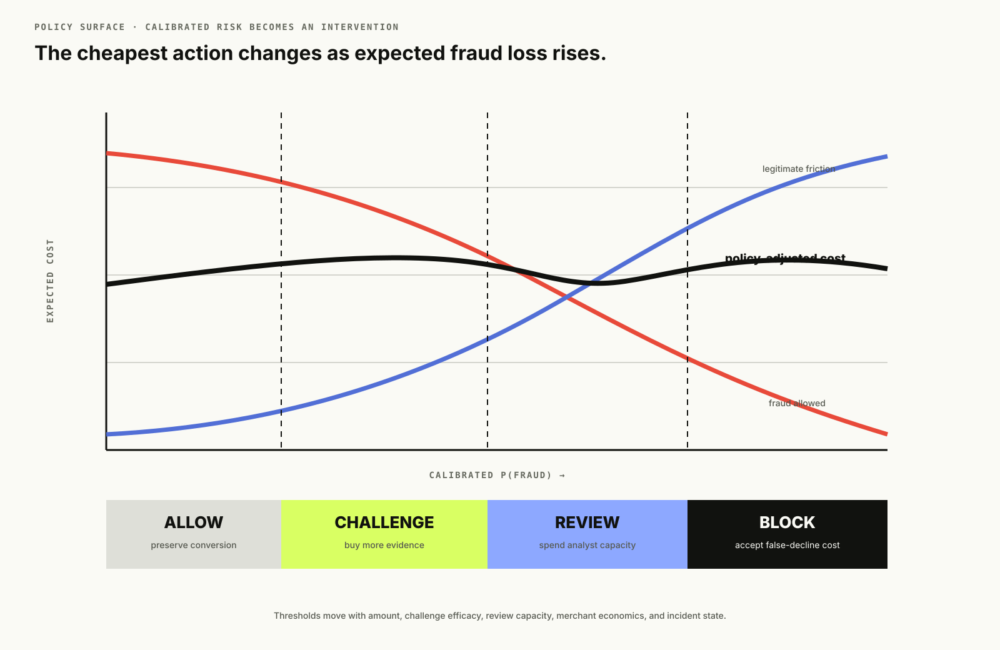</a>
  <figcaption>A score becomes useful only after a versioned policy maps it to an intervention whose fraud loss, friction, and operational capacity are understood.</figcaption>
</figure>

The primary product metric is **expected fraud loss plus intervention cost per $1,000 of approved volume**. Guardrails include approval rate, false-decline rate, challenge completion, analyst queue age, chargeback rate, p99 latency, and fairness slices. We also monitor gross fraud dollars prevented, but never without the legitimate volume sacrificed to prevent them.

<aside class="interview-dialogue">
  <p><strong>Interviewer</strong> Why are accuracy and ROC-AUC not enough?</p>
  <p><strong>Candidate</strong> Fraud is rare and actions are costly. Accuracy rewards predicting “legitimate,” while ROC-AUC averages over thresholds we may never operate at. I need precision and recall near the challenge, review, and block budgets, calibrated probabilities, and the business cost created by each action.</p>
</aside>

## Estimate Scale and the Critical Path

Assume 300 million attempts per day. That is about 3,472 requests per second on average. A six-times peak gives roughly 21,000 requests per second. At 2 KB of normalized event data per attempt, the canonical event stream receives about 600 GB per day before replication and indexing. A 180-day raw lake is therefore on the order of 108 TB. These are planning assumptions for this design, not reported numbers from a named company.

If the average synchronous operation spends 25 ms waiting on feature I/O, 21,000 peak requests per second imply roughly 525 feature requests in flight before accounting for fan-out, skew, or retries. Ten logical feature reads per payment can produce 210,000 key lookups per second, which argues for batch-get APIs and partition-aware caches rather than ten serial service calls.

**RPS** means requests per second. **p99 latency** is the duration below which 99% of requests complete in a measurement window; the slowest 1% take longer. We budget p99 because payment abandonment and timeouts are driven by the tail, not the average.

A defendable p99 budget for an 80 ms internal risk deadline is:

| Stage | p99 budget | Notes |
|---|---:|---|
| Contract validation and identity normalization | 5 ms | Reject malformed requests before expensive work |
| Parallel online feature reads | 25 ms | Entity snapshots, velocity counters, cached graph features |
| Deterministic rules | 5 ms | Run concurrently with feature retrieval where possible |
| Model inference | 12 ms | Batched or local CPU scoring for a tabular model |
| Policy and explanation | 5 ms | Thresholds, hard constraints, reason codes |
| Durable decision write or outbox append | 10 ms | Preserve audit and downstream event intent |
| Serialization and network contingency | 18 ms | Deadline propagation and tail protection |

These numbers are a budget, not a promise that sequential RPCs will fit inside it. Independent feature groups run in parallel under child deadlines. The model receives an explicit missingness mask. We do not retry dependencies inside the payment deadline unless the retry budget is proven safe; retries multiply tail latency and can turn a partial outage into a full one.

<figure class="technical-figure wide-figure">
  <a href="assets/checkout-decision-timeline.svg" target="_blank" rel="noreferrer">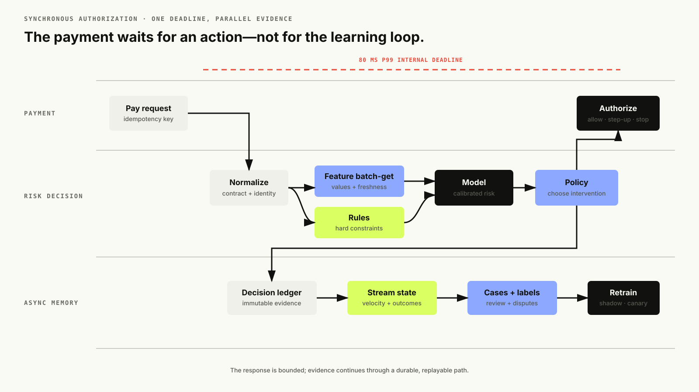</a>
  <figcaption>The solid synchronous path is what checkout waits for. Logging, labels, analytics, and learning continue asynchronously after the action is returned.</figcaption>
</figure>

<aside class="interview-dialogue">
  <p><strong>Interviewer</strong> Why can the 25 ms feature budget not contain five sequential 5 ms calls?</p>
  <p><strong>Candidate</strong> Those are nominal numbers, not guaranteed tails. Network and dependency latency compound, and one retry consumes the whole budget. I batch or parallelize independent reads under child deadlines, then cancel or degrade optional groups when the parent deadline approaches.</p>
</aside>

## HLD V0: Rules Plus a Tabular Model

Before satisfying the global target, test the smallest plausible single-region design. At roughly 50 requests per second, one deployable risk service, one relational database, a warehouse, and object storage for model bundles could ship quickly. HLD V0 is a reasoning baseline, not our claim that it already satisfies the final 21,000-RPS requirement. Keep modules separate in code:

```text
API contract
  -> idempotency guard
  -> feature assembler
  -> rule engine
  -> model scorer
  -> policy engine
  -> decision ledger + outbox
```

The first production version can combine:

- hard rules for known compromised tokens, impossible protocol states, sanctions, and merchant-specific controls;
- velocity rules such as card attempts in ten minutes and distinct accounts per device in 24 hours;
- a gradient-boosted decision-tree model over transaction, account, device, velocity, and historical features;
- four policy bands: allow, challenge, review, and block;
- a review queue and delayed-label importer;
- a daily or twice-daily training job with chronological evaluation.

**Tabular data** means rows of typed columns such as amount, account age, country, device tenure, and recent attempt count. A **gradient-boosted decision tree** is an ensemble of small if/then decision trees trained sequentially: each new tree reduces errors left by the current ensemble, and their outputs are added together. “Gradient” refers to optimizing the training loss, not to a neural-network architecture.

This model fits HLD V0 because boosted trees are strong on heterogeneous tabular inputs, capture nonlinear interactions, tolerate explicit missing values, and score quickly on CPU. Logistic regression remains the pipeline and calibration baseline. A deep sequence or graph model is not justified until reliable ordered behavior or relationship evidence produces measured gains over this simpler system.

This works because rules provide immediate coverage for crisp known attacks and legal constraints, while the model learns interactions that become unmaintainable as nested rules. The whiteboard remains deliberately small:

```text
Payment -> FraudDecisionService -> ALLOW / CHALLENGE / REVIEW / BLOCK
                    |
          +---------+----------+
          |                    |
       Rules            GBDT risk scorer
          |                    |
          +---------+----------+
                    |
             Decision policy
```

What does not work is an ever-growing rule file as the whole system. Attackers split activity just below thresholds, rule interactions become impossible to reason about, and every exception creates another branch. A model-only system also fails: it cannot guarantee a non-negotiable block, encode temporary incident response quickly, or explain what happens when its features disappear.

Keep HLD V0 while it meets the actual launch SLOs; otherwise use its failure analysis to justify the next version. A modular monolith is preferable when one team owns the path, all stages share a scaling profile, deploy frequency is modest, and local calls simplify the deadline. Splitting it into six services on day one adds six network and availability boundaries without creating useful organizational or scaling independence.

A **modular monolith** is one deployable application with explicit internal module boundaries. It is not one giant class. We keep `FeatureProvider`, `RuleEvaluator`, `RiskScorer`, `DecisionPolicy`, and `DecisionLedger` separable in code while avoiding network calls between them.

<aside class="interview-dialogue">
  <p><strong>Interviewer</strong> Why gradient boosting rather than a neural network?</p>
  <p><strong>Candidate</strong> The current evidence is mostly tabular, labels are limited and delayed, and the deadline favors cheap CPU inference. A neural model becomes credible when sequences, embeddings, or graph structure add repeatable value that survives temporal evaluation—not because it sounds more advanced.</p>
</aside>

<figure class="technical-figure wide-figure">
  <a href="assets/interview-board-01-decision-and-v0.svg" target="_blank" rel="noreferrer">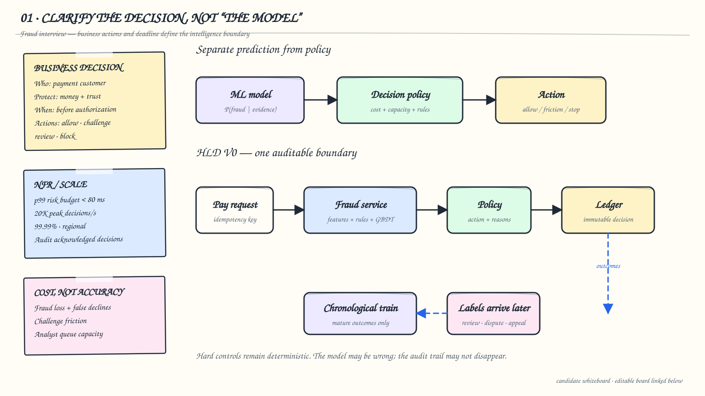</a>
  <figcaption>Whiteboard checkpoint 1: the candidate records the negotiated business contract, keeps risk prediction separate from action policy, and draws the smallest auditable boundary before introducing streams or services. Original diagram for this article.</figcaption>
</figure>

## Design the Event and Decision Contracts

The payment system calls:

```http
POST /v1/risk-decisions
Idempotency-Key: pay-attempt-8f73
Content-Type: application/json
```

```json
{
  "transaction_id": "txn_742",
  "event_time": "2026-08-10T02:15:41.320Z",
  "account_id": "acct_19",
  "account_created_at": "2026-08-09T23:58:00Z",
  "card_token": "tok_network_8a",
  "device_id": "dev_a91",
  "ip_prefix": "203.0.113.0/24",
  "country": "CA",
  "merchant_id": "merchant_4",
  "amount_minor": 90000,
  "currency": "CAD",
  "cvv_result": "match"
}
```

The response is a decision record, not merely a score:

```json
{
  "decision_id": "rd_01J...",
  "action": "challenge",
  "risk_score": 0.7812,
  "reason_codes": ["new_account", "card_velocity_10m"],
  "model_version": "fraud-gbdt-2026-08-09.3",
  "feature_version": "payment-risk-v7",
  "policy_version": "marketplace-ca-v12",
  "degraded": false
}
```

The idempotency key is scoped to the caller and compared against a canonical request hash. A retry with the same body returns the original record. Reusing the key with a different body returns a conflict. The decision ledger is append-only; a later analyst label or policy override becomes another linked event rather than rewriting what the system knew at authorization time.

A **transactional outbox** stores the decision and an event-to-publish in the same database transaction. A relay later publishes that outbox row to the stream. This avoids the dual-write failure where checkout commits a decision but crashes before publishing it, or publishes an event for a decision that never committed.

<aside class="interview-dialogue">
  <p><strong>Interviewer</strong> Why not write the ledger and Kafka independently?</p>
  <p><strong>Candidate</strong> There is a crash window between two independent writes. The outbox makes the database commit the source of truth, then an at-least-once relay publishes with a stable event ID. Consumers deduplicate, so retrying publication is safe.</p>
</aside>

Every decision event records:

- event time and processing time;
- normalized entity identifiers or privacy-preserving tokens;
- feature values, missingness, freshness, and source timestamps;
- matched rule IDs and versions;
- raw model score and calibration version;
- chosen action, policy version, reason codes, and deadline usage;
- downstream authorization, challenge, review, fulfillment, dispute, and appeal outcomes as they arrive.

Without that snapshot, we cannot reproduce a false decline after features have changed.

## Build Labels Without Pretending Every Decline Is Fraud

Labels are where fraud systems quietly go wrong.

A chargeback is a strong positive label, but it may arrive 30–90 days later and not every fraudulent payment is reported. An analyst decision arrives quickly but only for the biased slice the current system sends to review. A successful challenge is evidence of legitimacy, not proof. An issuer decline is not a fraud label. A transaction our system blocks cannot later charge back, so its outcome is censored by our own action.

Maintain provenance and maturity:

| Label | Typical delay | Confidence | Bias |
|---|---:|---:|---|
| Confirmed cardholder dispute | Weeks | High | Only approved/reported payments |
| Analyst-confirmed fraud | Minutes–days | Medium–high | Selected by old policy |
| Customer appeal accepted | Hours–days | High for false positive | Only users who appeal |
| Challenge passed | Seconds–minutes | Medium | Only challenged traffic |
| No dispute after maturity window | 60–120 days | Medium | Fraud can remain unreported |
| Model or rule decision | Immediate | None | Never use as ground truth |

<figure class="technical-figure wide-figure">
  <a href="assets/delayed-label-chronology.svg" target="_blank" rel="noreferrer">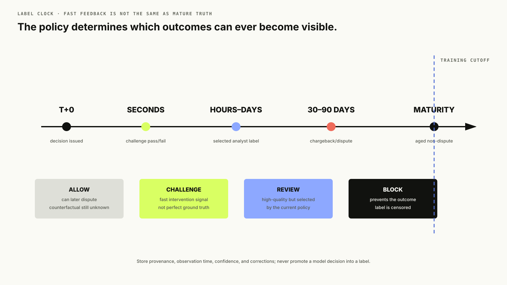</a>
  <figcaption>Fast feedback and mature outcomes are different datasets; mixing them without provenance lets the current policy train its own successor.</figcaption>
</figure>

Store `label_type`, `label_value`, `observed_at`, `effective_at`, `source`, `confidence`, and correction lineage. Build one fast-feedback model or weighting channel from analyst labels and another mature-outcome dataset from chargebacks and aged legitimate transactions. Research on realistic credit-card fraud detection highlights concept drift, severe imbalance, and verification latency together; production evaluation must model all three.

## Evaluate Chronologically Under Extreme Imbalance

Never random-split transaction rows. The same card, device, attack campaign, or future aggregate can leak into both sides. Train on an earlier interval, leave a gap for feature and label maturity, validate on the next interval, and test on the newest mature interval. Group related entities or attack clusters when possible so memorizing a ring does not masquerade as generalization.

Report:

- PR-AUC, not accuracy as the headline discrimination metric;
- recall at a fixed false-positive or approval-rate budget;
- precision at the review and block thresholds;
- expected dollars lost and prevented under the actual policy;
- calibration error by amount, region, merchant category, and customer tenure;
- early detection: loss accumulated before the first ring member is caught;
- review yield and estimated analyst minutes per prevented dollar;
- p50, p95, and p99 decision latency with dependency-failure slices.

Downsampling legitimate examples can make training practical, but restore the real class prior when calibrating probabilities and never downsample the evaluation population into a fantasy. Focal loss is one option for reducing the influence of abundant easy negatives, though it originated in object detection; weighted loss, hard-negative mining, and tree-model class weights are simpler baselines to test first.

Offline metrics cannot fully identify the effect of blocking because blocked fraud and blocked legitimate purchases both hide counterfactual outcomes. Run the challenger in shadow first. For medium-risk traffic where it is safe and permitted, use narrowly bounded randomized interventions or differing challenge policies to estimate causal cost. Maintain a stable policy holdout and never experiment past hard legal or security constraints.

## Engineer Features by Freshness and Attack Cost

Organize features by entity and by how quickly they become stale:

| Group | Examples | Freshness | Attack cost |
|---|---|---:|---:|
| Transaction | amount, currency, merchant category, cart composition | Request | Low |
| Account | age, verification, historical spend, prior disputes | Minutes–day | Medium |
| Payment instrument | first seen, issuer country, decline history | Seconds–hours | Medium |
| Device/network | device tenure, accounts per device, proxy signals | Seconds–hours | Medium–high |
| Velocity | attempts/sums/distinct entities over 1m, 10m, 1h, 24h | Seconds | High |
| Relational | shared cards/devices/IPs, risky-neighbor counts, ring embedding | Minutes–day | High |
| Context | session path, checkout duration, shipping/billing mismatch | Request | Medium |

Attack cost matters. A single user-agent string is easy to spoof. Coordinating hundreds of aged accounts, payment instruments, devices, and human-like session histories is harder. Prefer diverse evidence so one evasion does not collapse the model.

<figure class="technical-figure wide-figure">
  <a href="assets/feature-window-clock.svg" target="_blank" rel="noreferrer">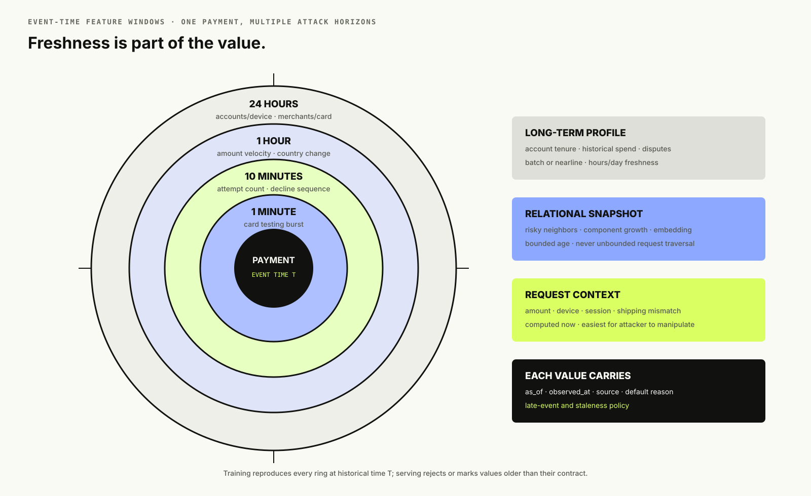</a>
  <figcaption>Features at different horizons answer different attack hypotheses; each online value needs an event-time boundary, source timestamp, and defined late-event policy.</figcaption>
</figure>

The request-time feature vector might include:

```python
features = {
    "amount_log": log1p(payment.amount_minor),
    "account_age_hours_log": log1p(hours_since(payment.account_created_at)),
    "card_attempts_10m": velocity.card_count_10m,
    "card_amount_1h_log": log1p(velocity.card_amount_1h),
    "device_accounts_24h": velocity.device_distinct_accounts_24h,
    "country_changed_1h": int(history.last_country != payment.country),
    "cvv_failed": int(payment.cvv_result == "fail"),
    "risky_neighbors_2hop": graph_snapshot.risky_neighbors_2hop,
}
```

Values must be computed **as of the decision event time** for training and serving. A training join that uses a chargeback filed later, a lifetime count observed after the payment, or a graph snapshot containing future edges is leakage.

## Integrate External Intelligence Without Putting Vendors on Checkout

Fraud decisions often need evidence that the platform did not create: sanctions and regulatory lists, compromised-instrument feeds, GeoIP and proxy intelligence, device reputation, issuer advisories, and merchant consortium signals. The unsafe design is to call each provider while the customer waits. One slow vendor then consumes the checkout deadline, one outage becomes a payment outage, and the same request can observe inconsistent vendor answers across retries.

Ingest these feeds asynchronously. A connector fetches or receives a candidate release, validates its schema and expected population, verifies signatures or checksums, and records provenance. Only a validated snapshot enters a versioned registry. Regional jobs materialize compact lookups into the feature cache used by checkout. Every snapshot carries at least `source`, `version`, `published_at`, `effective_at`, `expires_at`, checksum, schema version, and regional delivery status. The feature response carries both the value and its age.

<figure class="technical-figure wide-figure">
  <a href="assets/external-intelligence-decision-fusion.svg" target="_blank" rel="noreferrer">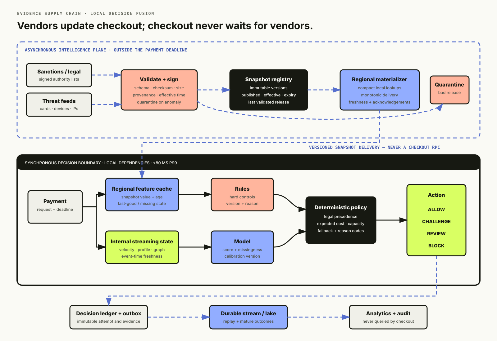</a>
  <figcaption>External providers update validated regional snapshots asynchronously. Checkout reads local evidence; it never waits for a sanctions, reputation, GeoIP, or compromised-instrument vendor.</figcaption>
</figure>

Not every feed has the same failure semantics:

- **Legal or contractual hard controls** use the last validated snapshot only within an approved maximum age. Past that age, a documented jurisdiction- and product-specific fail policy decides whether to stop, hold, or route the payment; the model is not allowed to override it.
- **Soft reputation signals** become stale or missing features. The model receives missingness and source-age metadata, and policy applies a fallback that was evaluated under simulated feed loss.
- **Malformed or suspicious releases** are quarantined. A signature failure, impossible schema change, unexpected population collapse, or large unexplained distribution shift never replaces the last-known-good snapshot automatically.

This design trades a small, measurable propagation delay for bounded latency and fault isolation. For a genuinely urgent compromised-token revocation, use a separate signed push channel into regional caches with monotonic versions and acknowledgement—not an unbounded request-time dependency. Monitor provider freshness, validation failures, regional replication lag, match rate, and marginal decision value; a prestigious feed that is stale, redundant, or noisy should not survive on reputation alone.

## Choose the First Model Deliberately

Start with logistic regression as a calibration and pipeline baseline, then a gradient-boosted tree model. The linear model exposes sign errors and leakage quickly. The tree model usually captures useful interactions among sparse, tabular, nonlinear risk signals at low CPU latency.

A deeper network becomes attractive when there is enough network-scale data, learned entity embeddings, or sequential behavior that hand-aggregated features miss. A graph neural network becomes attractive when coordinated relationships are a dominant signal. Neither automatically replaces the tabular model: Airbnb published that offline SIGN graph embeddings became valuable downstream features while keeping the real-time trust models simple, and Stripe has described combining large network-level signal sets with rules and interventions.

<aside class="interview-dialogue">
  <p><strong>Interviewer</strong> Fraud is fundamentally relational — rings share devices, cards, and addresses. Why not start with a graph neural network instead of a tree model?</p>
  <p><strong>Candidate</strong> A GNN adds training complexity, embedding freshness problems, and inference cost before I've shown the simpler model can't handle it. I'd rather ship the tabular model, add relational counts as ordinary features, and only reach for a graph-native model once replay shows that coordinated rings are slipping past everything else. That's also why Airbnb's public write-up computes graph embeddings offline and feeds them into a simple online model rather than serving graph inference live.</p>
</aside>

What often fails:

- **One giant deep model immediately:** harder to calibrate, debug, and serve; gains may disappear against a strong tree baseline.
- **SMOTE before splitting:** synthetic neighbors can leak campaign structure and distort probability calibration.
- **One global threshold:** ignores amount, merchant economics, challenge availability, review capacity, and regional requirements.
- **Raw identifiers as features:** encourage memorization, create privacy risk, and fail on unseen entities.
- **Accuracy-driven tuning:** rewards the majority class.
- **Training on decisions as labels:** turns policy into “ground truth” and locks in its blind spots.

The final model bundle contains preprocessing statistics, feature schema, model parameters, calibration mapping, training cutoff, data fingerprint, compatibility requirements, and checksums. Model and policy are promoted independently because the same probability may require different actions as fraud loss, review capacity, or challenge efficacy changes.

## Put Policy After Prediction

The model answers: “Given the available evidence, how risky is this payment?” The policy answers: “What are we allowed and willing to do about it now?”

A simple policy is:

```python
if hard_block_rule:
    action = BLOCK
elif score >= merchant.block_threshold:
    action = BLOCK
elif score >= merchant.review_threshold and review_queue.has_capacity:
    action = REVIEW
elif score >= merchant.challenge_threshold and challenge.is_available:
    action = CHALLENGE
else:
    action = ALLOW
```

Real policies also include amount-dependent thresholds, issuer/network rules, region, merchant risk appetite, inventory type, fulfillment reversibility, customer segment, and current incident overrides. Keep the policy deterministic, versioned, testable, and explainable. Do not bury it in model postprocessing code.

Threshold changes can have larger business impact than model changes. Test them against replay data, queue-capacity simulations, and shadow traffic. Require dual control for emergency rules with broad blast radius. Every rule needs owner, reason, creation/expiry time, affected scope, and observed match/precision metrics; temporary incident rules that never expire are technical debt with customer impact.

### Operate rules like production code

A rule should be a versioned artifact with an explicit blast radius, not an anonymous line in a mutable configuration file:

```text
RULE card_testing_v17
WHEN card_attempts_10m >= 8
  AND distinct_accounts_per_device_1h >= 4
THEN challenge
SCOPE merchant_group = "digital_goods"
EXPIRES 2026-08-17T00:00:00Z
```

Its lifecycle is: author with owner, reason, scope, and expiry; statically validate fields and types; reject unsafe complexity or fan-out; replay on historical traffic; dry-run or shadow on live traffic; canary by tenant or region; activate; monitor match rate, precision, false declines, and queue impact; then auto-expire or remove it with a kill switch. A rule compiler can represent conditions as an abstract syntax tree, but the important contract is deterministic evaluation against a pinned rule-set version.

<aside class="interview-dialogue">
  <p><strong>Interviewer</strong> Realistically, incident rules get written under pressure at 2 a.m. Won't the expiry field just get set to some far-off date and forgotten?</p>
  <p><strong>Candidate</strong> That's exactly why expiry can't be a courtesy field — it needs to be enforced the way a certificate expiry is. An emergency rule should default to a short expiry, page its owner before it lapses, and require a deliberate renewal with a reason, not a silent extension. A rule with no owner or an expiry years out should fail validation the same way a malformed schema would.</p>
</aside>

Rules and model inference can run concurrently after their required inputs are available. They return evidence—not the final customer action. The deterministic policy resolves legal hard blocks, model risk, challenge availability, merchant policy, and review capacity in one place. Analysts receive stable reason codes and bounded contributing factors; customers receive useful recovery guidance. Neither should receive a raw SHAP dump or exact attack thresholds that turn explanations into an evasion guide.

## HLD V1: Add Streaming State and Separate the Decision Plane

HLD V0 eventually fails in recognizable ways:

- database queries for rolling counts create p99 spikes and hot rows;
- attacks complete before hourly aggregates refresh;
- training code and online SQL compute “the same” feature differently;
- model/rule deploys are coupled to checkout-service releases;
- investigators cannot connect accounts sharing devices and instruments;
- one merchant's traffic spike consumes the whole risk service.

At roughly 2,000 requests per second with several teams changing risk logic, split by scaling and reliability boundary:

1. **Risk gateway** authenticates callers, normalizes identity, enforces idempotency, and owns the total deadline.
2. **Online feature service** batch-gets versioned entity snapshots and velocity aggregates from a low-latency key-value store.
3. **Rule engine** evaluates versioned deterministic controls.
4. **Model server** scores a complete vector plus missingness and freshness metadata.
5. **Policy engine** chooses the intervention and emits reason codes.
6. **Decision ledger/outbox** preserves the immutable result and publishes it after the response.
7. **Stream processor** consumes canonical attempts and outcomes, updates event-time aggregates, and writes the offline lake.
8. **Case service** groups alerts, graph context, notes, and labels for analysts.

Do not turn every module into a service automatically. The gateway and policy may remain one deployable unit if they share ownership and latency. The model server deserves separation when model runtimes or scaling differ. Streaming computation is naturally asynchronous. Case management has an entirely different workload. A feature service becomes worthwhile when many models share canonical features and online/offline parity is otherwise failing.

A **decision plane** is the small set of components that must produce the authorization action before the deadline. The **streaming memory plane** consumes events continuously and maintains recent state, but checkout does not wait for an event to traverse that pipeline. The **learning/control plane** builds and distributes versioned feature, model, rule, and policy artifacts; a short control-plane outage must not stop a region from serving its last-known-good bundle.

<figure class="technical-figure wide-figure">
  <a href="assets/risk-decision-planes.svg" target="_blank" rel="noreferrer">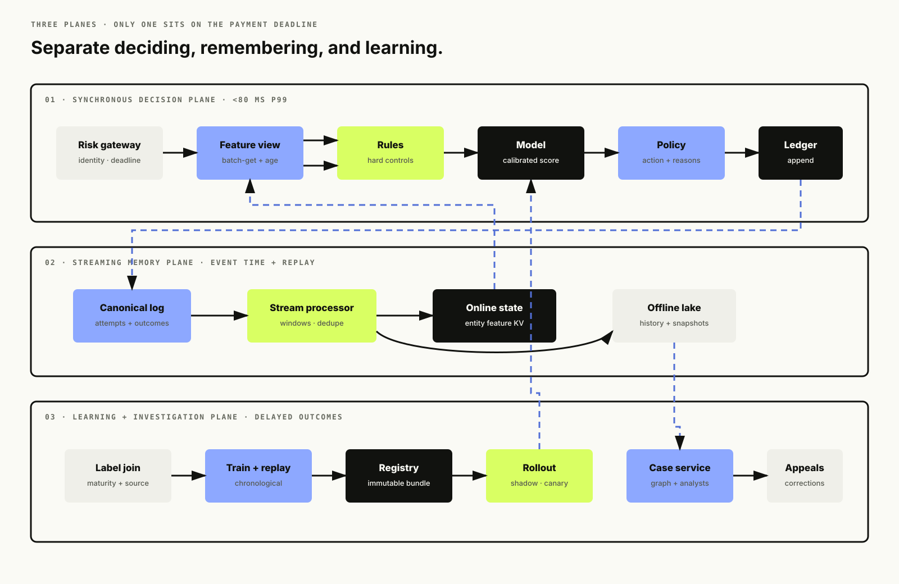</a>
  <figcaption>The payment deadline crosses only the decision plane; state maintenance, graph enrichment, labels, training, and cases progress on durable asynchronous lanes.</figcaption>
</figure>

### Synchronous request sequence

```text
Payment -> Risk gateway: Decide(request, idempotency_key, deadline)
Risk gateway -> Ledger: lookup idempotency key
Risk gateway -> Feature service: BatchGet(feature_view, entities, as_of)
Risk gateway -> Rule engine: Evaluate(rule_set, request, cheap context)
Feature service -> Risk gateway: values + source times + missingness
Risk gateway -> Model server: Predict(model_version, vector)
Model server -> Risk gateway: calibrated score + attributions
Risk gateway -> Policy: Resolve(score, rules, capacity, merchant policy)
Risk gateway -> Ledger/outbox: append immutable decision
Risk gateway -> Payment: action + versions + reason codes
```

The caller propagates an absolute deadline. Each child call receives a smaller deadline. Optional graph features never delay mandatory feature groups. Results include freshness, not merely values: a card count of zero from a store that has not updated for an hour is different from a fresh zero.

<aside class="interview-dialogue">
  <p><strong>Interviewer</strong> Why extract services now if local calls were safer in HLD V0?</p>
  <p><strong>Candidate</strong> The measured boundaries changed. Streaming has stateful event-time scaling, model runtimes release independently, and case management has a different workload. I still keep synchronous hops few; service extraction is justified by ownership, scaling, runtime, or failure isolation—not by a preference for microservices.</p>
</aside>

<figure class="technical-figure wide-figure">
  <a href="assets/interview-board-02-critical-path-and-streaming.svg" target="_blank" rel="noreferrer">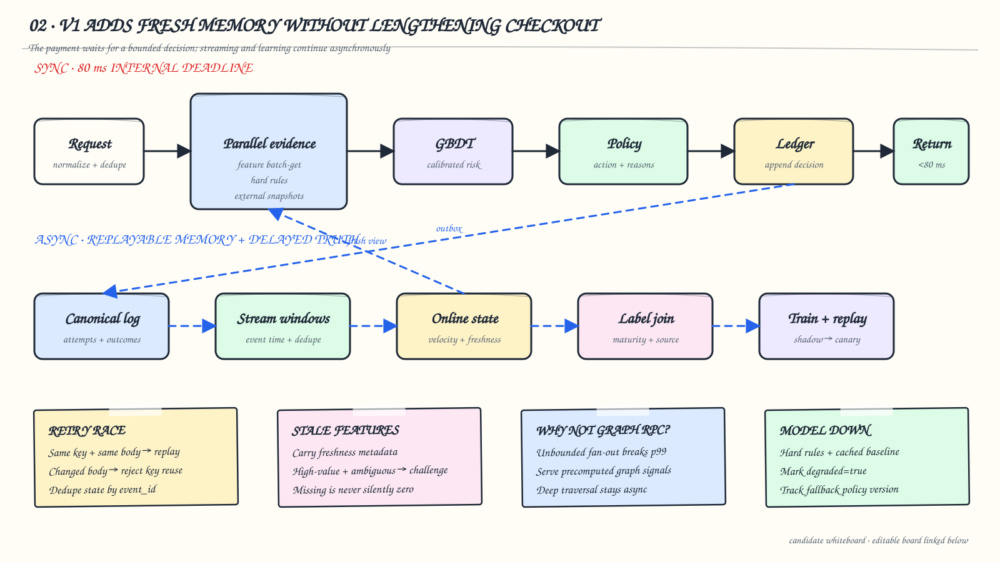</a>
  <figcaption>Whiteboard checkpoint 2: checkout waits only for the bounded decision lane. Dashed blue paths carry the durable outbox, velocity state, delayed truth, and release loop; the bottom notes capture the failure-mode follow-ups an interviewer is likely to ask. Original diagram for this article.</figcaption>
</figure>

## Make Velocity Features Correct Under Retries and Races

Velocity features are deceptively stateful. “Attempts by this card in ten minutes” requires decisions about identity, event time, late events, duplicates, window boundaries, and concurrent updates.

**Event time** is when the payment actually occurred; **processing time** is when a streaming worker handled it. A **watermark** is the processor's estimate that most events before a timestamp have arrived, allowing a window to produce a result while still accepting a bounded amount of late data. Without these definitions, two pipelines can both claim to compute “ten-minute attempts” and disagree.

Canonicalize the attempt once and assign `event_id`. The stream processor deduplicates by that ID. The synchronous path does not increment counters and then publish an event without coordination; a retry could increment twice, and a crash could update one side only. Two viable patterns are:

- append the canonical attempt to a durable log first, then read stream-maintained counters, accepting that the newest event may not yet be reflected and adding request-local evidence;
- atomically update keyed state and record the decision intent in one strongly consistent boundary, then publish through an outbox.

At large scale, partition the stream by the entity whose order matters—card token for card velocity, device for device sharing—and compute multiple keyed views. One event may fan out to several feature keys. The stream processor uses event time and watermarks. A payment arriving late can update future aggregates, but it must not retroactively change the feature snapshot used for an already-issued decision.

Define each feature as code plus metadata:

```yaml
name: card_attempt_count_10m
entity: card_token
event_source: normalized_payment_attempts_v3
event_time_column: event_time
window: 10m
aggregation: count_distinct(event_id)
allowed_lateness: 2m
online_ttl: 30m
default: 0
max_staleness: 5s
owner: payment-risk
```

The same definition drives historical backfill and online computation, or parity tests compare the two implementations on replayed events. Uber has published this batch/near-real-time feature-store pattern, including writing streaming features online and back to the offline store for training.

Hot entities are expected during card testing. Salting can spread write load but complicates reads. A stream processor with partition-local state and periodic materialization often handles hot counters better than direct read-modify-write traffic from every risk request. Apply per-key load shedding and hard caps so one attacked token does not exhaust memory.

<aside class="interview-dialogue">
  <p><strong>Interviewer</strong> Why not promise exactly-once processing and stop discussing duplicates?</p>
  <p><strong>Candidate</strong> A broker guarantee does not cover every database, cache, and external effect end to end. I use stable event identities, atomic state transitions where needed, idempotent consumers, and replay tests. That makes duplicate delivery harmless without relying on a vague global exactly-once claim.</p>
</aside>

## Add Graph Evidence Without Putting Graph Traversal on Checkout

Fraud is relational: many accounts may share one device, card, address, phone, IP range, or merchant. A row-wise model sees five mildly suspicious accounts; a graph sees a dense component attached to a known bad instrument.

Build a heterogeneous graph:

```text
(account)-[used]->(device)
(account)-[paid_with]->(card_token)
(transaction)-[sent_to]->(merchant)
(account)-[connected_from]->(ip_prefix)
(account)-[shipped_to]->(address_token)
```

Start with offline or nearline graph aggregates:

- distinct accounts per device/card/address;
- confirmed-risky neighbors within one or two hops;
- component size and density;
- shared-entity novelty and growth rate;
- distance to a confirmed fraud node;
- batch graph embedding with age/freshness.

Airbnb chose periodic offline SIGN embeddings as features for online trust models because the simpler maintenance/freshness tradeoff was right for its initial implementation. That is a strong default here. A real-time neighborhood expansion can create unpredictable fan-out and latency exactly when an attack forms a hot supernode.

Move toward GraphSAGE-style inductive embeddings, sampled online neighborhoods, or temporal GNNs only when replay and shadow tests show graph freshness materially improves early ring detection. GraphSAGE is useful conceptually because it learns an aggregation function that can represent unseen nodes rather than requiring a fixed embedding for every identity.

<figure class="technical-figure wide-figure">
  <a href="assets/fraud-ring-caseboard.svg" target="_blank" rel="noreferrer">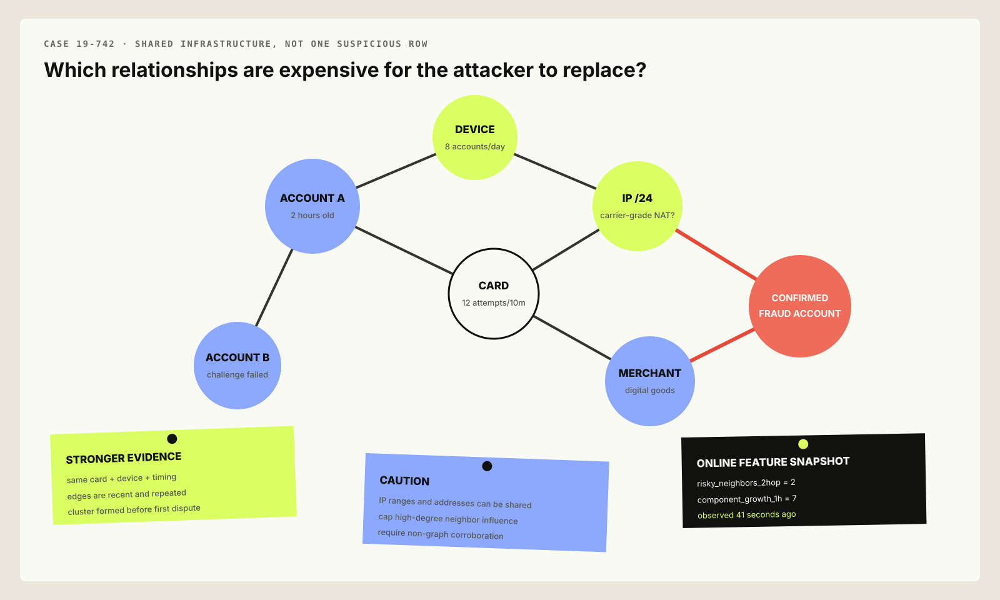</a>
  <figcaption>A graph turns repeated infrastructure into evidence, but the online decision usually consumes bounded snapshots and aggregates rather than an unbounded traversal.</figcaption>
</figure>

Protect against guilt by association. Shared Wi-Fi, family devices, corporate cards, apartment addresses, and mobile carrier IPs create legitimate high-degree nodes. Downweight common entities, track edge semantics and timestamps, cap neighbor influence, and require non-graph evidence before severe action.

<aside class="interview-dialogue">
  <p><strong>Interviewer</strong> If a device is shared by three accounts and one turns out to be fraudulent, isn't flagging the other two exactly what the graph is for?</p>
  <p><strong>Candidate</strong> It's evidence, not a verdict. A family tablet or a corporate card can legitimately touch a dozen accounts, so raw shared-entity count would flag ordinary households as often as rings. I cap how much influence one shared node contributes, weight it down as its degree grows, and require the graph signal to combine with independent evidence before it can push a decision past challenge — a shared device alone should never reach block.</p>
</aside>

## Use Analysts as a Scarce Labeling Instrument

Manual review is not a failure fallback; it is a constrained sensor and intervention.

Prioritize cases by expected value of information and preventable loss, not score alone. A $5 ambiguous transaction has less expected value than a $5,000 one. Ten alerts from one ring may need one case, not ten independent reviews. Queue policy should account for amount, fulfillment deadline, uncertainty, novelty, cluster coverage, merchant priority, and analyst skill.

The case view includes:

- transaction and entity timeline;
- reason codes and feature freshness;
- similar prior decisions and outcomes;
- graph neighborhood with edge semantics;
- model/rule/policy versions;
- recommended action without hiding uncertainty;
- structured label choices plus free-form notes;
- an appeal and correction trail.

Sample some low-risk and recently changed slices for review. Otherwise analysts only label what the old system already suspects, and blind spots remain invisible. Active learning can prioritize uncertain or novel examples, but reserve random audit capacity to estimate real prevalence and selection bias.

<aside class="interview-dialogue">
  <p><strong>Interviewer</strong> The model already scores every transaction. What does a human reviewer actually add?</p>
  <p><strong>Candidate</strong> A model trained on past decisions can only be as good as the labels it was given, and analysts are one of the few sources of labels the current model didn't produce itself. They catch novel patterns the model has never seen, absorb ambiguous cases that shouldn't be resolved by a threshold, and — if I sample some of their queue at random instead of only the model's top scores — tell me what the model is confidently missing.</p>
</aside>

LLMs can summarize case evidence or normalize analyst notes, but should not silently invent ground truth. Google researchers have published an LLM-assisted scam-review approach; its proper role in this design is reviewer augmentation with cited evidence, not an unreviewed authorization dependency.

## Train, Promote, Shadow, and Roll Back Safely

The learning path is:

```text
canonical events + feature snapshots + decision ledger
  -> label maturity/provenance join
  -> point-in-time training set
  -> chronological train/validation/test
  -> model + calibration + threshold simulation
  -> artifact compatibility checks
  -> offline gates
  -> shadow on live traffic
  -> canary by merchant/region
  -> gradual promotion
```

Release a **bundle manifest** that pins the model, preprocessing, feature view, calibration, policy compatibility range, training cutoff, and checksum. The online service loads the bundle immutably and keeps the last-known-good bundle warm. A control plane may distribute metadata globally, but the request path never waits for it.

Offline gates include:

- no schema or point-in-time validation errors;
- minimum PR-AUC and recall at the production false-positive budget;
- no unacceptable regression by amount, region, merchant, tenure, or device slice;
- calibration and expected-cost improvement;
- inference latency and memory limits;
- feature parity on replay;
- reason-code stability for a golden decision corpus;
- stress tests for missing and stale features.

Shadowing checks predictions, latency, feature availability, and decision disagreement without changing customer outcomes. Because attackers adapt to served actions, a long-running shadow is informative but not equivalent to a live policy. Promote narrowly, cap loss, and monitor fast proxies while waiting for mature chargebacks.

A **shadow release** runs the challenger on live inputs but does not let it change customer actions. A **canary release** lets the challenger affect a small, bounded slice of traffic. Shadowing reveals serving and disagreement problems; a canary is still required to observe intervention effects and rollback safely.

<aside class="interview-dialogue">
  <p><strong>Interviewer</strong> If the challenger wins offline and in shadow, why not deploy it globally?</p>
  <p><strong>Candidate</strong> Shadow traffic cannot reveal how customers, issuers, analysts, or attackers respond to changed actions. I canary by a bounded tenant or region, cap exposure, watch fast guardrails, and retain the previous immutable bundle for rollback while mature labels arrive.</p>
</aside>

Do not automatically retrain and fully deploy merely because drift is detected. Attackers can poison fast feedback. A high-severity drift alert freezes promotion, preserves evidence, and routes to human review. Emergency rules may bridge the gap while a clean dataset and model are prepared.

## Survive Missing Features, Model Failure, and Regional Loss

Design degradation before the first outage:

| Failure | Continue with | Typical action change |
|---|---|---|
| One optional feature group times out | Missingness-aware model | Slight threshold adjustment if validated |
| Streaming counters stale | Batch history + rules | Challenge risky new/high-value traffic |
| Graph snapshot missing | Tabular model | No severe action based on absent graph evidence |
| External intelligence stale or corrupt | Last validated snapshot within its max age; otherwise explicit feed policy | Enforce hard-control policy; mark soft signals missing |
| Malformed request or profile | Versioned schema validation + quarantine | Return a typed client error; never invent identity fields |
| Model server unavailable | Deterministic rules + cached baseline | Allow known-low-risk; challenge/review bounded risk |
| Stream lag or backpressure | Last complete event-time windows + lag metadata | Shed optional enrichment, not authorization records |
| Rule/model causes an alert flood | Prior bundle + kill switch + case coalescing | Roll back and protect analyst capacity |
| Decision ledger or primary store unavailable | Local durable outbox or strict fail policy | Do not acknowledge a decision that required durable audit |
| Review queue saturated | Challenge or amount-aware thresholds | Do not keep routing into a dead queue |
| Regional feature store lost | Region-local last-known-good snapshots | Tighten only policies proven safe |

A universal fail-open leaks money during attacks; a universal fail-closed becomes a self-inflicted denial of service. The correct fallback depends on amount, reversibility, customer tenure, challenge availability, merchant risk appetite, and regulatory constraints.

<aside class="interview-dialogue">
  <p><strong>Interviewer</strong> When the model server is down, why not just block everything until it comes back? That sounds safest.</p>
  <p><strong>Candidate</strong> Safest for fraud loss, but it turns one dependency outage into a full payment outage — every legitimate customer gets declined along with every attacker. I fall back to deterministic rules and a cached baseline instead, sized to the actual risk: known-low-risk traffic keeps flowing, ambiguous traffic gets challenged rather than blocked, and only traffic that a hard rule already covers gets blocked outright. "Safe" here means bounded loss on both sides, not zero fraud loss.</p>
</aside>

For example:

```text
known account + low amount + no hard rule     -> allow
new account + high amount + stale velocity    -> challenge
known compromised card token                 -> block
ambiguous high value + review capacity        -> review
ambiguous high value + no challenge/review    -> merchant-specific safe default
```

Every degraded decision says `degraded=true`, names unavailable feature groups, records fallback policy, and emits a separate reliability metric. Otherwise a feature outage can look like an unexplained drop in fraud scores.

Never silently drop transactions labelled “low risk” when the system is overloaded. Every request receives a decision or an explicit timeout/error interpreted by the caller's documented policy, and every acknowledged attempt is durably recorded where audit or financial controls require it. Backpressure can postpone analytics and optional enrichment; it cannot make authorization history disappear.

Bad records go to a quarantine or dead-letter stream with the schema reason, original event identity, source, and replay lineage. Do not silently coerce an invalid amount, timestamp, or entity identifier into a plausible value. During an alert flood, coalesce cases by entity or fraud ring, suppress duplicate notifications while preserving raw events, apply tenant quotas and value-aware queue priority, and trip a circuit breaker or kill switch when a bad rule or model is amplifying traffic.

## HLD V2: Build a Global, Multi-Tenant Risk Platform

At 20,000 peak decisions per second across regions and many merchants, use regional cells. Global routing sends a payment to its home/nearest healthy region. Each cell contains stateless risk gateways, local feature replicas, model servers, policy cache, and a durable decision log. The cell can decide using a last-known-good bundle without cross-region RPCs.

A **regional cell** is a self-contained slice of the serving data plane with its own compute, low-latency state, decision log, and failure boundary. Losing one cell should not exhaust every other region or require a synchronous call to a global control plane.

Global services manage model/policy registry, feature definitions, training, audit search, and rollout orchestration. They publish immutable artifacts to regional stores. They do not participate synchronously in authorization.

Cross-region signals create a hard tradeoff. A card used in Europe seconds after North America is valuable evidence, but synchronous global consistency is expensive and fragile. Stream compact entity-risk updates between regions with bounded delay; keep authoritative raw events in their jurisdiction when residency requires it. Treat remote evidence age as a feature. Reserve globally strongly consistent state for a very small set of non-negotiable controls, such as a confirmed compromised token, if the business can justify its latency and availability cost.

Tenant isolation includes:

- per-merchant authentication, quotas, deadlines, and feature permissions;
- shared global model plus calibrated merchant segment or custom model where data supports it;
- versioned tenant policy overlays with bounded override capabilities;
- queue and compute isolation for noisy merchants;
- audit boundaries preventing one tenant from seeing another's raw network data;
- privacy-preserving network aggregates where cross-merchant evidence is allowed.

Do not train a bespoke model per small merchant. Sparse labels produce unstable models and an operational explosion. Start with one global model plus merchant/category/context features, calibrate by meaningful segments, and require data/impact thresholds before custom models.

Microservices now make sense where independent ownership, language/runtime, scaling, or failure isolation is measurable. Keep the number of synchronous hops small. A “risk microservice” that calls twelve tiny feature microservices serially is a distributed latency bug.

<aside class="interview-dialogue">
  <p><strong>Interviewer</strong> Why not keep one globally consistent feature store?</p>
  <p><strong>Candidate</strong> It simplifies one mental model but puts WAN latency and a global failure domain on checkout. Most risk evidence tolerates bounded staleness, so I serve local state and replicate compact updates asynchronously. I reserve strong global consistency for a tiny set of controls whose correctness benefit justifies the availability cost.</p>
</aside>

### Make recovery objectives testable

Recovery targets depend on business loss and regulatory obligations. The following are planning targets for this design, not universal promises:

| Capability | Example RTO | Example RPO | Recovery behavior |
|---|---:|---:|---|
| Regional decision serving | About 60 seconds | Not applicable to immutable serving artifacts | Route to a healthy cell or start from the last-known-good bundle |
| Decision ledger and outbox | Under 5 minutes | Zero for acknowledged decisions | Restore quorum or replay the local durable journal before acknowledgement resumes |
| Streaming features | Under 15 minutes | At most 5 minutes | Serve marked-stale state, then replay the canonical log and reconcile windows |
| Cases and analytics | 4 hours | 15 minutes | Rebuild indexes and queues from durable decision and outcome events |
| Training and control plane | 24 hours | Last promoted immutable bundle | Pause promotion; regional cells continue serving the pinned bundle |

A disaster-recovery drill should evacuate a region, restore the latest verified snapshot, replay the canonical event log from a recorded offset, and verify deduplication by comparing decision IDs, counts, and ledger checksums before failback. It must also prove that residency boundaries survive rerouting: raw events may need to remain in-jurisdiction even when compact risk evidence is replicated. A runbook that has never restored data or exercised regional routing is documentation, not a recovery capability.

<figure class="technical-figure wide-figure">
  <a href="assets/interview-board-03-regional-and-failure.svg" target="_blank" rel="noreferrer">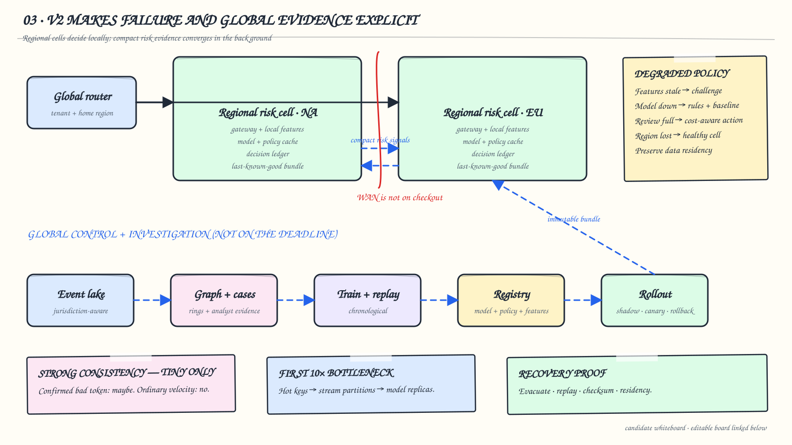</a>
  <figcaption>Whiteboard checkpoint 3: the red boundary keeps WAN calls off checkout, while compact evidence and immutable bundles cross asynchronously. Degraded policy and recovery evidence are drawn as first-class design decisions. Original diagram for this article.</figcaption>
</figure>

## Map the Design to AWS and Google Cloud

One AWS mapping is:

| Need | AWS option |
|---|---|
| Ingress and event log | API Gateway/ALB, MSK or Kinesis |
| Event-time features | Managed Service for Apache Flink |
| Online keyed state | DynamoDB, ElastiCache, or purpose-built state store |
| Offline lake/warehouse | S3 + Glue/Athena/Redshift |
| Training/registry/serving | SageMaker AI |
| Graph analytics | Neptune/Neptune ML or offline Spark graph jobs |
| Decision events/workflows | EventBridge, SQS, Step Functions |
| Search and cases | OpenSearch plus an application database |

AWS has published both in-stream inference and Neptune/GNN fraud reference architectures. These are implementation options, not proof that every fraud system needs every managed service. A smaller team may choose managed fraud tooling or one Flink job plus a tree model rather than operate a graph stack.

One Google Cloud mapping is:

| Need | Google Cloud option |
|---|---|
| Ingress and event log | Cloud Load Balancing/API Gateway + Pub/Sub |
| Event-time features | Dataflow/Apache Beam |
| Online keyed state | Bigtable, Memorystore, or Spanner for strongly consistent subsets |
| Offline lake/warehouse | Cloud Storage + BigQuery |
| Training/registry/serving | Vertex AI |
| Graph analysis | BigQuery graph queries or offline graph pipelines |
| Workflows/events | Pub/Sub, Eventarc, Workflows |
| Monitoring/cases | Cloud Monitoring plus application services |

Google Cloud has published a fraud pipeline using Pub/Sub, Dataflow, Bigtable, and Vertex AI, while WePay described Kafka, Dataflow, and Bigtable for velocity features. The design principle is more durable than the product names: durable events, event-time aggregation, low-latency entity state, point-in-time training, isolated inference, and an auditable policy.

## Keep the LLD Contracts Auditable

The core types are:

```python
@dataclass(frozen=True)
class FeatureValue:
    name: str
    value: float | str | bool | None
    observed_at: datetime | None
    source: str
    missing_reason: str | None

@dataclass(frozen=True)
class RiskPrediction:
    score: float
    model_version: str
    calibration_version: str
    attributions: tuple[tuple[str, float], ...]

@dataclass(frozen=True)
class RiskDecision:
    decision_id: str
    action: Action
    score: float
    reason_codes: tuple[str, ...]
    feature_version: str
    model_version: str
    policy_version: str
    degraded: bool
```

Important invariants:

- a decision references one canonical request hash;
- action severity can only be resolved by policy, never hidden inside a feature;
- the response and ledger record share the same decision ID;
- a feature has an `as_of` boundary and freshness;
- a model bundle rejects incompatible feature schemas;
- rules and policy evaluation are deterministic for the same inputs;
- labels append and can be corrected, but do not mutate the historical decision;
- analysts can explain a decision from stored evidence even after models change.

<figure class="technical-figure wide-figure">
  <a href="assets/decision-ledger-state.svg" target="_blank" rel="noreferrer">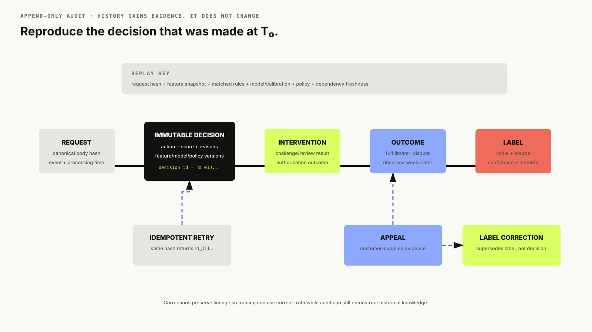</a>
  <figcaption>The authorization decision never changes; later interventions, outcomes, labels, appeals, and corrections append evidence around it.</figcaption>
</figure>

## Monitor Adversaries, Operations, and Business Harm Together

System metrics:

- QPS, deadline exhaustion, p50/p95/p99 latency;
- dependency timeouts and feature batch-get fan-out;
- stream lag, watermark delay, dedupe rate, hot keys;
- model load failures, memory, batch size, CPU saturation;
- decision-ledger and outbox lag;
- degraded-decision rate by cause.

Data/model metrics:

- null, default, staleness, and online/offline skew by feature;
- score and action distributions by tenant/region/amount;
- calibration and PR metrics as labels mature;
- challenger disagreement and reason-code shifts;
- graph degree/component growth and embedding age;
- label delay, source mix, correction rate, and reviewer agreement.

Product/operations metrics:

- fraud loss and chargebacks per approved volume;
- approval and false-decline rates;
- challenge rate, completion, latency, and abandonment;
- review precision, queue age, service-level misses, analyst minutes;
- appeal rate and successful appeals;
- prevented loss and customer friction by segment.

Alert on combinations. A falling fraud rate plus a falling approval rate may mean an over-aggressive policy. A sudden score drop plus stale velocity features is likely infrastructure, not safer traffic. A stable global PR-AUC can hide a new attack in one region or merchant category.

<aside class="interview-dialogue">
  <p><strong>Interviewer</strong> If your global PR-AUC dashboard looks flat and healthy, doesn't that mean the model is doing fine?</p>
  <p><strong>Candidate</strong> Not necessarily — a global average can hide a regional fire. A new attack concentrated in one merchant category or country can double the local fraud rate while barely moving a metric computed over the whole portfolio. That's why I slice PR-AUC and calibration by region, merchant category, and tenure rather than trusting one aggregate number to represent every population the model actually serves.</p>
</aside>

Adversarial monitoring adds canary entities, synthetic attack replays, rate-limited red-team traffic, rule probing detection, and survival analysis for newly observed campaigns. Protect exact thresholds and high-value feature logic as sensitive security configuration; explanations to customers should be useful without becoming an evasion manual.

### Keep analytics off the checkout path

```text
decision ledger + outbox + mature outcomes
  -> durable event lake
  -> analytical warehouse / audit index
  -> fraud trends, policy simulation, analyst ops, compliance exports
```

The warehouse and search index are asynchronous projections; neither is queried to authorize a payment. Aggregate daily fraud and friction by tenant, region, attack family, action, and model/policy version. Preserve immutable lineage from each report row back to decision and outcome events so policy simulation and compliance exports are reproducible. Isolate ad-hoc queries with separate compute and quotas: an investigator scanning six months of history must not consume stream-processing or decision-serving capacity.

## Protect Privacy and Measure Uneven Harm

Risk platforms touch payment, device, location, identity, and behavioral data. Minimize collection, tokenize payment instruments, separate raw identity from feature access, encrypt data, enforce purpose-bound authorization, audit analyst access, and expire data according to policy and law. Device fingerprinting and cross-merchant network signals require explicit privacy review and region-specific controls.

Exclude protected attributes unless there is a lawful, reviewed reason to use them. Also test proxies: geography, device price, language, and account history can create uneven false declines. Measure approval, challenge, review, block, appeal, and error rates across permitted slices. Different base rates make one fairness metric insufficient; document which harm is being constrained and why.

Human review does not remove bias. Measure analyst agreement, reversal, and decision time by slice; randomize case ordering where possible; hide irrelevant sensitive fields; and provide an appeal path. A technically correct model can still create an unacceptable product if recovery from a mistake is slow or impossible.

## Run the Companion Implementation

The [`code/`](code/) directory implements a small end-to-end version:

- a temporal, class-weighted logistic trainer that writes a versioned JSON bundle;
- a point-in-time evaluator reporting average precision, recall, and expected cost;
- a FastAPI decision service with idempotent request hashing;
- SQLite-backed rolling card/device features in one atomic local boundary;
- deterministic rules plus a calibrated model score and four-action policy;
- immutable decisions and append-only delayed labels;
- explicit stale/model-failure simulation and fallback decisions;
- tests, Docker Compose, and a k6 deadline/load probe.

SQLite deliberately serializes local writes so races and idempotency remain visible. Production replaces it with partitioned stream state, a low-latency online store, and a durable event log; the API, feature, scoring, policy, and ledger seams remain.

Run it:

```bash
cd code
python3.12 -m venv .venv
source .venv/bin/activate
pip install -e '.[dev]'
fraud-train
fraud-evaluate
uvicorn app.main:app --reload
```

Then submit a transaction, retry it with the same idempotency key, and simulate stale velocity state. The README contains complete requests.

## What Worked, What Failed, and When to Evolve

| Stage | What worked | What failed | Trigger to evolve |
|---|---|---|---|
| Rules only | Fast response to known attacks; clear controls | Threshold evasion and rule interaction debt | Precision/recall or maintenance becomes unacceptable |
| HLD V0: modular rules + boosted trees | Strong tabular baseline, low latency, one-team operation | Database velocities and coupled releases hit scale | Freshness/latency incidents or multiple owners |
| HLD V1: streaming features + decision plane | Fresh counters, reusable features, independent model releases | Cross-region signals and graph rings remain delayed | Global traffic, coordinated abuse, tenant isolation |
| Offline graph features | Bounded serving cost and useful relational context | Fast-forming rings may outrun snapshots | Measured early-detection value exceeds complexity |
| HLD V2: regional risk cells | Failure isolation and local deadlines | Eventual global evidence and operational cost | Keep unless consistency requirements justify more |

The mature system is not the one with the most models. It is the one that can answer: what did we know, why did we act, what did that action hide, how did the outcome arrive, and how quickly can we change without giving an attacker or an outage a larger opening?

## How I Would Summarize This in the Last Two Minutes

I would begin with one deterministic fraud-decision service combining versioned hard rules, a calibrated gradient-boosted tree over point-in-time tabular features, and a separate policy that chooses allow, challenge, review, or block. The request is idempotent, the p99 risk budget is 80 ms, and every acknowledged action is linked to its request, feature, rule, model, calibration, and policy versions.

When database-derived velocity becomes stale or creates hot rows, I evolve to HLD V1: a local decision plane reads versioned online features, while a durable stream maintains event-time windows and feeds the offline training lake. Heavy graph computation, analytics, labels, and training stay asynchronous. Models move through chronological evaluation, replay, shadow, canary, and rollback because fraud labels are delayed and the served policy changes what outcomes we can observe.

At global scale, HLD V2 uses regional cells so checkout does not depend on WAN calls or a healthy global control plane. Compact cross-region risk evidence converges asynchronously; only narrowly justified controls require stronger consistency. The largest risks are stale or poisoned evidence, duplicate state changes, false declines, alert floods, and silent loss of audit history, so every dependency has explicit freshness, fallback, ownership, and recovery behavior.

The scaling principle is simple: keep the synchronous path small, keep prediction separate from policy, introduce services only for measured boundaries, and never add a more complex model or global guarantee until evaluation shows that the current design is the limiting factor.

## Interview Follow-Ups

**Why not call the model directly from the payment service?**

Because feature retrieval, rules, policy, idempotency, audit, fallback, and version compatibility are product responsibilities. A model endpoint alone cannot guarantee a reproducible intervention.

**How do you handle a brand-new card and account?**

Use request context, device/network history, cross-entity/network aggregates where permitted, merchant/category priors, challenge availability, and conservative amount-aware policy. Missing history is a feature, not automatically fraud.

**Why is PR-AUC better than ROC-AUC here?**

Fraud is rare. PR-AUC focuses on positive-prediction quality and recall in the operational region; ROC-AUC can stay high while false positives overwhelm customers or analysts.

**Why not update the model online after every analyst label?**

Analyst labels are selected by the current model and can be wrong or attacked. Use them as fast feedback with provenance, combine them with mature outcomes, and gate deployments through replay, shadow, and canary checks.

**When would you choose synchronous graph queries?**

Only for a bounded, cached neighborhood with predictable fan-out and demonstrated incremental value inside the deadline. Otherwise consume precomputed graph features online and run heavier traversal asynchronously before fulfillment.

**How do you prevent one merchant from exhausting review capacity?**

Tenant quotas, value-aware case prioritization, cluster deduplication, queue reservations, and policies that divert eligible traffic to challenge rather than an already-saturated queue.

**How do you test a block threshold if blocked payments have no chargebacks?**

Use mature outcomes from previously allowed traffic, shadow predictions, analyst audits, safe bounded interventions such as challenge, stable policy holdouts, causal modeling with explicit assumptions, and appeal outcomes. Never claim the counterfactual is directly observed.

**Would you use an LLM in the synchronous path?**

Not for this tabular authorization decision unless it provides unique validated signal within cost and latency constraints. It is more naturally useful for case summarization, scam-message understanding, document review, and analyst assistance with evidence citations.

## Interview Whiteboard

The three whiteboard checkpoints above are views from one board that evolves from the clarified decision to HLD V0, fresh streaming memory, and the global regional-cell design. The shared snapshot opens as an editable local copy in Excalidraw; the repository file is the durable source of truth.

- [Open the fraud-detection interview board in Excalidraw](https://excalidraw.com/#json=ggyBvonabmAAIPt6ttGwr,TuW8eVCU4HhZl4FbBpJzqQ)
- [Download the editable `.excalidraw` scene](assets/fraud-detection-interview-board.excalidraw)

## References

**Source discipline.** Company-specific statements below summarize published material. The 300-million-attempt sizing, 80 ms budget, thresholds, service boundaries, failure policy, and regional design are our synthesis, not claims about a named company's private architecture.

### Interview framing and evaluation

1. [Hello Interview: ML System Design Delivery Framework](https://www.hellointerview.com/learn/ml-system-design/in-a-hurry/delivery) — business objective, data, model, serving, and evaluation structure.
2. [Hello Interview: Bot Detection](https://www.hellointerview.com/learn/ml-system-design/problem-breakdowns/bot-detection) — adversarial drift, scarce investigator labels, temporal/network evidence, and constrained actions.
3. [Hello Interview: Harmful Content Detection](https://www.hellointerview.com/learn/ml-system-design/problem-breakdowns/harmful-content) — precision guardrails, multi-action intervention, and human review capacity.
4. [Hello Interview: Feature Engineering](https://www.hellointerview.com/learn/ml-system-design/core-concepts/feature-engineering) — transaction, actor, context, temporal, and network feature framing.
5. [Hello Interview: Evaluation](https://www.hellointerview.com/learn/ml-system-design/core-concepts/evaluation) — PR-AUC under imbalance, shadowing, slicing, and temporal leakage.
6. [Bugfree.ai: Design a Real-Time Fraud Detection System](https://medium.com/@bugfreeai/tiktok-mle-system-design-interview-design-a-real-time-fraud-detection-system-749cea63ffa5) — a broad operational checklist covering hybrid rules and models, external feeds, online state, scaling, and failure modes; used here as interview inspiration rather than authority for every implementation choice.

### Published systems and primary technical sources

7. [Stripe: A Primer on Machine Learning for Fraud Detection](https://stripe.com/blog/a-primer-on-machine-learning-for-fraud-detection) — network-level payment evidence and bank-provided outcomes.
8. [Stripe: Improved Fraud Prevention with Radar 2.0](https://stripe.com/us/blog/radar-2018) — high-throughput historical signals, daily training, class imbalance, and merchant-specific models.
9. [Stripe: Dynamic Risk-Based Radar Rules](https://stripe.com/blog/using-ai-dynamic-radar-rules) — combining real-time model scores, issuer evidence, and adaptive intervention.
10. [Stripe: The ML Flywheel for Card Testing](https://stripe.com/blog/the-ml-flywheel-how-we-continually-improve-our-models-to-reduce-card-testing) — rapid labels, features, retraining, and redeployment against changing attacks.
11. [Airbnb: Architecting a Machine Learning System for Risk](https://medium.com/airbnb-engineering/architecting-a-machine-learning-system-for-risk-941abbba5a60) — fast scoring, parallel features, asynchronous detection, and agile model delivery.
12. [Airbnb: Fighting Financial Fraud with Targeted Friction](https://medium.com/airbnb-engineering/fighting-financial-fraud-with-targeted-friction-82d950d8900e) — expected loss, false-positive cost, and challenge versus hard block.
13. [Airbnb: Graph Machine Learning](https://medium.com/airbnb-engineering/graph-machine-learning-at-airbnb-f868d65f36ee) — offline SIGN embeddings as features for online trust-and-safety models.
14. [Uber: Michelangelo Machine Learning Platform](https://www.uber.com/in/en/blog/michelangelo-machine-learning-platform/) — batch and near-real-time features, online/offline consistency, and low-latency serving.
15. [Uber: Palette Feature Store](https://www.uber.com/en-GB/blog/palette-meta-store-journey/) — governed batch/near-real-time features used by fraud and other teams.
16. [Uber: Risk Entity Watch](https://www.uber.com/us/en/blog/risk-entity-watch/) — anomaly detection, explanation, and human review before consequential action.
17. [Google Cloud: Fraud Detection with Cloud Bigtable](https://cloud.google.com/blog/products/databases/fraud-detection-with-cloud-bigtable/) — Pub/Sub, Dataflow, low-latency entity history, and Vertex AI inference.
18. [Google Cloud and WePay: Stream Analytics for Fraud](https://cloud.google.com/blog/products/gcp/how-wepay-uses-stream-analytics-for-real-time-fraud-detection-using-gcp-and-apache-kafka) — multi-window velocity features with Kafka, Dataflow, and Bigtable.
19. [AWS: Real-Time In-Stream Inference](https://aws.amazon.com/blogs/architecture/realtime-in-stream-inference-kinesis-sagemaker-flink/) — Kinesis, Flink, and SageMaker streaming inference pattern.
20. [AWS: GNN-Based Real-Time Fraud Detection](https://aws.amazon.com/blogs/machine-learning/build-a-gnn-based-real-time-fraud-detection-solution-using-amazon-sagemaker-amazon-neptune-and-the-deep-graph-library/) — Neptune, DGL, and SageMaker graph-fraud architecture.
21. [Dal Pozzolo et al.: Credit Card Fraud Detection—A Realistic Modeling and a Novel Learning Strategy](https://doi.org/10.1109/TNNLS.2017.2736643) — concept drift, class imbalance, verification latency, and separate feedback channels.
22. [Hamilton, Ying, and Leskovec: GraphSAGE](https://proceedings.neurips.cc/paper/2017/hash/5dd9db5e033da9c6fb5ba83c7a7ebea9-Abstract.html) — inductive neighborhood aggregation for unseen graph nodes.
23. [Lin et al.: Focal Loss](https://arxiv.org/abs/1708.02002) — downweighting abundant easy negatives under extreme imbalance.
24. [Google Research: LLM-Powered Trust and Safety in Digital Payments](https://research.google/pubs/enhancing-trust-and-safety-in-digital-payments-an-llm-powered-approach/) — LLM-assisted scam classification and review reasoning.

## What Comes Next

This system depended repeatedly on online/offline feature parity, point-in-time joins, freshness metadata, and reusable feature definitions. Blog 23 takes that dependency out of the application and designs the **ML feature store** itself: historical retrieval, online serving, stream and batch computation, schema evolution, backfills, ownership, and correctness.

The permanent series map lives in **[the introduction](../01-introduction/)**.
